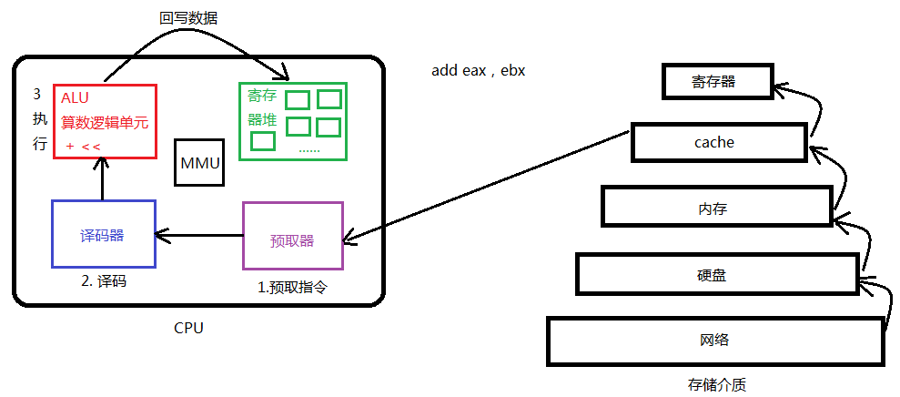
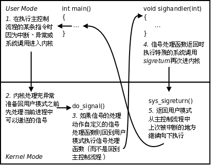
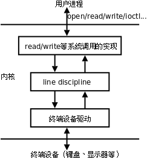
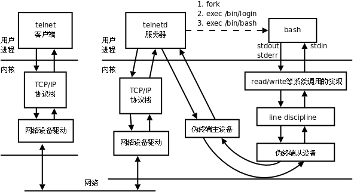

# 系统编程

### 静态库与动态库

静态库：对空间要求低，速度要求高

```c++
%构造静态库
gcc -c  add.c -o add.o
ar rcs libmylib.a add.o sub.o
    %使用静态库时，在编译主函数时，将静态库一同编译
    gcc test.c libmylib.a -o test
    %报错时有行号，编译时出错
    **实际**
    第一步
    创建调用函数的头文件，并将其移动至inc文件夹，且在主函数中添加头文件
   #ifndef _MYMATH_H_
#define _MYMATH_H_
int add(int,int);
int sub(int,int);
#endif
第二步
    gcc test.c ./lib/libmylib.a -o a.out -I ./inc

```

**动态库：相反

生成与位置无关的代码

数据段合并

地址回填


```c
/*动态库报错解决方法
    链接器：工作于链接阶段，工作时需要-l和-I
    动态链接器：工作与程序运行阶段，工作时需要提供动态库所在目录位置
    */
解决方法：
    1. 临时设置的方法:
					export LD_LIBRARY_PATH=./lib
		2. 永久设置的方法:
					1. 找到动态链接库的配置文件: /etc/ld.so.conf(vi ~/.bashrc)
					2. 在该文件中添加动态库的目录(绝对路径)
					3. 更新: sudo ldconfig -v(..bashrc或重启终端)
```

### gdb调试

```c
基本步骤：
1编译时末尾加-g
gcc gdbtest.c -o gdbtest -g
2进入gdb环境
gdb a.out
3查看代码:
l -- list
				l 10（行数）
4设置断点     b 10(行数)     查看设置的断点  	info b 
5运行程序
run
6单步调试
进入函数体内部: s
					从函数体内部跳出: finish
				不进入函数体内部:n
				退出当前循环: u
7查看变量的值: p
8继续执行断点后程序
continue
错误情况：段错误（核心已转储）
    gdb追段错误，直接进入gdb后run，停止的位置就是段错误位置
```

参考笔记

```c
1. 启动gdb
				start -- 只执行一步
					n -- next
					s -- step(单步) -- 可以进入到函数体内部
					c - continue -- 直接停在断点的位置
				
		2. 查看代码:
				l -- list
				l 10（函数名）
				l filename：行号（函数名）
		3. 设置断点:
				设置当前文件断点:
					b -- break
					b 10（函数名）
					b fileName:行号（函数名）
				设置指定文件断点:
				
				设置条件断点:
					b 10 if value==19
				删除断点:
					delete -- del - d
					d 断点的编号
						获取编号： info -- i									
		4. 查看设置的断点  info b
		5. 开始 执行gdb调试
				执行一步操作: 
					继续执行:
				执行多步, 直接停在断点处:
		5. 单步调试
				进入函数体内部: s
					从函数体内部跳出: finish
				不进入函数体内部:	n
				退出当前循环: u
		6. 查看变量的值: p -- print
		7. 查看变量的类型: ptype 变量名
		8. 设置变量的值:	set var 变量名 = 赋值
		9. 设置追踪变量
				display
				取消追踪变量
				undisplay 跟踪变量编号
						获取编号： info display
            查看栈区与层级关系：bt
            切换栈区：frame 栈区编号
		10. 退出gdb调试
					quit
```

### makefile

1. makefile的命名：只能取为makefile或Makefile

2. makefile的规则:
   		规则中的三要素: 目标， 依赖， 命令
      			目标：依赖条件
      				命令
      		子目标和终极目标的关系:谁在最前面谁就是最终目标，自定义最终目标--》加ALL：对应目标

3. makefile的两个函数
   wildcard：src=$(wildcard*.c)==src= add.c  sub.c   匹配当前目录下所有后缀.c文件，赋值给src

   patsubst:  obj=$(patsubst %.c,&.o,$(src))   将参数3中包含参数1的部分替换为参数2

​		clean:(无依赖)

​				-rm -rf $(obj) a.out     "-"出错仍执行

执行make命令中某一个过程时：

​			make clean -n     -n显示这个指令将要执行的命令

4.makefile的三个自动变量

​    $<:规则命令中表第一个依赖条件，如果将该变量应用到模式规则中，可将依赖条件列表中的依赖依次取出，套用模式规则
​	$@:规则命令中表规则中目标
​	$^:规则命令中表所有依赖条件

5.模式规则

​		%.o:%.c

 				gcc --c $< -o %@

静态模式规则p45-19min

伪目标：不管有无都生成

​              .PHONY: 目标（ex：clean ALL）

-f:制定文件执行make命令

------

## <font color="#dd0000">系统编程正式进入。。。</font>

## 1*文件IO

### 1.1 open/close

```c
%头文件包含
#include <unistd.h>
#include <fcntl.h>
%格式
     int open(const char *pathname, int flags);//打开已有文件
       int open(const char *pathname, int flags, mode_t mode);//创建并打开文件
/*falgs打开方式:
					必选项:
						O_RDONLY
						O_WRONLY
						O_RDWR    
						可选项:	O_CREAT   创建文件
                                            O_TRUNC 截断为0
*/

%%文件的实际权限:
									给定的权限	&本地掩码(取反)umask
	%具体代码%	
#include<unistd.h>
#include<fcntl.h>
#include<stdio.h>
#include<errno.h>
#include<string.h>

int main(int argc,char*argv[])
{
        int fd;
        fd=open("./open1.txt",O_RDONLY|O_CREAT,0511);
        printf("fd=%d,errno=%d:%s",fd,errno,strerror(errno));
        close(fd);
        return 0;
}    

```

### 	1.2 read/write	

```c
%头文件包含
     #include <unistd.h>
    read格式：
    ssize_t read(int fd, void *buf, size_t count);%文件描述符 存数据缓冲区  缓冲区大小
  write格式：
      ssize_t write(int fd, const void *buf, size_t count);%文件描述符 待写入数据缓冲区 数据大小
返回值:
					1. -1 读文件失败，但errno出现EAGIN或EWOULDBLOCK有则是read在读一个非阻塞的设备（网络）文件，并且文件无数据
					2. 0 文件读完了
					3. >0 读取的字节数
                        
 大文件
两种方式: 
	read write  -- 每次读1个byte
	getc putc   -- 每次读1个byte
	两种方式, 哪个效率高，第二种高，存在预读入缓输出，
        查看执行过程中使用的系统调用函数：strace
	
```

### 1.3 文件描述符

```
PCB进程控制块 本质：结构体
成员：文件描述符表
文件描述符：0 1 2 3。。。1023  优先使用最小的
0分配给--标准输入  STDIN_FILENO
1分配给--标准输出  STDOUT_FILENO
2分配给--标准错误  STDERR_FILENO

阻塞，非阻塞：是设备文件，网络文件特性
产生阻塞条件：读设备文件，网络文件（常规文件无这个说法）
  /dev/tty--终端文件
  open("/dev/tty",O_RDWR||O_NONBLOCK)
```

### 1.4 fcntl

```c
头文件：
#include <unistd.h>
#include <fcntl.h>
格式:
int fcntl(int fd, int cmd, ... /* arg */ );文件描述符 命令 对应参数

实现标准输入为非阻塞态：
int flag=fcntl(STDIN_FILED,F_GETFL);
flag|=O_NONBLOCK;
int ret=fcntl(STDIN_FILED,F_SETFL,flags)
```

### 1.5 lseek(qdm敲代码)

```c
头文件：
#include<sys/types.h>
#include<unistd.h>
格式:
off_t lseek(int fd, off_t offset, int whence);
参数：
    fd: 文件描述符
    offset: 文件指针的偏移量
    whence: 起始偏移位置
    SEEK_SET -> 从文件头部向后偏移
    SEEK_CUR -> 从当前位置向后偏移
    SEEK_END -> 从文件尾部向后偏移
返回值：
成功：较起始位置的偏移量；失败： -1 errno
 代码案例：
#include<unistd.h>
#include<sys/types.h>
#include<sys/stat.h>
#include<fcntl.h>
#include<stdio.h>
#include<stdlib.h>
#include<string.h>
        //注意：文件的读和写使用的是同一偏移位置
int main()
{
        int fd,n;
        char mag[]="ajslkdjfaaa";
        char buf[64];
           fd = open("a.txt", O_RDWR|O_CREAT,0644);
        if(fd == -1)
        {
                perror("open file");
                exit(1);
        }
        write(fd,mag,strlen(mag));
        lseek(fd,0,SEEK_SET);
        while((n=read(fd,buf,64))==0)
        {
                if(n<0)
                {
                        perror("read error");
                        exit(1);
                }

        }
        write(STDOUT_FILENO,buf,n);
        // 获取文件大小
        /*int ret = lseek(fd, 0, SEEK_END);
         printf("file length = %d\n", ret);
        
        // 文件拓展
        ret = lseek(fd, 2000, SEEK_END);
        printf("return value %d\n", ret);
        // 实现文件拓展，需要再最后做一次写操作
        write(fd, "a", 1);
        */

        close(fd);
        return 0;
}


    使用 truncate 函数，可直接拓展文件。

    int ret = truncate("dict.cp", 250);待拓展文件  拓展量


```

### 1.6 传入,传出参数,传入传出参数

```c
//传入参数：
1.指针作为函数参数。

2.通常有const关键字修饰。

3.指针指向有效区域，在函数内部做读操作。
char *strcpy(char *dest, const char *src)   const char *src就是传入参数

//传出参数：
1.指针作为函数参数。

2.在函数调用之前，指针指向的空间可以无意义，但必须有效。

3.在函数内部，做写操作。

4.函数调用结束后，充当函数返回值。

//传入传出参数
1.指针作为函数参数。

2.在函数调用之前，指针指向的空间有实际意义。

3.在函数内部，先做读操作，后做写操作。

4.函数调用结束后，充当函数返回值。


```

## 2*文件系统

### 2.1 文件存储

### inode

### dentry

### 2.2 文件操作

#### stat/lstat

```c
查看文件信息，stat会符号穿透链接信息，lstat不会，穿透就是查看链接时，是否能够读到链接的源文件的内容
头文件：
    #include <sys/types.h>
       #include <sys/stat.h>
       #include <unistd.h>
格式：
    int stat(const char *pathname, struct stat *statbuf);文件路径 存放文件属性（传出参数）
ex
    #include<stdio.h>
#include<stdlib.h>
#include<string.h>
#include<unistd.h>
#include<sys/stat.h>
#include<pthread.h>

int main(int argc,char*argv[])
{
        struct stat sbuf;
        int ret=stat(argv[1],&sbuf);
        if(ret==-1)
        {
                perror("stat error");
                        exit(1);
        }
        printf("size a:%ld\n",sbuf.st_size);//获取文件大小
    if(S_ISREG(sbuf.st_mode))//获取文件权限  S_ISREG是st_mode查看文件众多属性中的是否为一个常规文件
        {
                printf("is\n");
                exit(1);
        }
        else
        {
                printf("no\n");
        }
                return 0;
}


```

#### link/unlink/隐式回收

```c
//link格式：
int link(const char *oldpath,const char *newpath); 
ex：实现mv命令
#include <stdio.h>
#include <stdlib.h>
#include <unistd.h>
int main(int argc,char *argv[])
{
        link(argv[1],argv[2]);
 
        unlink(argv[1]);
 
        return 0;
}
//unlink(删除一个文件的目录项dentry)格式：
int unlinkat(int dirfd, const char *pathname, int flags);
#include <unistd.h>
#include <fcntl.h>
#include <stdlib.h>
#include <string.h>
#include <stdio.h>
 
int main(void)
{
        int fd,ret;
        char *p = "test of unlink\n";
        char *p1 = "after write something.\n";
        fd = open("temp.txt",O_RDWR|O_CREAT|O_TRUNC,0777);
        if(fd < 0)
        {
                perror("open temp error");
                exit(1);
        }
        /*  ret = unlink("temp.txt"); //到了这一步删除temp.txt文件,linux特性，关闭了目录项，但是不会马上删除对应文件，而是等待没有进程调用时才会删除
        if(ret < 0)
        {
                perror("unlink error");
                exit(1);
        }*/
        ret = write(fd,p,strlen(p));//往temp.txt里面写东西
        if(ret == -1)
        {
                perror("-------write error");
        }
 
 
        printf("hi! I'm printf\n");
 
        ret = write(fd,p1,strlen(p1));   //往temp.txt里面写东西
        if(ret == -1)
        {
                perror("-------write error");
        }
 //p[3]='p';
        printf("Enter anykey continue\n");
        getchar();                       //阻塞作用
 
        close(fd);
 
        ret = unlink("temp.txt"); //到了这一步删除temp.txt文件
        if(ret < 0)
        {
                perror("unlink error");
                exit(1);
        }
 
        return 0;
}                                                                                                                                                                                          
隐式回收：
当进程结束运行时，所有该进程打开的文件会被关闭，申请的内存空间会被释放。系统的这一特性称之为隐式回收系统资源。
readlink：
    读符号链接命令
   

```

### 2.3 目录操作

#### getcwd/chdir

```c
getcwd ex:返回当前工作目录的绝对路径
#include <unistd.h>
main()
{
    char buf[80];
    getcwd(buf, sizeof(buf));
    printf("current working directory : %s\n", buf);
}
chdir ex:
int chdir(const char *path );新的目录
    

```

#### opendir/closedir/readdir

```c
 DIR *opendir(const char *name);
int closedir(DIR *dirp);
 struct dirent *readdir(DIR *dirp);
ex:实现ls功能
    #include<stdio.h>
#include<stdlib.h>
#include<string.h>
#include<unistd.h>
#include<dirent.h>
#include<pthread.h>

int main(int argc,char*argv[])
{
        DIR* dp;//定义opendir函数返回值
        struct dirent* sdp;//定义readdir返回值
        dp=opendir(argv[1]);
        if(dp==NULL)
        {
                perror("open error");
                exit(1);
        }
        while((sdp=readdir(dp))!=NULL)//循环读目录
        {
                if(strcmp(sdp->d_name,".")==0||strcmp(sdp->d_name,"..")==0))//排除目录中的.和..
                {
                        continue;
                }
                        printf("%s\t",sdp->d_name);
        }
                printf("\n");

        closedir(dp);

        return 0;
}            
```

### 2.4 例题：递归遍历数组（抄3遍）

```c
#include<stdio.h>
#include<stdlib.h>
#include<string.h>
#include<unistd.h>
#include<pthread.h>
#include<sys/stat.h>
#include<dirent.h>

void is_file(char*name);
//开读关文件操作
void read_dir(char*dir)
{
	char path[256];
      DIR*dp;
      struct dirent*sdp;
      dp=opendir(dir);
      if(dp==NULL)
      {
	      perror("opendir error");
	      exit(1);
      }
      //读文件
     while( (sdp=readdir(dp))!=NULL)
     {
	     //如果读到目录中的.和..  为了避免出现循环，需排除这两个
	     if(strcmp(sdp->d_name,".")==0||strcmp(sdp->d_name,"..")==0)
	     {
		     continue;}
	     if(strlen(dir)+strlen(sdp->d_name)+2>256)
		{
			fprintf(stdout,"%s","too many");
			exit(1);
		}
	     //需要组合路径,拼接 目录/目录名
	     sprintf(path,"%s/%s",dir,sdp->d_name);
	     is_file(path);
     }

      closedir(dp);
	return;
}
//判断是文件还是目录
void is_file(char*name)
{

	struct stat sbuf;
   int ret=stat(name,&sbuf);
   if(ret==-1)
	 {
		 perror("stat error");
			 exit(1);
	 }
   //是目录，执行读目录操作
   if(S_ISDIR(sbuf.st_mode))
   {
     read_dir(name);
   }
   else//文件就打印名字和大小
   {
	   printf("%s\t%ld\n",name,sbuf.st_size);
   }
}
//主函数
int main(int argc,char*argv[])
{
	//判断命令行输入参数
	if(argc==1)
	{
		is_file(".");
	}
	else
	{
		is_file(argv[1]);
	}
	return 0;
}

```

### 2.5 dup/dup2重定向

```c
头文件：

#include <unistd.h>
int dup(int oldfd);
int dup2(int oldfd, int newfd);

返回值：
	成功：dup函数返回当前系统可用的最小整数值。
		 dup2函数返回第一个不小于newfd的整数值，分两种情况：

   		 	1. 如果newfd已经打开，则先将其关闭，再复制文件描述符；
   		 	2. 如果newfd等于oldfd，则dup2函数返回newfd，而不关闭它。
          失败：dup和dup2函数均返回-1，并设置errno。
//    dup ex：新的fd是旧fd的拷贝，返回的是文件描述符表里最小的fd
    #include<stdio.h>
#include<unistd.h>
#include<fcntl.h>
#include<string.h>
int main()
{
    int oldfd = open(argv[1],O_RDWR);//第一次打开文件，返回的文件描述符(oldfd)值为3
    if(oldfd < 0)
    {
        perror("open");
    }
    printf("oldfd is : %d\n",oldfd);
    int newfd = dup(oldfd);//调用dup函数，返回的新文件描述符为可用的最小正整数，即为4
    if(newfd < 0)//判断函数是否调用正确，newfd的值为-1时调用失败
    {
        perror("dup");
    }
    printf("newfd is : %d\n",newfd);
    
    return 0;
}
//dup2  ex:   理清定向关系
#include<stdio.h>
#include<unistd.h>
#include<fcntl.h>
#include<string.h>

int main(int argc,char*argv[])
{
	int fd1=open(argv[1],O_RDWR);//fd1=3
	int fd2=open(argv[2],O_RDWR);//fd2=4

	int fret=dup2(fd1,fd2);   //将fd2指向与fd1指向相同的文件，返回fd2
	printf("fret=%d\n",fret);
        char *data = "this is new data";
         int ret=write(fd2,data,strlen(data));//写入fd1指向的文件
	  printf("ret=%d\n",ret);
	  int fert2=dup2(fd2,STDOUT_FILENO);//将屏幕输出重定向给fd1指向文件
	  printf("1111111111111111\n");
	return 0;
}
//ex:fcntl实现dup2
#include <unistd.h>
#include <string.h>
#include <stdlib.h>
#include <stdio.h>
#include <fcntl.h>
int main()
{
  int fd =open("./test.txt",O_RDWR|O_CREAT,0644);
  if(fd==-1)
  {
    perror("open error");
  }
  int newfd=fcntl(fd,F_DUPFD,5); //fd5未被占用，返回=5的文件描述符
  printf("newfd=%d\n",newfd);
    int newfd1=fcntl(fd,F_DUPFD,0);//fd0被占用，fcntl使用文件描述符表中可用的最小文件描述符返回
     printf("newfd1=%d\n",newfd1);
  int ret= write(newfd,"test",4);
  printf("ret=%d\n",ret);
  return 0;
}

```

## 3*进程

### 3.1 基础

#### 进程与程序

**程序：**是指编译好的二进制文件，在磁盘上，不占用系统资源(cpu、内存、打开的文件、设备、锁....)
**进程：**是一个抽象的概念，与操作系统原理联系紧密。进程是活跃的程序，占用系统资源。在内存中执行。(程序运行起来，产生一个进程)

#### 并发与并行

**并发：**在[操作系统](http://baike.baidu.com/view/880.htm)中，一个时间段中有多个进程都处于已启动运行到运行完毕之间的状态。但，任一个时刻点上仍只有一个进程在运行。

**并行：**在操作系统中是指，一组程序按独立异步的速度执行，无论从微观还是宏观，程序都是一起执行的。

#### CPU和MMU（虚拟内存映射单元）



### 3.2 进程控制

#### fork

```c
头文件：
    #include<unistd.h>
    格式：
    pid_t fork(void)
    返回值：
    1，子进程返回0，表示父进程成功创建子进程
    2，父进程返回子进程pid
    getpid getppid函数
 //创建子进程ex：
    #include<stdlib.h>
#include<string.h>
#include<unistd.h>
#include<pthread.h>
#include<stdio.h>
int main(int argc,char*argv[])
{
        printf("-----------------------------------\n");
        pid_t pid=fork();
        if(pid==-1)
        {
                perror("fork error\n");
                exit(1);
        }
         else if(pid==0)
        {
                printf("creat child progress\n，pid=%d\n,ppid=%d\n",getpid(),getppid());
        }
        else if(pid>0)
        {
                printf("child progress pid=%d\n",pid);
        }
        printf("fork progress end\n");
        return 0;
}
//循环创建n个子进程
 #include<stdlib.h>
#include<string.h>
#include<unistd.h>
#include<pthread.h>
#include<stdio.h>
int main(int argc,char*argv[])
{
        printf("-----------------------------------\n");
    for(int i=0;i<5;i++)
    {
        if(fork()==0)
        {
            break;
        }
        if(i==5)
        {
            sleep(5);
            printf("parent progress\n")
        }
        else
        {
            sleep(i);
            printf("child progress %d\n",i+1);
            
        }   
        return 0;
    }
```

#### 进程共享

父子相同处: 全局变量、.data、.text、栈、堆、环境变量、用户ID、宿主目录、进程工作目录、信号处理方式...

父子不同处: 1.进程ID  2. fork返回值   3.父进程ID   4.进程运行时间    5.闹钟(定时器)  6.未决信号集

**读时共享写时复制**----全局变量

**共享：**文件描述符和映射区

#### gdb调试

用gdb调试的时候，gdb只能跟踪一个进程。可以在fork函数调用之前，通过指令设置gdb调试工具跟踪父进程或者是跟踪子进程。默认跟踪父进程。

set follow-fork-mode child 命令设置gdb在fork之后跟踪子进程。

set follow-fork-mode parent 设置跟踪父进程。

注意，一定要在fork函数调用之前设置才有效。

#### exec函数族

**指定父子进程去执行某个线程**

```c
//execl函数 
头文件：
    #include <unistd.h>
    格式：
     int execl(const char *path, const char *arg, ...   /* (char  *) NULL */);
       int execlp(const char *file, const char *arg, .../* (char  *) NULL */);    第二组参数是从argv【0】开始计算 末尾的NULL哨兵
 返回值：只有失败返回-1，成功不返回数值
//exec例子
 #include<stdlib.h>
#include<string.h>
#include<unistd.h>
#include<pthread.h>
#include<stdio.h>
        int main(int argc,char*argv[])
{
        printf("-----------------------------------\n");
        pid_t pid=fork();
        if(pid==-1)
        {
                perror("fork error\n");
                exit(1);
        }
         else if(pid==0)
        {
               execlp("ls","ls","-l",NULL);
             //execl("./forktest","./forktest",NULL);可以使用绝对地址或相对地址
             /*   execvp函数        char *argv[]={"ls","-l",NULL};
                      execvp("ls",argv);*/
        }
        else if(pid>0)
        {
            sleep(1);
                printf("i am parent :%d",getpid());
        }
        printf("fork progress end\n");
        return 0;
}   
```

#### 例题：利用exec实现ps输出数据打印到指定文件

```c
 #include<stdlib.h>
#include<string.h>
#include<unistd.h>
#include<pthread.h>
#include<stdio.h>
        int main(int argc,char*argv[])
{
        printf("-----------------------------------\n");
        pid_t pid=fork();
        if(pid==-1)
        {
                perror("fork error\n");
                exit(1);
        }
         else if(pid==0)
        {
              int fd=open("./ps_test",O_RDWR|O_CREAT,611);
             dup2(fd,STDOUT_FILENO);
             
              execlp("ps","ps","-aux",NULL);
             
        }
        else if(pid>0)
        {
            sleep(1);
                printf("i am parent :%d",getpid());
        }
        printf("fork progress end\n");
        return 0;
}   

```

#### 回收子进程

**孤儿进程** ：父进程先于子进程结束，则子进程成为孤儿进程，子进程的父进程成为 init进程，称为 init进程 (进程孤儿院）领养孤儿进程。

**查看父子进程命令**：ps ajx

```c
#include <stdio.h>
#include <unistd.h>
#include <sys/wait.h>

int main(void)
{
    pid_t pid;
    pid = fork();

    if (pid == 0) {
        while (1) {
            printf("I am child, my parent pid = %d\n", getppid());
            sleep(1);
        }
    } else if (pid > 0) {
            printf("I am parent, my pid is = %d\n", getpid());
            sleep(9);
            printf("------------parent going to die------------\n");
    } else {
        perror("fork");
        return 1;
    }

    return 0;
}
```

**僵尸进程**：进程终止，父进程尚未回收，子进程残留资源（PCB）存放于内核中，变成僵尸（Zombie）进程

```c
#include <stdio.h>
#include <stdlib.h>
#include <unistd.h>
#include <sys/wait.h>

int main(void)
{
    pid_t pid, wpid;
    pid = fork();

    if (pid == 0) {
            printf("---child, my parent= %d, going to sleep 10s\n", getppid());
            sleep(10);
            printf("-------------child die--------------\n");
    } else if (pid > 0) {
        while (1) {
            printf("I am parent, pid = %d, myson = %d\n", getpid(), pid);
            sleep(1);
        }
    } else {
        perror("fork");
        return 1;
    }

    return 0;
}
```

**kill杀不掉僵尸进程，回收僵尸进程，采用杀死父进程**

#### wait函数

```c
//wait函数功能：
//阻塞等待子进程退出
//回收子进程残留资源
//获取子进程结束状态(退出状态)

//ex:
#include <stdio.h>
#include <stdlib.h>
#include <unistd.h>
#include <sys/wait.h>
int main(void)
{
    pid_t pid, wpid;
    int status;
    pid = fork();

    if (pid == 0) {
            printf("---child, my pid= %d, going to sleep 3s\n", getpid());
            sleep(3);
            printf("-------------child die--------------\n");
    } else if (pid > 0) {
            wpid=wait(&status);
            if(wpid==-1)
            {
                    perror("wait error");
                    exit(1);

        }
            printf("fu ok huishou de pid is:%d\n",wpid);
    } else {
        perror("fork");
        return 1;
    }

    return 0;
}

    
```

**使用wait函数传出参数status来保存进程的退出状态.借助宏函数来进一步判断进程终止的具体原因**

1. WIFEXITED(status) 为非0	→ 进程正常结束

​	WEXITSTATUS(status) 如上宏为真，使用此宏 → 获取进程退出状态 (exit的参数)

2. WIFSIGNALED(status) 为非0 → 进程异常终止

​	WTERMSIG(status) 如上宏为真，使用此宏 → 取得使进程终止的那个信号的编号。

```c
#include <stdio.h>
#include <stdlib.h>
#include <unistd.h>
#include <sys/wait.h>
int main(void)
{
    pid_t pid, wpid;
    int status;
    pid = fork();

    if (pid == 0) {
            printf("---child, my pid= %d, going to sleep 3s\n", getpid());
            sleep(3);
            printf("-------------child die--------------\n");
    } else if (pid > 0) {
            wpid=wait(&status);//一次wait/waitpid函数调用只能回收一个子进程
            if(wpid==-1)
            {
                    perror("wait error");
                    exit(1);
             if(WIFWXITTED(status))
             {
                       printf("OVER by :%d\n",WEXITSTATUS(status)) ;          
             }
                if(WIFSIGNALED(status))
                {
                    printf("killed by :%d\n",WTERMSIG(status)) ;          
                }
        }
            printf("fu ok huishou de pid is:%d\n",wpid);
    } else {
        perror("fork");
        return 1;
    }

    return 0;
}

```

#### waitpid函数

```c
//指定pid进程回收，可以不堵塞
 pid_t waitpid(pid_t pid, int *status, int options);回收进程pid  回收进程的状态  指定回收方式
成功：返回清理掉的子进程ID；失败：-1(无子进程)
 //参数值：
     >0:回收指定id的子进程
      -1：回收任意子进程
       0：回收和当前调用waitpid一个组的所有子进程
    -1<:回收指定进程组内的任意子进程
 //返回0：参数3为WNOHANG，指定回收方式为非阻塞，且子进程正在运行
        //ex：
 #include <stdio.h>
#include <stdlib.h>
#include <unistd.h>
#include <sys/wait.h>
        int main (int argc,char*argv[])
    {
        int i;
        pid_t pid,wpid;
        for(i=0;i<5;i++)
        {
           pid=fork();
            if(pid==-1)
            {
                perror("fork error\n");
                exit(1)；
            }
            if(pid==0)
            {
                break;
            }
              if(i==5)
        {
            sleep(5);
                  wpid=waitpid(-1,	NULL,WNOHANG);
            printf("parent progress\n")
        }
        else
        {
            sleep(i);
            printf("child progress %d\n",i+1);
            
        }   
        }
        return 0;
    }
//ex2:
 #include <stdio.h>
#include <stdlib.h>
#include <unistd.h>
#include <sys/wait.h>
#include<string.h>
        int main (int argc,char*argv[])
    {
        int i;
        pid_t pid,wpid,tpid;
        for(i=0;i<5;i++)
        {
           pid=fork();
            if(pid==0)
            {
                break;
            }
            if(i==2)
            {
                    tpid=pid;
                    printf("huisoudeshi %d\n",tpid);
        }
        }
              if(5==i)
        {
           sleep(5);
                 // wpid=waitpid(-1,NULL,WNOHANG);
                  wpid=waitpid(tpid,NULL,0);//指定一个进程回收，阻塞
                  //wpid=waitpid(tpid,NULL,WNOHANG);指定一个进程回收，不阻塞
                  if(wpid==-1)
                  {
                          perror("waitpid error\n");
                          exit(1);
                  }
            printf("parent progress huishou %d\n",wpid);
        }
        else
        {
            sleep(i);
            printf("child progress %d\n",i+1);

        }

        return 0;
        }
```

#### waitpid回收多个子进程

```c
 #include <stdio.h>
#include <stdlib.h>
#include <unistd.h>
#include <sys/wait.h>
#include<string.h>
        int main (int argc,char*argv[])
    {
        int i;
        pid_t pid,wpid,tpid;
        for(i=0;i<5;i++)
        {

            if( fork()==0)
            {
                break;
            }
        }
              if(5==i)
        {
         // while((wpid=waitpid(-1,NULL,0)))
         while((wpid=waitpid(-1,NULL,WNOHANG))!=-1)
                {
                        sleep(1);

                    printf("hui shou jincheng wei %d\n",wpid);

               }
        }
        else
        {
            sleep(i);
            printf("child progress %d\n",i+1);

        }

        return 0;
        }
```

### 3.3 进程通信

pipe匿名管道

管道的原理: 管道实为内核使用环形队列机制，借助内核缓冲区(4k)实现。

1. 其本质是一个伪文件(实为内核缓冲区)，

2. 由两个文件描述符引用，一个表示读端，一个表示写端。

3. 规定数据从管道的写端流入管道，从读端流出。

① 数据自己读不能自己写。

② 数据一旦被读走，便不在管道中存在，不可反复读取。

③ 由于管道采用半双工通信方式。因此，数据只能在一个方向上流动。

④ 只能在有公共祖先的进程间使用管道。

```c
//pipe管道 创建并打开管道
 int pipe(int pipefd[2]);		成功：0；失败：-1，设置errno
     //demo
 #include <stdio.h>
#include <stdlib.h>
#include <unistd.h>
#include <errno.h>
#include<pthread.h>
#include<string.h>
     int main(int argc,char *argv[])
 {
     int ret,rett;
     pid_t pid;
     int fd[2];
     char buf[1024];
     char *str="asdfasdfasdf\n";
      ret=pipe(fd);

     pid=fork();
     if(pid==-1)
     {
         perror("fork error");
         exit(1);
     }
     if(pid==0)
     {

         close(fd[1]);
        int tt=read(fd[0],buf,rett+2);
         write(STDOUT_FILENO,buf,tt);
         close(fd[0]);
     }
     if(pid>0)
     {
         close(fd[0]);
        rett=write(fd[1],str,strlen(str))；
         close(fd[1]);
           sleep(1);
     }
     return 0;
 }

```

#### 管道读写行为

① 读管道：	

1. 管道中有数据，read返回实际读到的字节数。

2. 管道中无数据：

​    (1) 管道写端被全部关闭，read返回0 (好像读到文件结尾)

​    (2) 写端没有全部被关闭，read阻塞等待(不久的将来可能有数据递达，此时会让出cpu)

 ② 写管道：	

1. 管道读端全部被关闭， 进程异常终止(也可使用捕捉SIGPIPE信号，使进程不终止)

2. 管道读端没有全部关闭：

​       (1) 管道已满，write阻塞。

​	   (2) 管道未满，write将数据写入，并返回实际写入的字节数。

```c
 #include <stdio.h>
#include <stdlib.h>
#include <unistd.h>
#include <errno.h>
#include<pthread.h>
#include<string.h>
     int main(int argc,char *argv[])
 {
     int ret,rett;
     pid_t pid;
     int fd[2];
     char buf[1024];
     char *str="asdfasdfasdf\n";
      ret=pipe(fd);

     pid=fork();
     if(pid==-1)
     {
         perror("fork error");
         exit(1);
     }
     if(pid==0)
     {

         close(fd[1]);
        int tt=read(fd[0],buf,rett+2);
         write(STDOUT_FILENO,buf,tt);
         close(fd[0]);
     }
     if(pid>0)
     {
             sleep(1);
         close(fd[0]);

        rett=write(fd[1],str,strlen(str));

         close(fd[1]);
     }
     return 0;
 }
//父子进程通信练习
//自己编的
#include <stdio.h>
#include <stdlib.h>
#include <unistd.h>
#include <errno.h>
#include<pthread.h>
#include<string.h>
     int main(int argc,char *argv[])
 {
     int ret,rett;
     pid_t pid;
     int fd[2];
     char buf[1024];
     char *str="asdfasdfasdf\n";
      ret=pipe(fd);

     pid=fork();
     if(pid==-1)
     {
         perror("fork error");
         exit(1);
     }
     if(pid==0)
     {
    
         close(fd[1]);
         dup2(STDIN_FILENO,fd[0]); 
          execlp("wc","wc","-l",NULL);
       
         close(fd[0]);
          execlp("wc","wc","-l",NULL);
     }
     if(pid>0)
     {
         
         
         close(fd[0]);
          dup2(fd[1],STDOUT_FILENO);
         
           execlp("ls","ls",NULL);
        

         close(fd[1]);
     }
     return 0;
 }
//参考答案
 #include <stdio.h>
#include <stdlib.h>
#include <unistd.h>
#include <errno.h>
#include<pthread.h>
#include<string.h>
     int main(int argc,char *argv[])
 {
     int ret,rett;
     pid_t pid;
     int fd[2];
      ret=pipe(fd);
      pid=fork();
     if(pid==-1)
     {
         perror("fork error");
         exit(1);
     }
    else if(pid==0)
     {
         close(fd[1]);
         dup2(fd[0],STDIN_FILENO); 
          execlp("wc","wc","-l",NULL); 
     }
      else if(pid>0)
     {
         close(fd[0]);
          dup2(fd[1],STDOUT_FILENO);
           execlp("ls","ls",NULL);
     }
     return 0;
 }
//兄弟进程间通信
#include <stdio.h>
#include <stdlib.h>
#include <unistd.h>
#include <errno.h>
#include<pthread.h>
#include<string.h>
#include<sys/wait.h>
     int main(int argc,char *argv[])
 {
     int ret,rett,i;
     pid_t pid;
     int fd[2];
      ret=pipe(fd);
         for(i=0;i<2;i++)
         {
             pid=fork();
             if(pid==-1)
             {
                 perror("fork error");
                 exit(1);
             }
             if(pid==0)
             {
                 break;
             }
         }
         if(i==2)
         {
             close(fd[0]);
             close(fd[1]);
             wait(NULL);
             wait(NULL);
         }
       else if(i==0)
     {
           
         close(fd[1]);
         dup2(fd[0],STDIN_FILENO); 
          execlp("wc","wc","-l",NULL); 
     }
      else if(i==1)
     {
         close(fd[0]);
          dup2(fd[1],STDOUT_FILENO);
           execlp("ls","ls",NULL);
     }
     return 0;
 }
```

**可以实现多个读一个写，也可以实现多个写一个读**

**管道缓冲区大小 ulimit -a**

#### 管道的优劣

​	优点：简单，相比信号，套接字实现进程间通信，简单很多。

​	缺点：1. 只能单向通信，双向通信需建立两个管道。

​	            2. 只能用于父子、兄弟进程(有共同祖先)间通信。该问题后来使用fifo有名管道解决。

#### fifo有名管道

创建方式：

1. 命令：mkfifo 管道名

​	2. 库函数：int mkfifo(const char *pathname,  mode_t mode);  成功：0； 失败：-1

​	一旦使用mkfifo创建了一个FIFO，就可以使用open打开它，常见的文件I/O函数都可用于fifo。如：close、read、write、unlink等。

头文件：

​        #include <sys/types.h>
​       #include <sys/stat.h>

格式：

 int mkfifo(const char *pathname, mode_t mode);管道名 管道权限

```c
//fifo管道写入端
#include <stdio.h>
#include <stdlib.h>
#include <unistd.h>
#include <errno.h>
#include<pthread.h>
#include<string.h>
#include<sys/stat.h>
int main(int argc,char*argv[])
{
    int fd,ret;
    char buf[1024];
    int p=mkfifo("myfifo",0644)
    fd=open("myfifo",O_WRONLY);
    if(fd==-1)
    {
        perror("open error");
        exit(1);
    }
    int i=0;
    while(1)
    {
        sprintf(buf,"no %d\n",i++);
        write(fd,buf,strlen(buf));
        sleep(1);
    }
    return 0;
    
}
//fifo管道读出端
#include <stdio.h>
#include <stdlib.h>
#include <unistd.h>
#include <errno.h>
#include<pthread.h>
#include<string.h>
#include<sys/stat.h>
int main(int argc,char*argv[])
{
    int fd,ret;
    char buf[1024];
    fd=open("myfifo",O_RDONLY);
    if(fd==-1)
    {
        perror("open error");
        exit(1);
    }
 
    while(1)
    {   
      ret=read(fd,buf,sizeof(buf));
        write(STDOUT_FILENO,buf,ret);
        sleep(1);
    }
    close(fd);
    return 0;
    
}
```

#### mmap共享内存映射

头文件：#include <sys/mman.h>

格式“

void *mmap(void *adrr, size_t length, int prot, int flags, int fd, off_t offset); 

返回：成功：返回创建的映射区首地址；失败：MAP_FAILED**宏**

参数：	

​	addr: 建立映射区的首地址，由Linux内核指定。使用时，直接传递NULL

​	length： 欲创建映射区的大小(<=文件实际大小)

​	prot：	映射区权限PROT_READ、PROT_WRITE、PROT_READ|PROT_WRITE

​	flags：	标志位参数(常用于设定更新物理区域、设置共享、创建匿名映射区)   MAP_SHARED:  会将映射区所做的操作反映到物理设备（磁盘）上。

​		  	MAP_PRIVATE: 映射区所做的修改不会反映到物理设备。

​	fd： 用来建立映射区的文件描述符

​	offset： 映射文件的偏移(4k的整数倍)（从起始位置开始算偏移）默认0，表示映射文件全部

**关闭映射区**

int munmap(void *addr, size_t length);

```c
#include <stdio.h>
#include <stdlib.h>
#include <unistd.h>
#include <errno.h>
#include<pthread.h>
#include<string.h>
#include<sys/stat.h>
#include<sys/mman.h>
#include<fcntl.h>
int main(int argc,char*argv[])
{
    char*p;
    int fd=open("aaa.txt",O_RDWR|O_CREAT|O_TRUNC,0644);
    ftruncate(fd,20);
    int len=lseek(fd,0,SEEK_END);
    p=mmap(NULL,len,PORT_READ|PORT_WRITE,MAP_SHARED,fd,0);
    //出错检测
    strcpy(p,"asdfasdfasdf");
    printf("--------------%s\n",p);
    int ret=mumap(p,len);
    return 0;
}
```

#### mmap注意事项

1. 创建映射区的过程中，隐含着一次对映射文件的读操作。
2. 当MAP_SHARED时，要求：映射区的权限应 <=文件打开的权限(出于对映射区的保护)。而MAP_PRIVATE则无所谓，因为mmap中的权限是对内存的限制。
3. 映射区的释放与文件关闭无关。只要映射建立成功，文件可以立即关闭。
4. 特别注意，当映射文件大小为0时，不能创建映射区。所以：用于映射的文件必须要有实际大小！！	mmap使用时常常会出现总线错误，通常是由于共享文件存储空间大小引起的。
5. munmap传入的地址一定是mmap的返回地址。坚决杜绝指针++操作。
6. 如果文件偏移量必须为4K的整数倍
7. mmap创建映射区出错概率非常高，一定要检查返回值，确保映射区建立成功再进行后续操作。

**mmap保险调用方法**

1 fd=open("",O_RDWR)

2 mmap(NULL,有效文件大小，PORT_READ|PORT_WRITE,MAP_SHARED,fd,0)

#### mmap父子进程通信

```c
#include <stdio.h>
#include <stdlib.h>
#include <unistd.h>
#include <fcntl.h>
#include <sys/mman.h>
#include <sys/wait.h>
int var=100;
int main(int argc,char*argv[])
{
    int *p;
    int fd;
    pid_t pid;
    fd=open("aee",O_RDWR|O_CREAT|O_TRUNC,0644);
    if(fd==-1)
    {
        perror("open error");
        exit(1);
    }
    close(fd);
    ftruncate(fd,4);
    p=mmap(NULL,4,PROT_READ|PORT_WRITE,MAP_SHARED,0);
    if(p==MMAP_FAILED){
        perror("mmap error");
        exit(1);
    }
    pid=fork();
    if(pid==0){
        *p=2000;
        var=1000;
        printf("%d--------%d\n",*p,var);
    }
    else
    {
        sleep(1);
        printf("%d----------%d\n",*p,var);
    wait(NULL);
        int ret=munmap(p,4);
        if(ret==-1)
        {
            perror("munmap error");
            exit(1);
        }
    }
    return 0;
}
```

#### mmap无血缘关系进程通信

```c
//写进程
#include <stdio.h>
#include <stdlib.h>
#include <unistd.h>
#include <fcntl.h>
#include <sys/mman.h>
#include <sys/wait.h>
#include<errno.h>
struct student 
{
    int id;
    char name[128];
    int age;
};
int main(int argc,char*argv[])
{
  
    struct student stu={12,"adada",33};
      struct student*p;
    int fd=open("ass.txt",O_RDWR|O_CREAT|O_TRUNC,0644);
    ftruncate(fd,sizeof(stu));
    p=mmap(NULL,sizeof(stu),PROT_READ|PROT_WRITE,MAP_SHARED,fd,0);
    if(p==MMAP_FAILED)
    {
        perror("mmap error");
        exit(1);
    }
    close(fd);
    while(1)
    {
        memcpy(p,&stu,sizeof(stu));
        stu.id++;
    }
   int ret= munmap(p,sizeof(stu));
    return 0;
}
//读进程
#include <stdio.h>
#include <stdlib.h>
#include <unistd.h>
#include <fcntl.h>
#include <sys/mman.h>
#include <sys/wait.h>
#include<errno.h>
struct student 
{
    int id;
    char name[128];
    int age;
};
int main(int argc,char*argv[])
{
     
    struct student stu;
     struct student*p;
    int fd=open("ass.txt",O_RDWR,0644);

    p=mmap(NULL,sizeof(stu),PROT_READ|PROT_WRITE,MAP_SHARED,fd,0);
    if(p==MMAP_FAILED)
    {
        perror("mmap error");
        exit(1);
    }
    close(fd);
    while(1)
    {
       printf("%d------%s-----%d\n",p->id,p->name,p->age);
        sleep(1);
    }
   int ret= munmap(p,sizeof(stu));
    return 0;
}
```


#### 匿名映射

使用MAP_ANONYMOUS (或MAP_ANON)， 如: 

​	int *p = mmap(NULL, 4, PROT_READ|PROT_WRITE, MAP_SHARED|MAP_ANONYMOUS, -1, 0); "4"随意举例，该位置表大小，可依实际需要填写。

在类Unix系统中如无该宏定义，可使用如下两步来完成匿名映射区的建立。-1用于占位

​	① fd = open("/dev/zero", O_RDWR);

​	② p = mmap(NULL, size, PROT_READ|PROT_WRITE, MMAP_SHARED, fd, 0);

```c
#include <stdio.h>
#include <stdlib.h>
#include <unistd.h>
#include <fcntl.h>
#include <sys/mman.h>
#include <sys/wait.h>
int var=100;
int main(int argc,char*argv[])
{
    int *p;
    pid_t pid;
    p=mmap(NULL,4,PROT_READ|PORT_WRITE,MAP_ANON,-1,0);
    if(p==MMAP_FAILED){
        perror("mmap error");
        exit(1);
    }
    pid=fork();
    if(pid==0){
        *p=2000;
        var=1000;
        printf("%d--------%d\n",*p,var);
    }
    else
    {
        sleep(1);
        printf("%d----------%d\n",*p,var);
    wait(NULL);
        int ret=munmap(p,4);
        if(ret==-1)
        {
            perror("munmap error");
            exit(1);
        }
    }
    return 0;
}
```

#### 例题：多进程拷贝

```c
#include <stdio.h>
#include <string.h>
#include <stdlib.h>
 #include <unistd.h>
#include <sys/mman.h>
#include <sys/types.h>
#include <sys/stat.h>
#include <fcntl.h>
#include <sys/wait.h>
 
#define BUF_SIZE 400
 
int main(int argc, char *argv[])
{
	int fd1, fd2, ret, len, i, n;
	char *src = NULL;
	char *dest = NULL;
	pid_t pid;
 
	printf("Current file path:%s\n", argv[0]);
 //打开读的文件
	fd1 = open(argv[1], O_RDWR);
	if(fd1 == -1)
	{
		perror("open mmap.txt error:");
		exit(1);
	}
	printf("mmap文件打开成功\n");
 //查看文件大小
	len = lseek(fd1, 0, SEEK_END);
	printf("len = %d\n", len);
 
	//将文件分为n个部分,创建n个子进程
	if(len % BUF_SIZE == 0)//为BUF_SIZE的整数倍
	{
		n = len / BUF_SIZE;
		printf("n = %d\n", n);
	}
	else//不是BUF_SIZE的整数倍,加一个子进程
	{
		n = len / BUF_SIZE + 1;
		printf("n = %d\n", n);
	}
 
 //刚刚lseek偏移到了结尾，现在要让光标偏移到文件开始位置
	lseek(fd1, 0, SEEK_SET);
 //读进程创建映射区
	src = mmap(NULL, len, PROT_READ|PROT_WRITE, MAP_SHARED, fd1, 0);
	if(src == MAP_FAILED)
	{
		perror("mmap mmap.txt error:");
		exit(1);
	}
	printf("src mmap映射区创建成功\n");
	close(fd1);
 //打开写的文件
	fd2 = open(argv[2], O_RDWR|O_CREAT, 0664);
	if(fd2 == -1)
	{
		perror("open copy.txt error:");
		exit(1);
	}
	printf("copy文件打开成功\n");
 
	//为目标文件拓展上面返回的文件描述符指向文件的大小
	ret = ftruncate(fd2, len);
	if(ret == -1)
	{
		perror("ftruncate error:");
		exit(1);
	}
 
	dest = mmap(NULL, len, PROT_READ|PROT_WRITE, MAP_SHARED, fd2, 0);
	if(dest == MAP_FAILED)
	{
		perror("mmap copy.txt error:");
		exit(1);
	}
	printf("dest mmap映射区创建成功\n");
	//创建完共享内存后既可以关闭文件描述符
	close(fd2);
 
	for(i = 0; i < n; i++)
	{
		pid = fork();
 
		if(pid < 0)
		{
			perror("fork error:");
			exit(1);
		}
		else if(pid == 0)
		{
			break;
		}
	}
 
	if(i < n)
	{
		//sleep(i);
		//printf("I'm %dth child, I'm copying...\n", getpid());
        
        
		//从第 i 个字符开始复制，连续复制 BUF_SIZE 个字符
		if(i == (n - 1))
		{
			memcpy(dest + i*BUF_SIZE,src + i*BUF_SIZE, (len - i*BUF_SIZE));
			//printf("Last child %d process print data:%s\n", getpid(), dest);
			printf("Last i's length:%d\n", (len - i*BUF_SIZE));
		}
		else
		{
			memcpy(dest + i*BUF_SIZE,src + i*BUF_SIZE, BUF_SIZE);
			//printf("Child %d process print data:%s\n", getpid(), dest);
		}
 
	}
    //父进程回收子进程
	else
	{
		//sleep(i);
		wait(NULL);
		printf("拷贝结束!\n");
 
		ret = munmap(src, len);
		if(ret == -1){
			perror("munmap src error:");
			exit(1);
		}
 
		ret = munmap(dest, len);
		if(ret == -1){
			perror("munmap dest error:");
			exit(1);
		}
	}
 
	return 0;
}
```

## 4*信号

### 4.1 基础

**信号共性：**

1. 简单 2. 不能携带大量信息 3. 满足某个特设条件才发送

**信号特性：**

软件层面的”中断“，一旦信号产生，无论程序执行到任何位置，必须立刻停止运行，处理信号，处理结束，在执行后续指令。

**所有信号的产生及处理全部都是在内核中完成**

**产生信号**: 

1. 按键产生，如：Ctrl+c、Ctrl+z、Ctrl+\

2. 系统调用产生，如：kill、raise、abort

3. 软件条件产生，如：定时器alarm

4. 硬件异常产生，如：非法访问内存(段错误)、除0(浮点数例外)、内存对齐出错(总线错误)
5. 命令产生，如：kill命令

**递达**：递送并且到达进程。

**未决**：产生和递达之间的状态。主要由于阻塞(屏蔽)导致该状态。

**信号的处理方式**

1. 执行默认动作

2. 忽略(丢弃)

3. 捕捉(调用户处理函数)

 **阻塞信号集**(**信号屏蔽字**)： 将某些信号加入集合，对他们设置屏蔽，当屏蔽x信号后，再收到该信号，该信号的处理将推后(解除屏蔽后)

**未决信号集**:

1. 信号产生，未决信号集中描述该信号的位立刻翻转为1，表信号处于未决状态。当信号被处理对应位翻转回为0。这一时刻往往非常短暂。

2. 信号产生后由于某些原因(主要是阻塞)不能抵达。这类信号的集合称之为未决信号集。在屏蔽解除前，信号一直处于未决状态。   

**信号四要素：**

1. 编号 2. 名称 3. 事件 4. 默认处理动作

#### kill函数

```c
//头文件
#include<signal.h>
int kill(pid_t pid,int sig)
    sig：不推荐直接使用数字，应使用宏名，因为不同操作系统信号编号可能不同，但名称一致。
    pid > 0:  发送信号给指定的进程。
	pid = 0:  发送信号给 与调用kill函数进程属于同一进程组的所有进程。
	pid < 0:  取|pid|发给对应进程组。
	pid = -1：发送给进程有权限发送的系统中所有进程。
        
```

#### alarm函数

**每个进程都有且只有唯一个定时器。**

```c
//格式：
 unsigned int alarm(unsigned int seconds);返回0或剩余的秒数，无失败
#include<stdio.h>
#include<unistd.h>
int main()
{
    int i=0;
    alarm(1);
    while(1)
    {
        i++;
        printf("----------%d\n",i);
    }
    return 0;
}
```

**time命令：查看程序执行的时间。	程序运行的瓶颈在于IO，优化程序，首选优化IO。实际执行时间 = 系统时间 + 用户时间 + 等待时间**

#### setitimer函数

```c
//函数格式：
      int setitimer(int which, const struct itimerval *new_value，struct itimerval *old_value);定时方式  定时秒数 剩余秒数（传出参数）
参数：which：指定定时方式
		① 自然定时：ITIMER_REAL → 14）SIGLARM				 		计算自然时间
		② 虚拟空间计时(用户空间)：ITIMER_VIRTUAL → 26）SIGVTALRM  	 只计算进程占用cpu的时间
		③ 运行时计时(用户+内核)：ITIMER_PROF → 27）SIGPROF		 计算占用cpu及执行系统调用的时间
```

### 4.2 信号集操作函数

通过阻塞信号集控制未决信号集。

内核通过读取未决信号集来判断信号是否应被处理。信号屏蔽字mask可以影响未决信号集。而我们可以在应用程序中自定义set来改变mask。已达到屏蔽指定信号的目的。

#### sig**set函数组

```c
sigset_t  set;		// 自定义信号集
int sigemptyset(sigset_t *set);			将某个信号集清0		 		成功：0；失败：-1
 int sigfillset(sigset_t *set);				将某个信号集置1		  		成功：0；失败：-1
int sigaddset(sigset_t *set, int signum);		将某个信号加入信号集  		成功：0；失败：-1
int sigdelset(sigset_t *set, int signum);		将某个信号清出信号集   		成功：0；失败：-1
 int sigismember(const sigset_t *set, int signum);判断某个信号是否在信号集中	返回值：在集合：1；不在：0；出错：-1  
    sigset_t类型的本质是位图。但不应该直接使用位操作，而应该使用上述函数，保证跨系统操作有效。
        
```

#### sigprocmask函数

```c
用来   屏蔽信号、解除屏蔽  也使用该函数。其本质，读取或修改进程的信号屏蔽字(PCB中)
    严格注意，屏蔽信号：只是将信号处理延后执行(延至解除屏蔽)；而忽略表示将信号丢处理。
    格式：
    int sigprocmask(int how, const sigset_t *set, sigset_t *oldset);

参数：
		set：传入参数，是一个位图，set中哪位置1，就表示当前进程屏蔽哪个信号。
		oldset：传出参数，保存旧的信号屏蔽集。
		how参数取值：	假设当前的信号屏蔽字为mask
    1. SIG_BLOCK: 当how设置为此值，set表示需要屏蔽的信号。相当于 mask = mask|set
    2. SIG_UNBLOCK: 当how设置为此，set表示需要解除屏蔽的信号。相当于 mask = mask & ~set
    3. SIG_SETMASK: 当how设置为此，set表示用于替代原始屏蔽及的新屏蔽集。相当于 mask = set若，调用sigprocmask解除了对当前若干个信号的阻塞，则在sigprocmask返回前，至少将其中一个信号递达。
```

#### sigpending函数

```c
读取当前进程的未决信号集
int sigpending(sigset_t *set);	set传出参数。   返回值：成功：0；失败：-1，设置errno


```

### 4.3 信号捕捉

#### signal函数

```c
**注册**一个信号捕捉函数：

格式：

typedef void (*sighandler_t)(int);

sighandler_t signal(int signum, sighandler_t handler);
例子：
#include<signal.h>
#include<stdio.h>
#include<unistd.h>
#include<pthread.h>
#include<string.h>
#include<errno.h>

void  func(int signo)
{
        printf("okk %d\n",signo);
                return;
}
int main(int argc,char*argv[])
{
        signal(SIGINT,func);

        while(1);

        return 0;
}

```

#### sigaction函数

```c
//格式：
int sigaction(int signum, const struct sigaction *act, struct sigaction *oldact);  
act：传入参数，新的处理方式。     oldact：传出参数，旧的处理方式。
struct sigaction结构体
    ① sa_handler：指定信号捕捉后的处理函数名(即注册函数)。也可赋值为SIG_IGN表忽略 或 SIG_DFL表执行默认动作
	② sa_mask: 调用信号处理函数时，所要屏蔽的信号集合(信号屏蔽字)。注意：仅在处理函数被调用期间屏蔽生效，是临时性设置。
	③ sa_flags：通常设置为0，表使用默认属性（调用信号处理函数时，原信号再一次传入，默认进入屏蔽）。
        ex:
#include<signal.h>
#include<stdio.h>
#include<unistd.h>
#include<pthread.h>
#include<string.h>
#include<errno.h>
void func(int singo)
{
    printf("okk !!! %d\n",signo);
    return;
}
int main(int argc,char*argv[])
{
    struct sigaction act,oldact;
    act.sa_handler==func;//设置回调函数
    sigemptyset(&(act.sa_mask));//清空sa_mask屏蔽字，只在func工作时有效
    act.sa_flags==0;//默认值
    int ret=sigaction(SIGINT,&act,&oldact);//注册信号捕捉函数
    if(ret==-1)
    {
        perror("sig error");
        exit(1);
    }
    while(1);
    return 0;
}
```

#### 信号捕捉特性

1. 进程正常运行时，默认PCB中有一个信号屏蔽字，假定为☆，它决定了进程自动屏蔽哪些信号。当注册了某个信号捕捉函数，捕捉到该信号以后，要调用该函数。而该函数有可能执行很长时间，在这期间所屏蔽的信号不由☆来指定。而是用sa_mask来指定。调用完信号处理函数，再恢复为☆。
2. XXX信号捕捉函数执行期间，XXX信号自动被屏蔽。
3. 阻塞的常规信号不支持排队，产生多次只记录一次。（后32个实时信号支持排队）

```c
例子：
/*当执行SIGINT信号处理函数期间
 *多次收到SIGQUIT信号都将被屏蔽(阻塞)
 *SIGINT信号处理函数处理完，立刻解除对
 *SIGQUIT信号的屏蔽，由于没有捕捉该信号，
 *将立刻执行该信号的默认动作，程序退出
 */
#include <stdio.h>
#include <signal.h>
#include <unistd.h>

void sig_int(int signo)
{
	printf("catch signal SIGINT\n");
	sleep(10);			//模拟信号处理函数执行很长时间
	printf("end of handler\n");
}

int main(void)
{
	struct sigaction act;		


	act.sa_handler = sig_int;
	sigemptyset(&act.sa_mask);		
	sigaddset(&act.sa_mask, SIGQUIT);	

	/*将SIGQUIT加入信号屏蔽集,这就导致,在调用信号处理函数期间
	 *不仅不响应SIGINT信号本身,还不响应SIGQUIT*/
	act.sa_flags = 0;

	sigaction(SIGINT, &act, NULL);		//注册信号SIGINT捕捉函数

	while(1);

	return 0;
}
```

#### 内核实现信号捕捉过程



### 4.4 竞态条件

#### pause函数

```c
//调用该函数可以造成进程主动挂起，等待信号唤醒。调用该系统调用的进程将处于阻塞状态(主动放弃cpu) 直到有信号递达将其唤醒。
 int pause(void);	返回值：-1 并设置errno为EINTR
     例子：
     #include<signal.h>
#include<stdio.h>
#include<unistd.h>
#include<pthread.h>
#include<string.h>
#include<errno.h>
     void func(int singo)
 {
     ;
 }
int mysleep(int seconds)
{
    int ret;
    struct sigaction act,oldact;
    act.sa_handler=func;
    sigemptyset(&act.sa_mask);
    act.sa_flags=0;
    ret=sigaction(SIGALRM,&act,&oldact);
    alarm(seconds);
    ret=pause();
    alarm(0);
    sigaction(SIGALRM,&oldact,NULL);
    
    return ret;
}
int main(void)
{
    while(1);
    mysleep(3);
return 0;
}
```


### 4.5 SIGCHLD信号

**SIGCHLD产生条件**

1. 子进程继承了父进程的信号屏蔽字和信号处理动作，但子进程没有继承未决信号集spending。
2. 注意注册信号捕捉函数的位置。
3. 应该在fork之前，阻塞SIGCHLD信号。注册完捕捉函数后解除阻塞。

### 4.6 例题：SIGCHLD信号回收子进程

子进程结束运行，其父进程会收到SIGCHLD信号。该信号的默认处理动作是忽略。可以捕捉该信号，在捕捉函数中完成子进程状态的回收。

```c
#include<signal.h>
#include<stdio.h>
#include<unistd.h>
#include<pthread.h>
#include<string.h>
#include<errno.h>
#include<sys/wait.h>
void func(int singo)
{
    pid_t wpid;
    int status;
  while(wpid= waitpid(-1,&status,0)!=-1)
  {
      if(WIFEXITED(status))
         printf("catch erzi  %d,ret=%d\n",wpid,WEXITSTATUS(status));
    return;
  }
 
}
int main(int argc,char*argv[])
{
    pid_t pid;
    int i;
    for(i=0;i<5;i++)
    {
        if((pid=fork())==0)
        break;
    }
       if(5==i)
       {
       struct sigaction act;
           act.sa_handler=func;
           sigemptyset(&act.sa_mask);
           act.sa_flags=0;
           sigaction(SIGCHLD,&act,NULL);
           printf("baba-----pid=%d\n",getpid());
           while(1);
       }
        else
        {
            printf("erzhi--------pid=%d\n",getpid());
        }
   return 0;
}
```

### 4.7 系统中断调用

系统调用可分为两类：慢速系统调用和其他系统调用。

1. 慢速系统调用：可能会使进程永远阻塞的一类。如果在阻塞期间收到一个信号，该系统调用就被中断,不再继续执行(早期)；也可以设定系统调用是否重启。如，read、write、pause、wait...
2. 其他系统调用：getpid、getppid、fork...

结合pause，回顾慢速系统调用：

​	慢速系统调用被中断的相关行为，实际上就是pause的行为： 如，read

​		① 想中断pause，信号不能被屏蔽。

​		② 信号的处理方式必须是捕捉 (默认、忽略都不可以)

​		③ 中断后返回-1， 设置errno为EINTR(表“被信号中断”)

可修改**sa_flags**参数来设置被信号中断后系统调用是否重启。SA_INTERRURT不重启。 SA_RESTART重启。

扩展了解： 

​	sa_flags还有很多可选参数，适用于不同情况。如：捕捉到信号后，在执行捕捉函数期间，不希望自动阻塞该信号，可将sa_flags设置为SA_NODEFER，除非sa_mask中包含该信号。

## 5*终端

### 5.1 终端的启动流程

每个进程都可以通过一个特殊的设备文件/dev/tty访问它的控制终端。事实上每个终端设备都对应一个不同的设备文件，/dev/tty提供了一个通用的接口，一个进程要访问它的控制终端既可以通过/dev/tty也可以通过该终端设备所对应的设备文件来访问。ttyname函数可以由文件描述符查出对应的文件名，该文件描述符必须指向一个终端设备而不能是任意文件。

简单来说，一个Linux系统启动，大致经历如下的步骤：

​	init --> fork --> exec --> getty --> 用户输入帐号 --> login --> 输入密码 --> exec --> bash

硬件驱动程序负责读写实际的硬件设备，比如从键盘读入字符和把字符输出到显示器，**线路规程**像一个过滤器，对于某些特殊字符并不是让它直接通过，而是做特殊处理，比如在键盘上按下Ctrl-z，对应的字符并不会被用户程序的read读到，而是被线路规程截获，解释成SIGTSTP信号发给前台进程，通常会使该进程停止。线路规程应该过滤哪些字符和做哪些特殊处理是可以配置的。



line disciline: 线路规程，用来过滤键盘输入的内容。

### 5.2 ttyname函数

由文件描述符查出对应的文件名

​	char *ttyname(int fd);	成功：终端名；失败：NULL，设置errno	

### 5.3 网络终端

虚拟终端或串口终端的数目是有限的，虚拟终端(字符控制终端)一般就是/dev/tty1∼/dev/tty6六个，串口终端的数目也不超过串口的数目。然而网络终端或图形终端窗口的数目却是不受限制的，这是通过伪终端（Pseudo TTY）实现的。一套伪终端由一个**主设备**（PTY Master）和一个**从设备**（PTY Slave）组成。主设备在概念上相当于键盘和显示器，只不过它不是真正的硬件而是一个内核模块，操作它的也不是用户而是另外一个进程。从设备和上面介绍的/dev/tty1这样的终端设备模块类似，只不过它的底层驱动程序不是访问硬件而是访问主设备。网络终端或图形终端窗口的Shell进程以及它启动的其它进程都会认为自己的控制终端是伪终端从设备如/dev/pts/0、/dev/pts/1等。下面以telnet为例说明网络登录和使用伪终端的过程。



## 6*进程组

### 6.1 概念

进程组，也称之为作业。BSD于1980年前后向Unix中增加的一个新特性。代表一个或多个进程的集合。每个进程都属于一个进程组。在waitpid函数和kill函数的参数中都曾使用到。操作系统设计的进程组的概念，是为了简化对多个进程的管理。

当父进程，创建子进程的时候，默认子进程与父进程属于同一进程组。进程组ID==第一个进程ID(组长进程)。所以，组长进程标识：其进程组ID==其进程ID

可以使用kill -SIGKILL -进程组ID(负的)来将整个进程组内的进程全部杀死。			【kill_multprocess.c】

组长进程可以创建一个进程组，创建该进程组中的进程，然后终止。只要进程组中有一个进程存在，进程组就存在，与组长进程是否终止无关。

进程组生存期：进程组创建到最后一个进程离开(终止或转移到另一个进程组)。

一个进程可以为自己或子进程设置进程组ID

### 6.2 进程组操作函数

#### getpgrp函数

获取当前进程的进程组ID

​	pid_t getpgrp(void); 总是返回调用者的进程组ID

#### getpgid函数三

获取指定进程的进程组ID

​	pid_t getpgid(pid_t pid);	 成功：0；失败：-1，设置errno

如果pid = 0，那么该函数作用和getpgrp一样。

#### setpgid函数

改变进程默认所属的进程组。通常可用来加入一个现有的进程组或创建一个新进程组。

​	int setpgid(pid_t pid, pid_t pgid); 	选择的进程 想要创建或加入的进程组

成功：0；失败：-1，设置errno

将参1对应的进程，加入参2对应的进程组中。

​	**注意：**

1. 如改变子进程为新的组，应fork后，exec前。

2. 权级问题。非root进程只能改变自己创建的子进程，或有权限操作的进程

## 7*会话（session)

### 7.1 概念

将一个进程组对其编号被称为会话

### 7.2 创建会话

创建一个会话需要注意以下6点注意事项：

1. 调用进程不能是进程组组长，该进程变成新会话首进程(session header)
2. 该进程成为一个新进程组的组长进程。
3. 需有root权限(ubuntu不需要)
4. 新会话丢弃原有的控制终端，该会话没有控制终端
5. 该调用进程是组长进程，则出错返回
6. 建立新会话时，先调用fork, 父进程终止，子进程调用setsid

### 7.3 getsid函数

获取进程所属的会话ID

​	pid_t getsid(pid_t pid); 成功：返回调用进程的会话ID；失败：-1，设置errno

pid为0表示察看当前进程session ID

ps ajx命令查看系统中的进程。参数a表示不仅列当前用户的进程，也列出所有其他用户的进程，参数x表示不仅列有控制终端的进程，也列出所有无控制终端的进程，参数j表示列出与作业控制相关的信息。

组长进程不能成为新会话首进程，新会话首进程必定会成为组长进程。

### 7.4 setsid函数

创建一个会话，并以自己的ID设置进程组ID，同时也是新会话的ID。

​	pid_t setsid(void);  成功：返回调用进程的会话ID；失败：-1，设置errno

​	调用了setsid函数的进程，既是新的会长，也是新的组长。			

### 7.5 守护进程

Daemon(精灵)进程，是Linux中的后台服务进程，通常独立于控制终端并且周期性地执行某种任务或等待处理某些发生的事件。一般采用以d结尾的名字。

Linux后台的一些系统服务进程，没有控制终端，不能直接和用户交互。不受用户登录、注销的影响，一直在运行着，他们都是守护进程。如：预读入缓输出机制的实现；ftp服务器；nfs服务器等。

​    创建守护进程，最关键的一步是调用setsid函数创建一个新的Session，并成为Session Leader。

#### 创建守护进程

1. 创建子进程，父进程退出，所有工作在子进程中进行形式上脱离了控制终端
2. 在子进程中创建新会话，setsid()函数使子进程完全独立出来，脱离控制
3. 改变当前工作目录，chdir()函数防止占用可卸载的文件系统，也可以换成其它路径
4. 重设文件权限掩码，umask()函数防止继承的文件创建屏蔽字，拒绝某些权限增加守护进程灵活性
5. 关闭文件描述符，继承的打开文件不会用到，浪费系统资源，无法卸载
6. 开始执行守护进程核心工作
7. 守护进程退出处理程序模型		

```c
#include <stdio.h>
#include <stdlib.h>
#include <fcntl.h>
#include <sys/stat.h>
#include <unistd.h>

void mydaemond(void)
{
    //创建子进程
    pid_t pid = fork();
  //父进程退出
    if (pid > 0) {
        exit(1);
    }
//在子进程中创建新会话
    setsid();
//改变当前工作目录
    int ret = chdir("/home/llf/");
    if (ret == -1) {
        perror("chdir error");  // chdir error no such diractroy or file
        exit(1);
    }
//重设文件权限掩码
    umask(0022);

    //关闭文件描述符
    close(STDIN_FILENO);
    open("/dev/null", O_RDWR);
    dup2(0, STDOUT_FILENO);
    dup2(0, STDERR_FILENO);
}

int main(void)
{
    mydaemond();

    while (1) {
        
    }

    return 0;
}
```


### 7.6 **例题：守护进程

```c
//要求创建一个守护进程，每隔1秒读取当前时间，并且输出到一个文件
//自写没跑通
#include <stdio.h>
#include <stdlib.h>
#include <fcntl.h>
#include <sys/stat.h>
#include <unistd.h>

void mydaemond(void)
{
    pid_t pid = fork();
    if (pid > 0) {
        exit(1);
    }
    setsid();
    int ret = chdir("/home/llf/");
    if (ret == -1) {
        perror("chdir error");  
        exit(1);
    }
    umask(0022);
    close(STDIN_FILENO);
    open("/dev/null", O_RDWR);
    dup2(0, STDOUT_FILENO);
    dup2(0, STDERR_FILENO);
    int fd=open("./a.c",O_RDWR|O_CREAT|O_TRUNC,0644);
    dup2(fd,STDOUT_FILENO);
    execlp("date","date",NULL);
   
}

int main(void)
{
    mydaemond();

    while (1) {
        sleep(1);
    }

    return 0;
}


//参考答案
   #include<stdio.h>
  #include<signal.h>
  #include<unistd.h>
  #include<stdlib.h>
  #include<time.h>
  #include<fcntl.h>
  #include<string.h>
 #include<sys/time.h>
 void dowork(int n)
{
     //获取当前时间，写到磁盘中去
     time_t curtime;
     time(&curtime);
     //格式化时间
     char *ptr = ctime(&curtime);
     //写到文件中去
     int fd = open("file",O_CREAT|O_WRONLY | O_APPEND,0664);
     write(fd,ptr,strlen(ptr) + 1);
     close(fd);
 }
 
 int main()
 {
    pid_t pid = fork();
     if(pid > 0)
     {
         exit(0);
     }
     else if(pid == 0)
     {
         //子进程成为新的会长，脱离终端，成为守护进程
         setsid();
         //重新设置文件掩码
         umask(0);
        //关闭文件描述符
         close(0);
         close(1);
         close(2);
 
        //执行核心的工作
 
         //注册信号捕捉
        struct sigaction act;
         act.sa_flags = 0;
         act.sa_handler = dowork;//将信号默认动作修改为dowork
         sigemptyset(&act.sa_mask);
         sigaction(SIGALRM,&act,NULL); 
        //创建一个定时器
         struct itimerval val;
         //第一次触发的时间
         val.it_value.tv_usec = 0;
         val.it_value.tv_sec = 2;
         //循环周期
         val.it_interval.tv_usec = 0;
        val.it_interval.tv_sec = 1;
         setitimer(ITIMER_REAL,&val,NULL);
          while(1);
      }
     return 0;
 }
 
```

## 8*线程

### 8.1 概念

LWP：light weight process 轻量级的进程，本质仍是进程(在Linux环境下)

​	进程：独立地址空间，拥有PCB

​	线程：也有PCB，但没有独立的地址空间(共享)

​	区别：在于是否共享地址空间。	独居(进程)；合租(线程)。

​	Linux下：	线程：最小的执行单位（cpu资源）

​		 	            进程：最小分配资源单位（pcb分配），可看成是只有一个线程的进程。

查看进程的线程的具体数据：

ps -Lf 进程id

### 8.2 linux内核线程实现原理

\1. 轻量级进程(light-weight process)，也有PCB，创建线程使用的底层函数和进程一样，都是clone

\2. 从内核里看进程和线程是一样的，都有各自不同的PCB，但是PCB中指向内存资源的三级页表（页目录、页表、物理页面）是相同的。（线程的pcb指向相同的三级页表，即共享内存）

\3. 进程可以蜕变成线程

\4. 线程可看做寄存器和栈的集合

\5. 在linux下，线程最是小的执行单位；进程是最小的分配资源单位

三级映射：进程PCB --> 页目录(可看成数组，首地址位于PCB中) --> 页表 --> 物理页面 --> 内存单元

### 8.3 线程资源

**线程共享资源**

1.文件描述符表

​	2.每种信号的处理方式

​	3.当前工作目录

​	4.用户ID和组ID

​	5.内存地址空间 (.text/.data/.bss/heap/共享库)（不共享栈空间）

**线程非共享资源**

1. 线程id；
2. 处理器现场（寄存器）和栈指针（内核栈）；
3. 独立的栈空间（用户空间栈）；
4. errno变量；
5. 信号屏蔽字；
6. 调度优先级；

**线程优、缺点**

优点：	1. 提高程序并发性	2. 开销小	3. 数据通信、共享数据方便 

​	缺点：	1. 库函数，不稳定（进程一般使用的是系统函数，更稳定）	2. 调试、编写困难、gdb不支持	3. 对信号支持不好

​	优点相对突出，缺点均不是硬伤。Linux下由于实现方法导致进程、线程差别不是很大。

### 8.4 线程控制原语

#### pthread_self函数

获取线程ID。其作用对应进程中 getpid() 函数。

​	pthread_t pthread_self(void);

线程ID：pthread_t类型，本质：在Linux下为无符号整数(%lu)，其他系统中可能是结构体实现

注意：不应使用全局变量 pthread_t tid，在子线程中通过pthread_create传出参数来获取线程ID，而应使用pthread_self

#### pthread_create函数

创建一个新线程。		其作用，对应进程中fork() 函数。

​	int pthread_create(pthread_t *thread, const pthread_attr_t *attr, void *(*start_routine) (void *), void *arg);

pthread_t：当前Linux中可理解为：typedef unsigned long int  pthread_t;

参数1：传出参数，保存系统为我们分配好的线程ID

​	参数2：通常传NULL，表示使用线程默认属性。若想使用具体属性也可以修改该参数。

​	参数3：函数指针，指向线程主函数(线程体)，该函数运行结束，则线程结束。

​	参数4：线程主函数执行期间所使用的参数。

```c
案例：
  #include<stdio.h>
  #include<signal.h>
  #include<unistd.h>
  #include<stdlib.h>
  #include<time.h>
  #include<fcntl.h>
  #include<string.h>
 #include<sys/time.h>
 #include<pthread.h>
    void*func(void*arg)
{
       printf("pthread:  pid=%d,tid=%lu",getpid(),pthread_self());
    return NULL;
}
    int main(int argc,char*argv[])
{
    pthread_t tid;
    int ret=pthread_create(tid,NULL,func,NULL);
        if(ret==-1)
        {
            perror("pthread error");
            exit(1);
        }
        printf("main:  pid=%d,tid=%lu",getpid(),pthread_self());
        sleep(1);
        return 0;
}
```

#### 案例：循环创建多个子线程

```c
#include<stdio.h>
  #include<signal.h>
  #include<unistd.h>
  #include<stdlib.h>
  #include<time.h>
  #include<fcntl.h>
  #include<string.h>
 #include<sys/time.h>
 #include<pthread.h>
void*func(void*arg)
{
    int i=(int)arg;
    printf("pthread: %dth----pid=%d----------tid=%lu\n",i+1,getpid(),pthread_self());
    return NULL;
}

int main(int argc,char*argv[])
{
    pthread_t tid;
    int i,ret;
    for(i=0;i<5;i++)
    {
        ret=pthread_create(&tid,NULL,func,(void*)i);
        if(ret==-1)
        {
            perror("pthread error");
            exit(1);
        }
    }
    sleep(i);
    printf("main: pid=%d----------tid=%lu\n",getpid(),pthread_self());
    return 0;
}
```

#### 线程与共享

**线程间共享全局变量！**

```c
#include<stdio.h>
  #include<signal.h>
  #include<unistd.h>
  #include<stdlib.h>
  #include<time.h>
  #include<fcntl.h>
  #include<string.h>
 #include<sys/time.h>
 #include<pthread.h>
int var=100;
    void*func(void*arg)
{
        var=200
       printf("pthread:  pid=%d,tid=%lu",getpid(),pthread_self());
    return NULL;
}
    int main(int argc,char*argv[])
{
    pthread_t tid;
    int ret=pthread_create(tid,NULL,func,NULL);
        if(ret==-1)
        {
            perror("pthread error");
            exit(1);
        }
        printf("main:  %d,",var);
        
        sleep(1);
        return 0;
}
```

#### pthread_exit函数

**单个线程退出**

void pthread_exit(void *retval);	参数：retval表示线程退出状态，通常传NULL

结论：**线程中，禁止使用exit函数，会导致进程内所有线程全部退出。**

​	在不添加sleep控制输出顺序的情况下。pthread_create在循环中，几乎瞬间创建5个线程，但只有第1个线程有机会输出（或者第2个也有，也可能没有，取决于内核调度）如果第3个线程执行了exit，将整个进程退出了，所以全部线程退出了。

​	所以，多线程环境中，应尽量少用，或者不使用exit函数，取而代之使用pthread_exit函数，将单个线程退出。任何线程里exit导致进程退出，其他线程未工作结束，主控线程退出时不能return或exit。

另注意，pthread_exit或者return返回的指针所指向的内存单元必须是全局的或者是用malloc分配的，不能在线程函数的栈上分配，因为当其它线程得到这个返回指针时线程函数已经退出了。

​	return：返回到调用者那里去。

​	pthread_exit()：将调用该函数的线程			

​	exit: 将进程退出。

#### pthread_join函数

阻塞等待线程退出，获取线程退出状态		其作用，对应进程中 waitpid() 函数。

​	int pthread_join(pthread_t thread, void **retval); 成功：0；失败：错误号

​	参数：thread：线程ID （【注意】：不是指针）；retval：存储线程结束状态。

​	对比记忆：

​		进程中：main返回值、exit参数-->int；等待子进程结束 wait 函数参数-->int *

​		线程中：线程主函数返回值、pthread_exit-->void *；等待线程结束 pthread_join 函数参数-->void **

```c
#include<stdio.h>
#include<unistd.h>
#include<pthread.h>
#include<stdlib.h>

typedef struct{
    int a;
    char b;
    
}exit_t;
void*func(void*arg)
{
    exit_t*ret;
    ret=malloc(sizeof(exit_t));
    ret->a=33;
    ret->b="a";
    pthread_exit((void*)ret);
}

int main(void)
{
    pthread_t tid;
    exit_t*retval;
    pthread_create(&tid,NULL,func,NULL);
   pthread_join(tid,(void**)&retval);
    printf("a=%d,b=%s\n",retval->a,retval->b);
    return 0;

}
```

#### 案例：回收多个子线程

```c
#include <stdio.h>
#include <stdlib.h>
#include <unistd.h>
#include <pthread.h>
int var=0;
//子线程干的活
void*func(void*arg)
{
    int i;
    i=(int)arg;
    sleep(i);
    if(i==1)
    {
        var=333;
        printf("var=%d\n",var);
        return (void*)var;//返回值是void*类型，这里强转为该类型
    }
    else if(i==3)
    {
        var=777;
        printf("-------%dth  pthread_id=%lu\n var=%d\n",i+1,pthread_self(),var);
        return (void*)var;
    }
    else
    {
        printf("-------%dth  pthread_id=%lu\n var=%d\n",i+1,pthread_self(),var);
    }
    return NULL;
}

int main(void)
{
    pthread_t tid[5];
     int i;
    int *ret[5]; 
    //循环创建子线程
    for(i=0;i<5;i++)
    {
        pthread_create(&tid[i],NULL,func,(void*)i);
    }
    for(i=0,i<5,i++)
    {
        pthread_join(tid[i],(void**)&ret[i]);
        printf("------%d   ret=%d\n",i,(int)ret[i]);
    }
    printf("man pthread tid=%lu\t" var=%d\n,pthread_self(),var);
    sleep(i);
    return 0;
}
```


#### pthread_detach函数

实现线程分离

int pthread_detach(pthread_t thread);	成功：0；失败：错误号

线程分离后，分离的线程不会变成僵尸线程

```c
#include <stdio.h>
#include <stdlib.h>
#include <unistd.h>
#include <string.h>
#include <pthread.h>

void*func(void*atg)
{
    int n=3;
    while(n--)
    {
        printf("---------%d\n",n);
        sleep(1);
    }
    pthread_exit((void*)1);
}
int main(void)
{
    int err;
    pthread_t tid;
    void*ret;
    pthread_create(&tid,NULL,func,NULL);
    pthread_detach(tid);
    
   while(1)
   {
       err=pthread_join(tid,&ret);
       printf("-------err=%d\n",err);
       if(err!=0)
       {
           perror("join error");
           exit(1);
       }
       else
       {
           fprintf(stderr,"thread exit code%d\n",(int)ret);
       }
       sleep(1);
   }
    return 0;
}
```


#### pthread_cancel函数

杀死线程

**【注意】：线程的取消并不是实时的，而有一定的延时。需要等待线程到达某个取消点(检查点)。**

取消点：是线程检查是否被取消，并按请求进行动作的一个位置。通常是一些系统调用creat，open，pause，close，read，write..... 执行命令man 7 pthreads可以查看具备这些取消点的系统调用列表。也可参阅 APUE.12.7 取消选项小节。

对一个已经被取消的线程使用pthread_join回收时，得到的返回值为-1。

```c
#include <stdio.h>
#include <unistd.h>
#include <pthread.h>
#include <stdlib.h>

void*func1(void*arg)
{
    printf("thread 1 returning\n");
    return (void*)777
}
void*func2(void*arg)
{
    printf("thread 2 returning\n");
    return (void*)777
}
void*func3(void*arg)
{
    while (1) {
		printf("thread 3: I'm going to die in 3 seconds ...\n");
		sleep(1);
}
    return (void *)666;
}
int main(void)
{
	pthread_t tid;
	void *tret = NULL;

	pthread_create(&tid, NULL, tfn1, NULL);
	pthread_join(tid, &tret);
	printf("thread 1 exit code = %d\n\n", (int)tret);

	pthread_create(&tid, NULL, tfn2, NULL);
	pthread_join(tid, &tret);
	printf("thread 2 exit code = %d\n\n", (int)tret);

	pthread_create(&tid, NULL, tfn3, NULL);
	sleep(3);
    pthread_cancel(tid);
	pthread_join(tid, &tret);
	printf("thread 3 exit code = %d\n", (int)tret);

	return 0;
}
    
```


#### pthread_equal函数

比较两个线程id是否相同

int pthread_equal(pthread_t t1, pthread_t t2);

#### 控制原语对比

进程			线程-

​	fork			pthread_create

​	exit			pthread_exit

​	wait			pthread_join

​	kill			pthread_cancel

​	getpid		pthread_self		命名空间

### 8.5 线程属性

typedef struct

{

int 					etachstate; //线程的分离状态

int 					schedpolicy; //线程调度策略

struct sched_param	schedparam; 	//线程的调度参数

int 					inheritsched; //线程的继承性

int 					scope; 	//线程的作用域

size_t 				guardsize; //线程栈末尾的警戒缓冲区大小

int					stackaddr_set; //线程的栈设置

void* 				stackaddr; //线程栈的位置

size_t 				stacksize; //线程栈的大小

} pthread_attr_t; 


主要结构体成员：

​	1. 线程分离状态

​	2. 线程栈大小（默认平均分配）

#### 线程属性初始化

注意：应先初始化线程属性，再pthread_create创建线程

初始化线程属性

int pthread_attr_init(pthread_attr_t *attr); 成功：0；失败：错误号

销毁线程属性所占用的资源

int pthread_attr_destroy(pthread_attr_t *attr); 成功：0；失败：错误号

#### 线程的分离状态

线程分离状态的函数：

设置线程属性，分离or非分离

int pthread_attr_setdetachstate(pthread_attr_t *attr, int detachstate); 

获取程属性，分离or非分离

 	int pthread_attr_getdetachstate(pthread_attr_t *attr, int *detachstate); 

​	参数：	attr：已初始化的线程属性

detachstate：	PTHREAD_CREATE_DETACHED（分离线程）


如果设置一个线程为分离线程，而这个线程运行又非常快，它很可能在pthread_create函数返回之前就终止了，它终止以后就可能将线程号和系统资源移交给其他的线程使用，这样调用pthread_create的线程就得到了错误的线程号。要避免这种情况可以采取一定的同步措施，最简单的方法之一是可以在被创建的线程里调用pthread_cond_timedwait函数，让这个线程等待一会儿，留出足够的时间让函数pthread_create返回。设置一段等待时间，是在多线程编程里常用的方法。但是注意不要使用诸如wait()之类的函数，它们是使整个进程睡眠，并不能解决线程同步的问题。PTHREAD _CREATE_JOINABLE（非分离线程）

```c
线程属性初始化&线程的分离状态
#include <stdio.h>
#include <unistd.h>
#include <pthread.h>
#include <stdlib.h>
#include <error.h>
void*func(void*arg)
{
    printf("------hahahaha\n");
    pthread_exit((void*)33);
}

int main(void)
{
    pthread_attr_t aid;
    pthread_t tid;
    int ret;
    ret=pthread_attr_init(&aid);
    pthread_attr_setdetachstate(&attr, PTHREAD_CREATE_DETACHED);
   ret= pthread_create(&tid,&aid,func,NULL);
    ret=pthread_join(tid,NULL);
    if(ret!=0)
    {
        perror("join error\n");
        exit(1);
    }
    printf("----join id=%d\n",ret);
    return 1;
}
```

#### 线程的栈地址\栈大小

**栈地址**

当进程栈地址空间不够用时，指定新建线程使用由malloc分配的空间作为自己的栈空间。通过pthread_attr_setstack和pthread_attr_getstack两个函数分别设置和获取线程的栈地址。

int pthread_attr_setstack(pthread_attr_t *attr, void *stackaddr, size_t stacksize); 成功：0；失败：错误号

int pthread_attr_getstack(pthread_attr_t *attr, void **stackaddr, size_t *stacksize); 成功：0；失败：错误号

参数：	attr：指向一个线程属性的指针

​               stackaddr：返回获取的栈地址

​               stacksize：返回获取的栈大小

**栈大小**

当系统中有很多线程时，可能需要减小每个线程栈的默认大小，防止进程的地址空间不够用，当线程调用的函数会分配很大的局部变量或者函数调用层次很深时，可能需要增大线程栈的默认大小。

函数pthread_attr_getstacksize和 pthread_attr_setstacksize提供设置。

int pthread_attr_setstacksize(pthread_attr_t *attr, size_t stacksize); 成功：0；失败：错误号

int pthread_attr_getstacksize(pthread_attr_t *attr, size_t *stacksize); 成功：0；失败：错误号

参数：	attr：指向一个线程属性的指针

​               stacksize：返回线程的堆栈大小

```c
#include <stdio.h>
#include <unistd.h>
#include <pthread.h>
#include <stdlib.h>
#include <error.h>
#define SIZE 0x100000

void*func(void*arg)
{
    while(1);
    sleep(1);
}
int main(void)
{
    pthread_t tid;
    int err,detachstate;
    int i=1;
    pthread_attr_t attr;
    size_t stacksize;
    void*stackaddr;
    //线程属性初始化
    pthread_attr_init(&attr);
    //线程获取堆空间用作栈空间
    pthread_attr_getstack(&attr,&stackaddr,&stacksize);
    //获取线程分离状态
    pthread_attr_getdetachstate(&attr,&detachstate);
    if(detachstate==PTHREAD_CREATE_DETACHED)
    {
       printf("fenlitai\n");
    }
    else if(detachstate==PTHREAD_CREATE_JOINABLE)
        printf("hebitai\n");
    else
      printf("buzhidao/n");
    //设置线程分离状态
    pthread_attr_setdetachstate(&attr,PTHREAD_CREAT_DETACHED);
    //定义用于循环开辟堆空间用于栈空间的大小
    while (1)
    {
        stackaddr=malloc(SIZE);
        if(stackaddr==NULL)
        {
            perror("malloc");
            exit(1);
        }
    stacksize=SIZE;
        //设置线程的栈地址
    pthread_attr_setstack(&attr,stackaddr,stacksize);
    err=pthread_create(&tid,&attr,func,NULL);
    printf("%d\n",i++);
      }
    //回收线程初始化数据
    pthread_attr_destory(&attr);
  return 11;
}
```


#### NPTL

1.察看当前pthread库版本getconf GNU_LIBPTHREAD_VERSION

2.NPTL实现机制(POSIX)，Native POSIX Thread Library

3.使用线程库时gcc指定 –lpthread

#### 线程使用注意事项

1. 
2. ​	主线程退出其他线程不退出，主线程应调用pthread_exit

3. 
4. ​	避免僵尸线程

pthread_join

pthread_detach

pthread_create指定分离属性

被join线程可能在join函数返回前就释放完自己的所有内存资源，所以不应当返回被回收线程栈中的值;

1. 
2. ​	malloc和mmap申请的内存可以被其他线程释放 	

3. 
4. ​	应避免在多线程模型中调用fork除非，马上exec，子进程中只有调用fork的线程存在，其他线程在子进程中均pthread_exit

5. 
6. ​	信号的复杂语义很难和多线程共存，应避免在多线程引入信号机制

## 9*线程同步

**线程同步：指一个线程发出某一功能调用时，在没有得到结果之前，该调用不返回。同时其它线程为保证数据一致性，不能调用该功能。**

### 9.1 互斥量mutex

​           当A线程对某个全局变量加锁访问，B在访问前尝试加锁，拿不到锁，B阻塞。C线程不去加锁，而直接访问该全局变量，依然能够访问，但会出现数据混乱。所以，互斥锁实质上是操作系统提供的一把“建议锁”（又称“协同锁”），建议程序中有多线程访问共享资源的时候使用该机制。但，并没有强制限定。

### 9.2主要应用函数

创建锁

​     pthread_mutex_init函数  初始化

​	pthread_mutex_lock函数  加锁

访问数据

​	pthread_mutex_unlock函数 解锁

​    pthread_mutex_destroy函数  销毁锁

**注意：**

restrixt关键字：用来限定指针变量，被该关键字限定的指针变量所指向的内存操作，必须由本指针完成，不能通过除本指针以外的其他变量或指针修改

pthread_mutex_t 类型，其本质是一个结构体。为简化理解，应用时可忽略其实现细节，简单当成整数看待。

pthread_mutex_t mutex; 变量mutex只有两种取值1、0。+

#### **pthread_mutex_init函数**

int pthread_mutex_init(pthread_mutex_t *restrict mutex, const pthread_mutexattr_t *restrict attr);

参2：互斥量属性。是一个传入参数，通常传NULL，选用默认属性(线程间共享)。 参APUE.12.4同步属性

1. ​	静态初始化：如果互斥锁 mutex 是静态分配的（定义在全局，或加了static关键字修饰），可以直接使用宏进行初始化。e.g.  pthead_mutex_t muetx = PTHREAD_MUTEX_INITIALIZER;
2. 动态初始化：局部变量应采用动态初始化。e.g.  pthread_mutex_init(&mutex, NULL)

#### **pthread_mutex_destroy函数**

int pthread_mutex_destroy(pthread_mutex_t *mutex);

#### **pthread_mutex_lock函数**

加锁。可理解为将mutex--（或-1）

​	int pthread_mutex_lock(pthread_mutex_t *mutex); 

#### **pthread_mutex_unlock函数**

解锁。可理解为将mutex ++（或+1）

​	int pthread_mutex_unlock(pthread_mutex_t *mutex);

#### **pthread_mutex_trylock函数**

尝试加锁

​	int pthread_mutex_trylock(pthread_mutex_t *mutex);

**lock/unlock/trylock**

lock尝试加锁，如果加锁不成功，线程阻塞，阻塞到持有该互斥量的其他线程解锁为止。

unlock主动解锁函数，**同时将阻塞在该锁上的所有线程**全部唤醒**，至于哪个线程先被唤醒，取决于优先级、调度。默认：先阻塞、先唤醒。

trylock加锁失败直接返回错误号（如：EBUSY），不阻塞。

#### demo

```c
#include <stdio.h>
#include <string.h>
#include <pthread.h>
#include <stdlib.h>
#include <unistd.h>

pthread_mutex_t mutex;

void *func(void*arg)
{
    srand(time(NULL));
    while(1)
    {
        pthread_mutex_lock(&mutex);
        printf("hello");
        sleep(rand()%1);
        printf("222222");
        pthread_mutex_unlock(&mutex);
        sleep(rand()%1);
    }
    return NULL;
}
int main(void)
{
    pthred_t tid;
    srand(time(NULL));
    int ret=pthread_mutex_init(&mutex,NULL);
    if (ret!=0)
    {
        fprintf(stderr,"mutex error:%s\n",sterror(ret));
        exit(11);
    }
    pthread_create(&tid,NULL,func,NULL);
     while(1)
    {
        pthread_mutex_lock(&mutex);
        printf("HHHH");
        sleep(rand()%1);
        printf("2333332");
        pthread_mutex_unlock(&mutex);
        sleep(rand()%1);
    }
    pthread_join(tid,NULL);
    pthread_mutex_destroy(&mutez);
    return 0;
}
```

### 9.3 死锁

**注意：**死锁是使用锁不恰当导致的一种现象

1. 线程试图对同一个互斥量A加锁两次。

​	2. 线程1拥有A锁，请求获得B锁；线程2拥有B锁，请求获得A锁（解决使用try_lock,当不能获取所有锁时，放弃已将占有的锁）

### 9.4 读写锁

锁只有一把

写独占，读共享

写锁优先级高

#### 特性

1. 读写锁是“写模式加锁”时， 解锁前，所有对该锁加锁的线程都会被阻塞。
2. 读写锁是“读模式加锁”时， 如果线程以读模式对其加锁会成功；如果线程以写模式加锁会阻塞。
3. 读写锁是“读模式加锁”时， 既有试图以写模式加锁的线程，也有试图以读模式加锁的线程。那么读写锁会阻塞随后的读模式锁请求。优先满足写模式锁。**读锁、写锁并行阻塞，****写锁优先级高**

#### 操作函数

pthread_rwlock_init函数

​	pthread_rwlock_destroy函数

​	pthread_rwlock_rdlock函数

​	pthread_rwlock_wrlock函数

​	pthread_rwlock_tryrdlock函数

​	pthread_rwlock_trywrlock函数

​	pthread_rwlock_unlock函数

以上7 个函数的返回值都是：成功返回0， 失败直接返回错误号。	

​	pthread_rwlock_t类型	用于定义一个读写锁变量。

​	pthread_rwlock_t rwlock;

```c
#include <stdio.h>
#include <unistd.h>
#include <pthread.h>

int counter;
pthread_rwlock_t rwlock;

void*th_write(void*arg)
{
    int t;
    int i=(int )arg;
    while(1){
        t=counter;
        usleep(1000);
        pthread_rwlock_wrlock(&rwlock);
        printf("======write %d:%lu: counter=%d  ++counter=%d\n",i,pthread_self(),t,++counter);
               pthread_rwlock_unlock(&rwlock);
               usleep(5000);
    }
    return NULL;
}
 void *th_read(void*arg)
               {
                   int i=(int)arg;
                   while(1)
                       
                   {
                       pthread_rwlock_rdlock(&rwlock);
                       printf("---------------read %d:%lu: %d\n",i,pthread_self(),counter);
                       pthread_rwlock_unlock(&rwlock);
                       usleep(900);
                   }
                   return NULL;
               }
               int main(void)
               {
                   int i;
                   pthread_t tid[8];
                   pthread_rwlock_init(&rwlock,NULL);
                   for(i=0;i<3;i++)
                   {
                       pthread_create(&tid[i],NULL,th_write,(void*)i);
                   }
                   for(i=0;i<5;i++)
                   {
                       pthread_create(&tid[i+3],NULL,th_read,(void*)i);
                   }
                   for(i=0;i<8;i++)
                   {
                       pthread_rwlock_destory(&rwlock);
                   }
                   return 0;
               }
```

### 9.5 条件变量

条件变量本身不是锁！但它也可以造成线程阻塞。通常与互斥锁配合使用。给多线程提供一个会合的场所。

#### pthread_cond_init函数

初始化一个条件变量

int pthread_cond_init(pthread_cond_t *restrict cond, const pthread_condattr_t *restrict attr);		

参2：attr表条件变量属性，通常为默认值，传NULL即可

也可以使用静态初始化的方法，初始化条件变量：

pthread_cond_t cond = PTHREAD_COND_INITIALIZER;

#### pthread_cond_destroy函数

销毁一个条件变量

int pthread_cond_destroy(pthread_cond_t *cond);

#### *pthread_cond_wait函数

阻塞等待一个条件变量  

​    int pthread_cond_wait(pthread_cond_t *restrict cond, pthread_mutex_t *restrict mutex);

函数作用：

1. 阻塞等待条件变量cond（参1）满足	
2. 释放已掌握的互斥锁（解锁互斥量）相当于pthread_mutex_unlock(&mutex);

​                     **1.2.** **两步为一个原子操作。**

   3.当被唤醒，pthread_cond_wait函数返回时，解除阻塞并重新申请获取互斥锁pthread_mutex_lock(&mutex);

#### pthread_cond_timedwait函数

限时等待一个条件变量

int pthread_cond_timedwait(pthread_cond_t *restrict cond, pthread_mutex_t *restrict mutex, const struct timespec *restrict abstime);

​	参3：	参看man sem_timedwait函数，查看struct timespec结构体。

​		struct timespec {

​			time_t tv_sec;		/* seconds */ 秒

​			long  tv_nsec;	/* nanosecondes*/ 纳秒

​		}								

形参abstime：绝对时间。										

如：time(NULL)返回的就是绝对时间。而alarm(1)是相对时间，相对当前时间定时1秒钟。	

​			struct timespec t = {1, 0};

​			pthread_cond_timedwait (&cond, &mutex, &t); 只能定时到 1970年1月1日 00:00:01秒(早已经过去)

<font color="#dd0000">获取当前时间正确用法：</font> 

​			time_t cur = time(NULL); 获取当前时间。

​             struct timespec t;	定义timespec 结构体变量t

​			t.tv_sec = cur+1; 定时1秒

​          pthread_cond_timedwait (&cond, &mutex, &t); 传参				参APUE.11.6线程同步条件变量小节

​		

在讲解setitimer函数时我们还提到另外一种时间类型：

​        struct timeval {

​            time_t      tv_sec;  /* seconds */ 秒

​            suseconds_t tv_usec; 	/* microseconds */ 微秒

​        };

#### pthread_cond_signal函数

唤醒至少一个阻塞在条件变量上的线程

int pthread_cond_signal(pthread_cond_t *cond);

#### pthread_cond_broadcast函数（广播）

唤醒全部阻塞在条件变量上的线程

​    int pthread_cond_broadcast(pthread_cond_t *cond);

#### 条件变量优点

相较于mutex而言，条件变量可以减少竞争。

如直接使用mutex，除了生产者、消费者之间要竞争互斥量以外，消费者之间也需要竞争互斥量，但如果汇聚（链表）中没有数据，消费者之间竞争互斥锁是无意义的。有了条件变量机制以后，只有生产者完成生产，才会引起消费者之间的竞争。提高了程序效率。

### 

### 9.6 **生产者消费者条件变量模型

```c
#include <stdio.h>
#include <unistd.h>
#include <pthread.h>
#include <stdlib.h>

struct msg{
    int num;
    struct msg*next;
};
struct msg*head=NULL;
struct msg*mp=NULL;

pthread_mutex_t mutex=PTHREAD_MUTEX_INITIALIZER;
pthread_con_t has_product=PTHREAD_COND_INITIALIZER;

void*proder(void*arg)
{
    while(1){
    mp=malloc(sizeof(struct msg));
    mp->num=rand()%498+1;
    printf("---------------p------%d\n",mp->num);
    pthread_mutex_lock(&mutex);
    mp->next=head;
    head=mp;
    pthread_mutex_umlock(&mutex);
    pthread_cond_signal(&has_product);
    }
    sleep(rand()%3);
    return NULL;
}

void*coner(void*arg)
{
    while(1){
    pthread_mutex_lock(&mutex);
    while(head==NULL){
    pthread_cond_wait(&has_product,&mutex);
    }
    mp=head;
    head=mp->next;
    pthread_mutex_unlock(&mutex);
    printf("--------c-----%d\n",mp->next);
    free(mp);
    mp=NULL;
    }
    return NULL;
}
int main(void)
{
   pthread_t pid,cid;
    pthread_create(&pid,NULL,proder,NULL);
    pthread_create(&cid,NULL,coner, NULL);
    
    pthread_join(&pid,NULL);
    pthread_join(&cid,NULL);
    return 0;
}

```

### 9.7 信号量

进化版的互斥锁（1 --> N）

在多个线程间对某一对象的部分数据进行共享，使用互斥锁是没有办法实现的，只能将整个数据对象锁住。这样虽然达到了多线程操作共享数据时保证数据正确性的目的，却无形中导致线程的并发性下降。线程从并行执行，变成了串行执行。与直接使用单进程无异。

​	信号量，是相对折中的一种处理方式，既能保证同步，数据不混乱，又能提高线程并发。

#### 信号量基本操作：

sem_wait:	1. 信号量大于0，则信号量--		（类比pthread_mutex_lock）

​	 |			2. 信号量等于0，造成线程阻塞

​	对应

​	 |

​	sem_post：	将信号量++，同时唤醒阻塞在信号量上的线程	（类比pthread_mutex_unlock）

但，由于sem_t的实现对用户隐藏，所以所谓的++、--操作只能通过函数来实现，而不能直接++、--符号。

<font color="#dd0000">**信号量的初值，决定了占用信号量的线程的个数。**</font> 

#### sem_init函数

初始化一个信号量

​	int sem_init(sem_t *sem, int pshared, unsigned int value);

​	参1：sem信号量	

参2：pshared取0用于线程间；取非0（一般为1）用于进程间	

参3：value指定信号量初值

#### sem_destroy函数

销毁一个信号量

​	int sem_destroy(sem_t *sem);

#### sem_wait函数

给信号量加锁 -- 

​	int sem_wait(sem_t *sem);

#### sem_post函数

给信号量解锁 ++

​	 int sem_post(sem_t *sem);	

#### sem_trywait函数

尝试对信号量加锁 --	(与sem_wait的区别类比lock和trylock)

​	 int sem_trywait(sem_t *sem);	

#### sem_timedwait函数

限时尝试对信号量加锁 --

​	int sem_timedwait(sem_t *sem, const struct timespec *abs_timeout);

​	参2：abs_timeout采用的是绝对时间。			

​	定时1秒：

​		time_t cur = time(NULL); 获取当前时间。

struct timespec t;	定义timespec 结构体变量t

​		t.tv_sec = cur+1; 定时1秒

​		t.tv_nsec = t.tv_sec +100; 

sem_timedwait(&sem, &t); 传参

#### **信号量实现生产者消费者模型

```c
#include <stdlib.h>
#include <unistd.h>
#include <pthread.h>
#include <semaphore.h>

#define NUM 5

int queue[NUM];
sem_t blank_num,star_num;
 
void*pro(void*arg)
{
    int i;
    sem_wait(&blank_num);
    queue[i]=rand()%1000+1;
    printf("-------------p=%d\n",queue[i]);
    sem_post(&star_num);
    
    i=(i+1)%NUM;
    sleep(rand()%3);
}

void*con(void*arg)
{
    sem_wait(&star_num);
    printf("------------------c=%d\n",queue[i]);
    queue[i]=0;
    sem_post(&blank_num);
    
      i=(i+1)%NUM;
    sleep(rand()%3);

}

int main(int argc,char*argv[])
{
    pthread_t pid,cid;
    //信号量初始化
    sem_init(&blank_num,0,NUM);
    sem_init(&star_num,0,0);
    
    pthread_create(&pid,NULL,&pro,NULL);
    pthread_create(%cid,NULL,&con,NULL);
    
    pthread_join(pid,NULL);
    pthread_join(cid,NULL);
    
    sem_destroy(&blank_num);
    sem_destroy(&star_num);
    
    return 0;
}
```

## 10*进程间同步

### 10.1 互斥锁mutex

进程间也可以使用互斥锁，来达到同步的目的。但应在pthread_mutex_init初始化之前，修改其属性为进程间共享。

#### 主要应用函数：

​	pthread_mutexattr_t mattr 类型：		用于定义mutex锁的【属性】

​	**pthread_mutexattr_init****函数**：			初始化一个mutex属性对象

​		int pthread_mutexattr_init(pthread_mutexattr_t *attr);

​	**pthread_mutexattr_destroy****函数**：		销毁mutex属性对象 (而非销毁锁)

​		int pthread_mutexattr_destroy(pthread_mutexattr_t *attr);

​	**pthread_mutexattr_setpshared****函数**：	修改mutex属性。

​		int pthread_mutexattr_setpshared(pthread_mutexattr_t *attr, int pshared);

​		参2：pshared取值：

​			线程锁：PTHREAD_PROCESS_PRIVATE (mutex的默认属性即为线程锁，进程间私有)

​			进程锁：PTHREAD_PROCESS_SHARED

### 10.2文件锁

借助 fcntl函数来实现锁机制。	操作文件的进程没有获得锁时，可以打开，但无法执行read、write操作。

fcntl函数：	获取、设置文件访问控制属性
