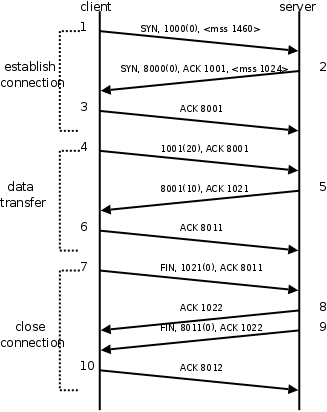
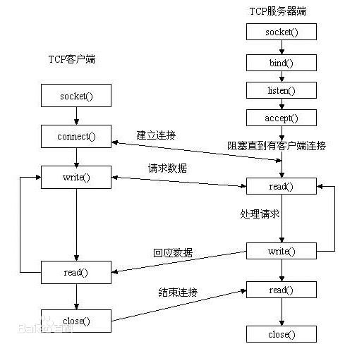

# 网络编程

## 1*基础

### 1.1协议

#### 定义

仅在A、B之间被遵守的协议称之为**原始协议**。当此协议被更多的人采用，不断的增加、改进、维护、完善。最终形成一个稳定的、完整的文件传输协议，被广泛应用于各种文件传输过程中。该协议就成为一个**标准协议**。

#### 典型协议

传输层 常见协议有TCP/UDP协议。

应用层 常见的协议有HTTP协议，FTP协议。

网络层 常见协议有IP协议、ICMP协议、IGMP协议。

网络接口层 常见协议有ARP协议、RARP协议。

TCP[传输控制协议](http://baike.baidu.com/view/544903.htm)（Transmission Control Protocol）是一种面向连接的、可靠的、基于字节流的[传输层](http://baike.baidu.com/view/239605.htm)通信协议。

UDP用户数据报协议（User Datagram Protocol）是[OSI](http://baike.baidu.com/view/113948.htm)参考模型中一种无连接的[传输层](http://baike.baidu.com/view/239605.htm)协议，提供面向事务的简单不可靠信息传送服务。

HTTP[超文本传输协议](http://baike.baidu.com/view/468465.htm)（Hyper Text Transfer Protocol）是[互联网](http://baike.baidu.com/view/6825.htm)上应用最为广泛的一种[网络协议](http://baike.baidu.com/view/16603.htm)。

FTP文件传输协议（File Transfer Protocol）

IP协议是[因特网](http://baike.baidu.com/view/1706.htm)互联协议（Internet Protocol）

ICMP协议是Internet控制[报文](http://baike.baidu.com/view/175122.htm)协议（Internet Control Message Protocol）它是[TCP/IP](http://baike.baidu.com/view/2221037.htm)[协议族](http://baike.baidu.com/view/2221037.htm)的一个子协议，用于在IP[主机](http://baike.baidu.com/view/23880.htm)、[路由](http://baike.baidu.com/view/18655.htm)器之间传递控制消息。

IGMP协议是 Internet 组管理协议（Internet Group Management Protocol），是因特网协议家族中的一个组播协议。该协议运行在主机和组播路由器之间。

[ARP](http://baike.baidu.com/view/32698.htm)协议是正向[地址解析协议](http://baike.baidu.com/view/149421.htm)（Address Resolution Protocol），通过已知的IP，寻找对应主机的[MAC](http://baike.baidu.com/view/69334.htm)[地址](http://baike.baidu.com/view/69334.htm)。

[RARP](http://baike.baidu.com/view/32772.htm)是反向地址转换协议，通过MAC地址确定IP地址。

### 1.2网络应用程序设计模式

#### C/S模式

客户机(client)/服务器(server)模式。需要在通讯两端各自部署客户机和服务器来完成数据通信。

**优点缺点：**客户端位于目标主机上可以保证性能，将数据缓存至客户端本地，从而**提高数据传输效率**。且，一般来说客户端和服务器程序由一个开发团队创作，所以他们之间**所采用的协议相对灵活**。可以在标准协议的基础上根据需求裁剪及定制。由于客户端和服务器都需要有一个开发团队来完成开发。**工作量**将成倍提升，开发周期较长。另外，从用户角度出发，需要将客户端安插至用户主机上，对用户主机的**安全性构成威胁**

#### B/S模式

浏览器()/服务器(server)模式。只需在一端部署服务器，而另外一端使用每台PC都默认配置的浏览器即可完成数据的传输。

**优点缺点：**没有独立的客户端，使用标准浏览器作为客户端，其工作**开发量较小**。只需开发服务器端即可。另外由于其采用浏览器显示数据，因此移植性非常好，**不受平台限制**。由于使用第三方浏览器，因此**网络应用支持受限**。另外，没有客户端放到对方主机上，**缓存数据不尽如人意**，从而传输数据量受到限制。应用的观感大打折扣。第三，必须与浏览器一样，采用**标准http协议**进行通信，**协议选择不灵活**。

### 1.3分层模型

#### OSI模型


1. ​	**物理层**：主要定义物理设备标准，如网线的接口类型、光纤的接口类型、各种传输介质的传输速率等。它的主要作用是传输比特流（就是由1、0转化为电流强弱来进行传输，到达目的地后再转化为1、0，也就是我们常说的数模转换与模数转换）。这一层的数据叫做**比特**。

   

2. ​	**数据链路层**：定义了如何让格式化数据以帧为单位进行传输，以及如何让控制对物理介质的访问。这一层通常还提供错误检测和纠正，以确保数据的可靠传输。如：串口通信中使用到的115200、8、N、1

   

3. ​	**网络层**：在位于不同地理位置的网络中的两个主机系统之间提供连接和路径选择。Internet的发展使得从世界各站点访问信息的用户数大大增加，而网络层正是管理这种连接的层。

   

4. ​	**传输层**：定义了一些传输数据的协议和端口号（WWW端口80等），如：TCP（传输控制协议，传输效率低，可靠性强，用于传输可靠性要求高，数据量大的数据），UDP（用户数据报协议，与TCP特性恰恰相反，用于传输可靠性要求不高，数据量小的数据，如QQ聊天数据就是通过这种方式传输的）。 主要是将从下层接收的数据进行分段和传输，到达目的地址后再进行重组。常常把这一层数据叫做**段**。

   

5. ​	**会话层**：通过传输层(端口号：传输端口与接收端口)建立数据传输的通路。主要在你的系统之间发起会话或者接受会话请求（设备之间需要互相认识可以是IP也可以是MAC或者是主机名）。

   

6. ​	**表示层**：可确保一个系统的应用层所发送的信息可以被另一个系统的应用层读取。例如，PC程序与另一台计算机进行通信，其中一台计算机使用扩展二一十进制交换码(EBCDIC)，而另一台则使用美国信息交换标准码（ASCII）来表示相同的字符。如有必要，表示层会通过使用一种通格式来实现多种数据格式之间的转换。

   

7. ​	**应用层**：是最靠近用户的OSI层。这一层为用户的应用程序（例如电子邮件、文件传输和终端仿真）提供网络服务。


#### TCP/IP模型

TCP/IP网络协议栈分为应用层（Application）、传输层（Transport）、网络层（Network）和链路层（Link）四层。


### 1.4通信过程（参考《计算机网络》）


### 1.5 TCP协议（参考《计算机网络》）




#### 半关闭及shutdown函数

当TCP链接中A发送FIN请求关闭，B端回应ACK后（A端进入FIN_WAIT_2状态），B没有立即发送FIN给A时，A方处在半链接状态，此时A可以接收B发送的数据，但是A已不能再向B发送数据。

从程序的角度，可以使用API来控制实现半连接状态。

```c
#include <sys/socket.h>

int shutdown(int sockfd, int how);

sockfd: 需要关闭的socket的描述符

how:	允许为shutdown操作选择以下几种方式:

​	SHUT_RD(0)：	关闭sockfd上的读功能，此选项将不允许sockfd进行读操作。

​					该套接字**不再接受数据**，任何当前在套接字接受缓冲区的数据将被无声的丢弃掉。

​	SHUT_WR(1):		关闭sockfd的写功能，此选项将不允许sockfd进行写操作。进程不能再对此套接字发出写操作。

​	SHUT_RDWR(2):	关闭sockfd的读写功能。相当于调用shutdown两次：首先是以SHUT_RD,然后以SHUT_WR。
```

用close中止一个连接，但它只是减少描述符的引用计数，并不直接关闭连接，只有当描述符的引用计数为0时才关闭连接。

**shutdown****不考虑描述符的引用计数，直接关闭描述符**。也可选择中止一个方向的连接，只中止读或只中止写。

注意:

1. ​	如果有多个进程共享一个套接字，close每被调用一次，计数减1，直到计数为0时，也就是所用进程都调用了close，套接字将被释放。 	

   

2. ​	在多进程中如果一个进程调用了shutdown(sfd, SHUT_RDWR)后，其它的进程将无法进行通信。但，如果一个进程close(sfd)将不会影响到其它进程。

#### 2MSL

##### 端口复用

在server的TCP连接没有完全断开之前不允许重新监听是不合理的。因为TCP连接没有完全断开指的是connfd（127.0.0.1:6666）没有完全断开，而我们重新监听的是listenfd（0.0.0.0:6666），虽然是占用同一个端口，但IP地址不同，connfd对应的是与某个客户端通讯的一个具体的IP地址，而listenfd对应的是wildcard address。解决这个问题的方法是使用setsockopt()设置socket描述符的选项SO_REUSEADDR为1，表示允许创建端口号相同但IP地址不同的多个socket描述符。

在server代码的socket()和bind()调用之间插入如下代码：

​	int opt = 1;

​	setsockopt(listenfd, SOL_SOCKET, SO_REUSEADDR, &opt, sizeof(opt));

## 2*socket编程

### 2.1基础知识

#### 套接字概念

在TCP/IP协议中，“IP地址+TCP或UDP端口号”唯一标识网络通讯中的一个进程。“IP地址+端口号”就对应一个socket。欲建立连接的两个进程各自有一个socket来标识，那么这两个socket组成的socket pair就唯一标识一个连接。因此可以用Socket来描述网络连接的一对一关系。


<font color="#dd0000">**网络通信中，套接字一定是成对出现的（成对指的是C和S端，不是指的是单端的发送与接受端）**</font>

#### 网络字节序(端口号）

> - 大端字节序：高位字节在前，低位字节在后，这是人类读写数值的方法。
> - 小端字节序：低位字节在前，高位字节在后，即以`0x1122`形式储存。

网络数据流的地址这样规定：先发出的数据是低地址，后发出的数据是高地址

调用以下库函数做**网络字节序和主机字节序的转换**。

```c
\#include <arpa/inet.h>

uint32_t htonl(uint32_t hostlong);//主机字节序转到网络字节序，转的是32位ip地址  ff.ss.aa.bb,实际是ip地址的主机字节序转为网络字节序

uint16_t htons(uint16_t hostshort);//主机字节序转到网络字节序，转的是16位的端口号，实际是port地址的主机字节序转为网络字节序

uint32_t ntohl(uint32_t netlong);

uint16_t ntohs(uint16_t netshort);
//h表示host，n表示network，l表示32位长整数，s表示16位短整数。

```

####  IP地址转换函数

```c
#include <arpa/inet.h>
	int inet_pton(int af, const char *src, void *dst);//ip地址转化为网络字节序
	const char *inet_ntop(int af, const void *src, char *dst, socklen_t size);//网络字节序转化为ip地址

支持IPv4和IPv6：int af有两个参数，ipv4和ipv6（AF_INEF/AF_INEF6）
src：源地址；  dst：目标地址；  size：缓冲区的大小
```

####  sockaddr数据结构

```c
struct sockaddr_in addr;
addr.sin_family=AF_INET/AF_INET6
    addr.sin_port=htons(3333);//设定端口号
addr.sin_addr.s_addr=htonl(INADDR_ANY);//宏定义取出系统中有效的ip地址（二进制整型）
bind(fd,(struct sockadddr*)&addr,size);//绑定端口
```

### 2.2网络套接字函数

#### socket模型创建流程图



**<font color="#dd0000">一个C/S模型只有三个socket套接字</font>** 

#### socket函数

```c
//创建socket
#include <sys/socket.h>
int socket(int domain, int type, int protocol);//创建套接字
domain:
	AF_INET 这是大多数用来产生socket的协议，使用TCP或UDP来传输，用IPv4的地址
	AF_INET6 与上面类似，不过是来用IPv6的地址
	AF_UNIX 本地协议，使用在Unix和Linux系统上，一般都是当客户端和服务器在同一台及其上的时候使用
type:
	SOCK_STREAM 这个协议是按照顺序的、可靠的、数据完整的基于字节流的连接。这是一个使用最多的socket类型，这个socket是使用TCP来进行传输。
	SOCK_DGRAM 这个协议是无连接的、固定长度的传输调用。该协议是不可靠的，使用UDP来进行它的连接。
protocol:
	传0 表示使用默认协议。
返回值：
	成功：返回指向新创建的socket的文件描述符，失败：返回-1，设置errno
```

**<font color="#dd0000">特别注意：返回值是新创建的socket的文件描述符</font>** 

#### bind函数

```c
//绑定服务器地址结构
#include <sys/socket.h>
#include <arpa/inet.h>
int bind(int sockfd, const struct sockaddr *addr, socklen_t addrlen);
sockfd：
	socket文件描述符//就是socket函数所返回的值
addr:
	构造出IP地址加端口号
addrlen:
	sizeof(addr)长度
返回值：
	成功返回0，失败返回-1, 设置errno
```

#### listen函数

```c
//最大同时连接服务器的数量 设置监听上限
int listen(int sockfd, int backlog);
sockfd:
	socket文件描述符
backlog:
	排队建立3次握手队列和刚刚建立3次握手队列的链接数和，最多允许有backlog个客户端处于连接待状态
        成功返回0，失败返回-1
```

#### accept函数

```c
//阻塞等待客户端发起链接
int accept(int sockfd, struct sockaddr *addr, socklen_t *addrlen);
sockfd: 
	socket文件描述符//老的---由socket函数所创建的socket套接字
addr:
	传出参数，返回“成功与服务器建立链接的那个客户端的地址信息”，含IP地址和端口号
addrlen:
	传入传出参数（值-结果）,传入sizeof(addr)大小，函数返回时返回真正接收到地址结构体的大小
返回值：
	成功返回一个新的socket文件描述符，用于和客户端通信，失败返回-1，设置errno
```

#### connect函数

```c
int connect(int sockfd, const struct sockaddr *addr, socklen_t addrlen);
sockdf:
	socket文件描述符
addr:
	传入参数，指定服务器端地址信息，含IP地址和端口号
addrlen:
	传入参数,传入sizeof(addr)大小
返回值：
	成功返回0，失败返回-1，设置errno
```

### 2.3 C/S模型-TCP


#### sever端

```c
 #include <stdio.h>
#include <stdlib.h>
#include <string.h>
#include <unistd.h>
#include <sys/socket.h>
#include <netinet/in.h>
#include <arpa/inet.h>
#define SERV_PORT 9527

void sys_err(const char* arg)//判定出错的函数
{
    perror(arg);
    exit(1);
}
void main(int argc,char*argv[])
{
    int sld,cld;
    int ret,n;
    char buf[BUFSIZ],cli_ip[1024];
    sld=socket(AF_INET,SOCK_STREAM,0);//创建socket
    if(sld==-1)
    {
        sys_err("socket error");
    }
    
    socklen_t cli_addr_len;//后面用来接受cli_addr的大小
   
    struct sockaddr_in sev_addr,cli_addr;
    sev_addr.sin_family=AF_INET;
    sev_addr.sin_port=htons(SERV_PORT);
    sev_addr.sin_addr.s_addr=htonl(INADDR_ANY);
    
    ret=bind(sld,(struct socketaddr*)&sev_addr,sizeof(sev_addr));
     if(ret==-1)
    {
        sys_err("ret error");
    }
    
    listen(sld,128);
    
    cli_addr_len=sizeof(cli_addr);
    cld=accept(sld,(struct socketaddr*)&cli_addr,&cli_addr_len);
    
    //固定方法，直接copy
   printf("client ip%s--------port=%d\n",inet_ntop(AF_INET,&cli_addr.sin_addr.s_addr,cli_ip,sizeof(cli_ip)),ntohs(cli_addr.sin_port));
    if(cld==-1)
    {
        sys_err("socket error");
    }
    
    //服务器具体工作(包含系统编程的相关命令)
    while(1){
    n=read(cld,buf,sizeof(buf));
    write(STDOUT_FILENO,buf,n);
        for(int i=0;i<n;i++)
        {
            buf[i]=toupper(buf[i]);
        }
         write(cld,buf,n);

    }
    
    //切记关闭套接字
    close(sld);
    close(cld);
}
        
```

#### client端

```c
#include <stdio.h>
#include <stdlib.h>
#include <string.h>
#include <unistd.h>
#include <sys/socket.h>
#include <netinet/in.h>
#include <arpa/inet.h>
#define SEV_PORT 8888
void sys_err(const char* arg)
{
    perror(arg);
    exit(1);

}
void main(int argc,char*argv[])
{
    int cld;
    int counter=10;
    char buf[BUFSIZ];
    
    struct sockaddr_in sev_addr;//服务器地址结构
    sev_addr.sin_family=AF_INET;
    sev_addr.sin_port=htons(SEV_PORT);
    inet_pton(AF_INET,"127.0.0.1",&sev_addr.sin_addr.s_addr);//利用该函数中的传出参数获得所需的ip地址
   
    cld=socket(AF_INET,SOCK_STREAM,0);
    if(cld==-1)
    {
        sys_err("socket error");
    }
    
    int ret=connect(cld,(struct socketaddr*)&sev_addr,sizeof(sev_addr));
      if(ret!=0)
    {
        sys_err("socket error");
    }
    
    while(--counter)
    {

        write(cld,"hello",5);
        ret=read(cld,buf,sizeof(buf));
        write(STDOUT_FILENO,buf,ret);
    }
    close(cld);
    return 0;
}
```

```c
//客户端键盘输入，服务器返回数据版本
#include <stdio.h>
#include <stdlib.h>
#include <string.h>
#include <unistd.h>
#include <sys/socket.h>
#include <netinet/in.h>
#include <arpa/inet.h>
#define SEV_PORT 9527
void sys_err(const char* arg)
{
    perror(arg);
    exit(1);

}
int main(int argc,char*argv[])
{
    int cld;
    int counter=10;
    char buf[BUFSIZ];
    char buff[1024];
    struct sockaddr_in sev_addr;//服务器地址结构
    sev_addr.sin_family=AF_INET;
    sev_addr.sin_port=htons(SEV_PORT);
    inet_pton(AF_INET,"127.0.0.1",&sev_addr.sin_addr.s_addr);//利用该函数中的传出参数获得所需的ip>地址
    cld=socket(AF_INET,SOCK_STREAM,0);
    if(cld==-1)
    {
        sys_err("socket error");
    }
    int ret=connect(cld,(struct socketaddr*)&sev_addr,sizeof(sev_addr));
      if(ret!=0)
    {
        sys_err("socket error");
    }
    while(--counter)
    {
         int n=read(STDIN_FILENO,buff,sizeof(buff));
        write(cld,buff,n);
        ret=read(cld,buf,sizeof(buf));
        write(STDOUT_FILENO,buf,ret);
    }
    close(cld);
    return 0;
}
~              
```

### **2.4 出错处理函数封装

**封装目的：**在server.c编程过程中突出逻辑，将出错处理与逻辑分开，直接跳到man手册

```c
//wrap.c
存放网络通信相关常用，自定义函数
    命名方式是系统调用函数首字母大写
    函数功能 调用系统调用函数，处理出错场景
    在server和client函数调用，联合编译生成对应的可执行文件
    
    //以及readn，readline封装思想
  
#include <stdlib.h>
#include <stdio.h>
#include <unistd.h>
#include <errno.h>
#include <sys/socket.h>

void perr_exit(const char *s)
{
	perror(s);
	exit(-1);
}

int Accept(int fd, struct sockaddr *sa, socklen_t *salenptr)
{
	int n;
again:
	if ((n = accept(fd, sa, salenptr)) < 0) {
		if ((errno == ECONNABORTED) || (errno == EINTR))
			goto again;
		else
			perr_exit("accept error");
	}
	return n;
}

int Bind(int fd, const struct sockaddr *sa, socklen_t salen)
{
    int n;

	if ((n = bind(fd, sa, salen)) < 0)
		perr_exit("bind error");

    return n;
}

int Connect(int fd, const struct sockaddr *sa, socklen_t salen)
{
    int n;
    n = connect(fd, sa, salen);
	if (n < 0) {
		perr_exit("connect error");
    }

    return n;
}

int Listen(int fd, int backlog)
{
    int n;

	if ((n = listen(fd, backlog)) < 0)
		perr_exit("listen error");

    return n;
}

int Socket(int family, int type, int protocol)
{
	int n;

	if ((n = socket(family, type, protocol)) < 0)
		perr_exit("socket error");

	return n;
}

ssize_t Read(int fd, void *ptr, size_t nbytes)
{
	ssize_t n;

again:
	if ( (n = read(fd, ptr, nbytes)) == -1) {
		if (errno == EINTR)
			goto again;
		else
			return -1;
	}

	return n;
}

ssize_t Write(int fd, const void *ptr, size_t nbytes)
{
	ssize_t n;

again:
	if ((n = write(fd, ptr, nbytes)) == -1) {
		if (errno == EINTR)
			goto again;
		else
			return -1;
	}
	return n;
}

int Close(int fd)
{
    int n;
	if ((n = close(fd)) == -1)
		perr_exit("close error");

    return n;
}

/*参三: 应该读取的字节数*/                          //socket 4096  readn(cfd, buf, 4096)   nleft = 4096-1500
ssize_t Readn(int fd, void *vptr, size_t n)
{
	size_t  nleft;              //usigned int 剩余未读取的字节数
	ssize_t nread;              //int 实际读到的字节数
	char   *ptr;

	ptr = vptr;
	nleft = n;                  //n 未读取字节数

	while (nleft > 0) {
		if ((nread = read(fd, ptr, nleft)) < 0) {
			if (errno == EINTR)
				nread = 0;
			else
				return -1;
		} else if (nread == 0)
			break;

		nleft -= nread;   //nleft = nleft - nread 
		ptr += nread;
	}
	return n - nleft;
}

ssize_t Writen(int fd, const void *vptr, size_t n)
{
	size_t nleft;
	ssize_t nwritten;
	const char *ptr;

	ptr = vptr;
	nleft = n;
	while (nleft > 0) {
		if ( (nwritten = write(fd, ptr, nleft)) <= 0) {
			if (nwritten < 0 && errno == EINTR)
				nwritten = 0;
			else
				return -1;
		}
		nleft -= nwritten;
		ptr += nwritten;
	}
	return n;
}

static ssize_t my_read(int fd, char *ptr)
{
	static int read_cnt;
	static char *read_ptr;
	static char read_buf[100];

	if (read_cnt <= 0) {
again:
		if ( (read_cnt = read(fd, read_buf, sizeof(read_buf))) < 0) {   //"hello\n"
			if (errno == EINTR)
				goto again;
			return -1;
		} else if (read_cnt == 0)
			return 0;

		read_ptr = read_buf;
	}
	read_cnt--;
	*ptr = *read_ptr++;

	return 1;
}

/*readline --- fgets*/    
//传出参数 vptr
ssize_t Readline(int fd, void *vptr, size_t maxlen)
{
	ssize_t n, rc;
	char    c, *ptr;
	ptr = vptr;

	for (n = 1; n < maxlen; n++) {
		if ((rc = my_read(fd, &c)) == 1) {   //ptr[] = hello\n
			*ptr++ = c;
			if (c == '\n')
				break;
		} else if (rc == 0) {
			*ptr = 0;
			return n-1;
		} else
			return -1;
	}
	*ptr = 0;

	return n;
}
```

```c
//warp.h
存放网络通信相关的常用，自定义函数声明

#ifndef __WRAP_H_
#define __WRAP_H_

void perr_exit(const char *s);
int Accept(int fd, struct sockaddr *sa, socklen_t *salenptr);
int Bind(int fd, const struct sockaddr *sa, socklen_t salen);
int Connect(int fd, const struct sockaddr *sa, socklen_t salen);
int Listen(int fd, int backlog);
int Socket(int family, int type, int protocol);
ssize_t Read(int fd, void *ptr, size_t nbytes);
ssize_t Write(int fd, const void *ptr, size_t nbytes);
int Close(int fd);
ssize_t Readn(int fd, void *vptr, size_t n);
ssize_t Writen(int fd, const void *vptr, size_t n);
ssize_t my_read(int fd, char *ptr);
ssize_t Readline(int fd, void *vptr, size_t maxlen);

#endif
```

## 3*高并发服务器

### 3.1多进程并发服务器

使用多进程并发服务器考虑以下几点：

1.父进程最大文件描述个数(父进程中需要close关闭accept返回的新文件描述符)

2.系统内创建进程个数(与内存大小相关)

3.进程创建过多是否降低整体服务性能(进程调度)

#### demo

```c
#include <stdio.h>
#include <stdlib.h>
#include <string.h>
#include <strings.h>
#include <unistd.h>
#include <sys/socket.h>
#include <netinet/in.h>
#include <arpa/inet.h>
#include <ctype.h>
#include <sys/wait.h>

#include "wrap.h"
#define SRV_PORT 9999


void catch_child(int signum)
{
    while((waitpid(0,NULL,WNOHANG))>0);
    return;

}

int main(int argc,char*argv[])
{
    int lfd,cfd;
    struct sockaddr_in srv_addr,clt_addr;
    socklen_t  clt_addr_len;
    int ret,i;
    char buf[BUFSIZ];
    
    
    bzero(&srv_addr,sizeof(srv_addr));
    srv_addr.sin_family=AF_INET;
    srv_addr.sin_port=htons(SRV_PORT);
    srv_addr.sin_addr.s_addr=htonl(INADDR_ANY);
    
    lfd=Socket(AF_INET,SOCK_STREAM,0);
    Bind(lfd,(struct sockaddr*)&srv_addr,sizeof(srv_addr));
    Listen(lfd,128);
    
    clt_addr_len=sizeof(clt_addr);
    
    //循环创建多个子进程
    while(1)
    {
        cfd=Accept(lfd,(struct sockaddr*)&clt_addr,&clt_addr_len);
        pid=fork();
        if(pid<0)
        {
            perr_exit("fork error");
        }
        else if(pid==0)
        {
            close(lfd);//子进程只需要cfd执行与客户端进行数据交互
            break;//直接跳出循环，执行循环外的代码
        }
        else//父进程
        {
            struct sigaction act;
            act.sa_handler=catch_child;//这里指明了信号回调函数
            sigemptyset(&act.sa_mask);
            act.sa_flags=0;
            ret=sigaction(SIGCHLD,&act,NULL);
            if(ret!=0)
            {
                perr_exit("sig error");
            }
            close(cfd);
        }
    }
    
    //服务端执行的操作
    while(1)
    {
        if(pid==0)//跳出循环后执行的代码
       {
           ret=Read(cfd,buf,sizeof(buf));
          if(ret==0)//读到0，表示client端已经关闭
          {
            close(cfd);
            exit(1);
          }
        
        for(i=0;i<ret;i++)
        {
            buf[i]=toupper(buf[i]);
        }
        write(cfd,buf,ret);
        write(STDOUT_FILENO,buf,ret);
      }
    }
    
    retrurn 0;
}
```

#### 多进程服务器测试ip地址调整

参考b站视频

#### 服务器程序上传外网服务器并访问

参考b站视频

### 3.2多线程并发服务器

#### demo

```c
#include <stdio.h>
#include <stdlib.h>
#include <string.h>
#include <strings.h>
#include <unistd.h>
#include <sys/socket.h>
#include <netinet/in.h>
#include <arpa/inet.h>
#include <ctype.h>
#include <sys/wait.h>
#include <pthread.h>
#include "wrap.h"
#define SRV_PORT 8200
#define MAX

struct s_info{
    struct sockaddr_in cliaddr;
    int cfd;
};
void *do_work(void*arg)
{
    int n,i;
    struct s_info *ts=(struct s_info*)arg;
    char buf[BUFSIZE];
    char str[INET_ADDRSTRLEN];
    
    while(1){
        n=Read(ts->cfd,buf,MAX)；
            if(n==0)
            {
                printf("the other side closed\n");
                break;
            }
        
        //固定写法
        printf("received form %s at port %d\n",inet_ntop(AF_INET,&(*ts).cliaddr.sin_addr,str,sizeof(str)),ntohs(*ts).cliaddr.sin_port);
    
        for(i=0;i<n;i++)
        {
            buf[i]=toupper(buf[i]);
        }
        write(ts->cfd,buf,n);
    }
    close(ts->cfd);
}

int main(int argc,char*argv[])
{
    struct sockaddr_in srv_addr,cli_addr;
    socklen_t cli_addr_len;
    int lfd,cfd;
    //定义线程变量
    pthread_t tid;
    struct s_info ts[256];
    int i=0;
    
    lfd=Socket(AF_INET,SOCK_STREAM,0);//返回监听端口号
    
    bzero(&srv_addr,sizeof(srv_addr));
    srv_addr.sin_family=AF_INET;
    srv_addr.sin_port=htons(SRV_PORT);
    srv_addr.sin_addr.s_addr=htonl(INADDR_ANY);
    
    cfd=Bind(lfd,(struct sockaddr*)&srv_addr,sizeof(srv_addr));
    listen(lfd,128);
    printf("Accepting connections ...\n");
    
    while(1)
    {
        cli_addr_len=sizeof(cli_addr);
        cfd=Accept(lfd,(struct sockaddr*)&cfd,&cli_addr_len);
        ts[i].cliaddr=cli_addr;
        ts[i].cfd=cfd;
        
        pthread_create(&tid,NULL,do_work,(void*)&ts[i]);
        i++;
    }
    return 0;
}
```

#### read函数返回值

1.  大于0，实际读到的字节数
2. =0，已经读到结尾，（读到文件、管道、socket 末尾---对端已经关闭）
3. -1，

​             1 error=ENTER 慢速系统调用被中断

​              2 error==EAGAIN (EWOULDBLOCK)非阻塞方式读，且没有数据到达

​              3 error==“其他情况” 异常

### 3.3 多路I/O转接服务器

#### slect函数

```c
#include <sys/select.h>
/* According to earlier standards */
#include <sys/time.h>
#include <sys/types.h>
#include <unistd.h>
int select(int nfds, fd_set *readfds, fd_set *writefds,
			fd_set *exceptfds, struct timeval *timeout);

	nfds: 		监控的文件描述符集里最大文件描述符加1，因为此参数会告诉内核检测前多少个文件描述符的状态
	readfds：	监控有读数据到达文件描述符集合，传入传出参数
	writefds：	监控写数据到达文件描述符集合，传入传出参数
	exceptfds：	监控异常发生达文件描述符集合,如带外数据到达异常，传入传出参数
	timeout：	定时阻塞监控时间，3种情况
				1.NULL，永远等下去
				2.设置timeval，等待固定时间
				3.设置timeval里时间均为0，检查描述字后立即返回，轮询
	struct timeval {
		long tv_sec; /* seconds */
		long tv_usec; /* microseconds */
	};
	void FD_CLR(int fd, fd_set *set); 	//把文件描述符集合里fd清0
	int FD_ISSET(int fd, fd_set *set); 	//测试文件描述符集合里fd是否置1
	void FD_SET(int fd, fd_set *set); 	//把文件描述符集合里fd位置1
	void FD_ZERO(fd_set *set); 			//把文件描述符集合里所有位清0
```

##### slect函数优缺点

**优点**：跨平台

**缺点：**监听上限受文件描述符限制，最大1024

​            检测满足条件fd，提高编码难度

##### demo

```c
//select实现多路I/O转接
#include <stdio.h>
#include <stdlib.h>
#include <string.h>
#include <strings.h>
#include <unistd.h>
#include <sys/socket.h>
#include <netinet/in.h>
#include <arpa/inet.h>
#include <ctype.h>
#include <sys/wait.h>
#include <pthread.h>
#include "wrap.h"

#define SERV_PORT 4232

int main(int argc,char*argv[])
{
    
    int lfd,cfd;                             //注：lfd是listenfd，cfd是connectfd
    char buf[BUFSIZ];
    
    struct sockaddr_in cli_addr,srv_addr;
    socklen_t cli_addr_len;
    //创建套接字
    lfd=Socket(AF_INET,SOCK_STREAM,0);
   //端口复用固定格式
    int opt=1;
    setsockopt(lfd,SOL_SOCKET,SO_REUSEADDR,&opt,sizeof(opt));
    //创建bind对应结构体
    bzero(&srv_addr,sizeof(srv_addr));
    srv_addr.sin_family=AF_INET;
    srv_addr.sin_port=htons(SERV_PORT);
    srv_addr.sin_addr.s_addr=htonl(INADDR_ANY);
    Bind(lfd,(struct sockaddr*)&srv_addr,sizeof(srv_addr));
    //设置监听上限
    Listen(lfd,128);
    
    int i,j,n,ret;
    int maxfd=0;
    fd_set rset,allset;
    maxfd=lfd;//描述最大文件描述符
    //清空集合和将监听fd添加到集合
    FD_ZERO(&allset);
    FD_SET(lfd,&allset);
    
    while(1){
        //开辟监听select函数
        rset=allset;
        ret=select(maxfd+1,&rset,NULL,NULL,NULL);
        if(ret<0)
        {
            perr_exit("select error");
        }
        //判断lfd在rset集合里面
        if(FD_ISSET(lfd,&rset))
        {
            //在，就执行accept函数，accept不会阻塞
            cli_addr_len=sizeof(cli_addr);
            cfd=Accept(lfd,(struct sockaddr*)&cli_addr,&cli_addr_len);
            //判断cfd在allset里面没，
            FD_SET(cfd,&allset);
            //修改maxfd
            if(maxfd<cfd)
                maxfd=cfd;
            //说明select只返回一个，并且是lfd，后续无法执行
            if(ret==1)
                continue;
  }
        //读取读事件fd
            for(i=lfd+1;i<=maxfd;i++)
            {
                //找到满足读事件的fd
                if(FD_ISSET(i,&rset))
                {
                    n=Read(i,buf,sizeof(buf));
                    if(n==0)//检测客户端已经关闭
                    {//关闭自己端口，并移出监听集合
                        Close(i);
                        FD_CLR(i,&allset);
                    }
                    else if(n==-1)
                    {
                            perr_exit("read error");
                    }
                    //具体执行对应的读事件
                    for(j=0;j<n;j++)
                            buf[j]=toupper(buf[j]);

                    write(i,buf,n);
                    write(STDOUT_FILENO,buf,n);

                }
          
        }
    }
    close(lfd);
    return 0;
}
```

##### demo高版本

```c
int main(int argc, char *argv[])
{
	int i, maxi, maxfd, listenfd, connfd, sockfd;
	int nready, client[FD_SETSIZE]; 	/* FD_SETSIZE 默认为 1024 */
	ssize_t n;
	fd_set rset, allset;
	char buf[MAXLINE];
	char str[INET_ADDRSTRLEN]; 			/* #define INET_ADDRSTRLEN 16 */
	socklen_t cliaddr_len;
	struct sockaddr_in cliaddr, servaddr;

	listenfd = Socket(AF_INET, SOCK_STREAM, 0);

bzero(&servaddr, sizeof(servaddr));
servaddr.sin_family = AF_INET;
servaddr.sin_addr.s_addr = htonl(INADDR_ANY);
servaddr.sin_port = htons(SERV_PORT);

Bind(listenfd, (struct sockaddr *)&servaddr, sizeof(servaddr));

Listen(listenfd, 20); 		/* 默认最大128 */

maxfd = listenfd; 			/* 初始化 */
maxi = -1;					/* client[]的下标 */

for (i = 0; i < FD_SETSIZE; i++)
	client[i] = -1; 		/* 用-1初始化client[] */

FD_ZERO(&allset);
FD_SET(listenfd, &allset); /* 构造select监控文件描述符集 */

for ( ; ; ) {
	rset = allset; 			/* 每次循环时都从新设置select监控信号集 */
	nready = select(maxfd+1, &rset, NULL, NULL, NULL);

	if (nready < 0)
		perr_exit("select error");
	if (FD_ISSET(listenfd, &rset)) { /* new client connection */
		cliaddr_len = sizeof(cliaddr);
		connfd = Accept(listenfd, (struct sockaddr *)&cliaddr, &cliaddr_len);
		printf("received from %s at PORT %d\n",
				inet_ntop(AF_INET, &cliaddr.sin_addr, str, sizeof(str)),
				ntohs(cliaddr.sin_port));
		for (i = 0; i < FD_SETSIZE; i++) {
			if (client[i] < 0) {
				client[i] = connfd; /* 保存accept返回的文件描述符到client[]里 */
				break;
			}
		}
		/* 达到select能监控的文件个数上限 1024 */
		if (i == FD_SETSIZE) {
			fputs("too many clients\n", stderr);
			exit(1);
		}

		FD_SET(connfd, &allset); 	/* 添加一个新的文件描述符到监控信号集里 */
		if (connfd > maxfd)
			maxfd = connfd; 		/* select第一个参数需要 */
		if (i > maxi)
			maxi = i; 				/* 更新client[]最大下标值 */

		if (--nready == 0)
			continue; 				/* 如果没有更多的就绪文件描述符继续回到上面select阻塞监听,
										负责处理未处理完的就绪文件描述符 */
		}
		for (i = 0; i <= maxi; i++) { 	/* 检测哪个clients 有数据就绪 */
			if ( (sockfd = client[i]) < 0)
				continue;
			if (FD_ISSET(sockfd, &rset)) {
				if ( (n = Read(sockfd, buf, MAXLINE)) == 0) {
					Close(sockfd);		/* 当client关闭链接时，服务器端也关闭对应链接 */
					FD_CLR(sockfd, &allset); /* 解除select监控此文件描述符 */
					client[i] = -1;
				} else {
					int j;
					for (j = 0; j < n; j++)
						buf[j] = toupper(buf[j]);
					Write(sockfd, buf, n);
				}
				if (--nready == 0)
					break;
			}
		}
	}
	close(listenfd);
	return 0;
}
```

#### poll函数

##### 

```c
#include <poll.h>
int poll(struct pollfd *fds, nfds_t nfds, int timeout);
	struct pollfd {
		int fd; /* 文件描述符 */
		short events; /* 监控的事件 */
		short revents; /* 监控事件中满足条件返回的事件 */
	};
	POLLIN			普通或带外优先数据可读,即POLLRDNORM | POLLRDBAND
	POLLRDNORM		数据可读
	POLLRDBAND		优先级带数据可读
	POLLPRI 		高优先级可读数据
	POLLOUT		普通或带外数据可写
	POLLWRNORM		数据可写
	POLLWRBAND		优先级带数据可写
	POLLERR 		发生错误
	POLLHUP 		发生挂起
	POLLNVAL 		描述字不是一个打开的文件

    fds               监听的文件描述符【数组】
	nfds 			监控数组中有多少文件描述符需要被监控

	timeout 		毫秒级等待
		-1：阻塞等，#define INFTIM -1 				Linux中没有定义此宏
		0：立即返回，不阻塞进程
		>0：等待指定毫秒数，如当前系统时间精度不够毫秒，向上取值
```

##### poll优缺点

自带数组 可将监听事件集合和返回事件集合分离 拓展监听上限

无法跨平台 无法直接定位满足监听事件的文件描述符

##### demo

```c
#include <stdio.h>
#include <stdlib.h>
#include <string.h>
#include <netinet/in.h>
#include <arpa/inet.h>
#include <poll.h>
#include <errno.h>
#include "wrap.h"

#define MAXLINE 80
#define SERV_PORT 6666
#define OPEN_MAX 1024

int main(int argc, char *argv[])
{
	int i, j, maxi, listenfd, connfd, sockfd;
	int nready;
	ssize_t n;
	char buf[MAXLINE], str[INET_ADDRSTRLEN];
	socklen_t clilen;
	struct pollfd client[OPEN_MAX];
	struct sockaddr_in cliaddr, servaddr;

	listenfd = Socket(AF_INET, SOCK_STREAM, 0);

	bzero(&servaddr, sizeof(servaddr));
	servaddr.sin_family = AF_INET;
	servaddr.sin_addr.s_addr = htonl(INADDR_ANY);
	servaddr.sin_port = htons(SERV_PORT);

	Bind(listenfd, (struct sockaddr *)&servaddr, sizeof(servaddr));

	Listen(listenfd, 20);

	client[0].fd = listenfd;
	client[0].events = POLLRDNORM; 					/* listenfd监听普通读事件 */

	for (i = 1; i < OPEN_MAX; i++)
		client[i].fd = -1; 							/* 用-1初始化client[]里剩下元素 */
	maxi = 0; 										/* client[]数组有效元素中最大元素下标 */

	for ( ; ; ) {
		nready = poll(client, maxi+1, -1); 			/* 阻塞 */
		if (client[0].revents & POLLRDNORM) { 		/* 有客户端链接请求 */
			clilen = sizeof(cliaddr);
			connfd = Accept(listenfd, (struct sockaddr *)&cliaddr, &clilen);
			printf("received from %s at PORT %d\n",
					inet_ntop(AF_INET, &cliaddr.sin_addr, str, sizeof(str)),
					ntohs(cliaddr.sin_port));
			for (i = 1; i < OPEN_MAX; i++) {
				if (client[i].fd < 0) {
					client[i].fd = connfd; 	/* 找到client[]中空闲的位置，存放accept返回的connfd */
					break;
				}
			}

			if (i == OPEN_MAX)
				perr_exit("too many clients");

			client[i].events = POLLRDNORM; 		/* 设置刚刚返回的connfd，监控读事件 */
			if (i > maxi)
				maxi = i; 						/* 更新client[]中最大元素下标 */
			if (--nready <= 0)
				continue; 						/* 没有更多就绪事件时,继续回到poll阻塞 */
		}
		for (i = 1; i <= maxi; i++) { 			/* 检测client[] */
			if ((sockfd = client[i].fd) < 0)
				continue;
			if (client[i].revents & (POLLRDNORM | POLLERR)) {
				if ((n = Read(sockfd, buf, MAXLINE)) < 0) {
					if (errno == ECONNRESET) { /* 当收到 RST标志时 */
						/* connection reset by client */
						printf("client[%d] aborted connection\n", i);
						Close(sockfd);
						client[i].fd = -1;
					} else {
						perr_exit("read error");
					}
				} else if (n == 0) {
					/* connection closed by client */
					printf("client[%d] closed connection\n", i);
					Close(sockfd);
					client[i].fd = -1;
				} else {
					for (j = 0; j < n; j++)
						buf[j] = toupper(buf[j]);
						Writen(sockfd, buf, n);
				}
				if (--nready <= 0)
					break; 				/* no more readable descriptors */
			}
		}
	}
	return 0;
}
```

##### 突破1024文件描述符限制

cat /proc/sys/fs/file-max   当前计算机所能打开的最大文件个数u 受硬件影响

ulimit -a  当前用户下的进程 默认打开文件描述符个数 缺省为1024

修改：

​    打开 sudo vi /etc/security/limits.conf  写入

    * *soft nofile 32323  设置默认值 可以直接使用命令修改（ulimit -n 3000)
    * *hard nofile 100000 命令修改的上限

#### epoll函数

##### epoll_create函数

创建epoll句柄 

```c
#include <sys/epoll.h>
	int epoll_create(int size)		size：监听数目
        参数size 用来告诉内核监听的文件描述符的个数 跟内存大小有关
```

##### **epoll_ctl函数**

控制某个epoll监控的文件描述符上的事件：注册、修改、删除

```c
#include <sys/epoll.h>
	int epoll_ctl(int epfd, int op, int fd, struct epoll_event *event)
		epfd：	为epoll_creat的句柄
		op：		表示动作，用3个宏来表示：
			EPOLL_CTL_ADD (注册新的fd到epfd)，
			EPOLL_CTL_MOD (修改已经注册的fd的监听事件)，
			EPOLL_CTL_DEL (从epfd删除一个fd)；
		event：	告诉内核需要监听的事件//需要定义

		struct epoll_event {
			__uint32_t events; /* Epoll events *///见下面解释
			epoll_data_t data; /* User data variable */
		};
		typedef union epoll_data {
			void *ptr;
			int fd;//目前只关注这个参数
			uint32_t u32;
			uint64_t u64;
		} epoll_data_t;

//events事件参数
		//EPOLLIN ：	表示对应的文件描述符可以读（包括对端SOCKET正常关闭）
		//EPOLLOUT：	表示对应的文件描述符可以写
		EPOLLPRI：	表示对应的文件描述符有紧急的数据可读（这里应该表示有带外数据到来）
		//EPOLLERR：	表示对应的文件描述符发生错误
		EPOLLHUP：	表示对应的文件描述符被挂断；
		EPOLLET： 	将EPOLL设为边缘触发(Edge Triggered)模式，这是相对于水平触发(Level Triggered)而言的
		EPOLLONESHOT：只监听一次事件，当监听完这次事件之后，如果还需要继续监听这个socket的话，需要再次把这个socket加入到EPOLL队列里
```

##### **epoll_wait函数**

待所监控文件描述符上有事件的产生，类似于select()调用

```c
#include <sys/epoll.h>
	int epoll_wait(int epfd, struct epoll_event *events, int maxevents, int timeout)
		events：		传出参数【数组】满足监听条件的那些fd结构体 用来存内核得到事件的集合，
		maxevents：	告之内核这个events有多大，这个maxevents的值不能大于创建epoll_create()时的size，
		timeout：	是超时时间
			-1：	阻塞
			0：	立即返回，非阻塞
			>0：	指定毫秒
		返回值：	成功返回有多少文件描述符就绪，时间到时返回0，出错返回-1
```

##### demo

```c
#include <stdio.h>
#include <stdlib.h>
#include <string.h>
#include <netinet/in.h>
#include <arpa/inet.h>
#include <sys/epoll.h>
#include <errno.h>
#include "wrap.h"

#define MAXLINE 8192
#define SERV_PORT 8888
#define OPEN_MAX 5000

int main(int argc,char *argv[])
{
    int i,lfd,cfd,sockfd;
    int n,num=0;
    ssize_t ret,efd,res;
    char buf[MAXLINE],str[INET_ADDRSTRLEN];
    socklen_t cli_addr_len;
    
    struct sockaddr_in cli_addr,srv_addr;
    struct epoll_event tep,ep[OPEN_MAX];
    
    lfd=Socket(AF_INET,SOCK_STREAM,0);
    
    int opt=1;
    setsockopt(lfd,SOL_SOCKET,SO_REUSEADDR,&opt,sizeof(opt));
    
    bzero(&srv_addr,sizeof(srv_addr));
    srv_addr.sin_family=AF_INET;
    srv_addr.sin_port=htons(SERV_PORT);
    srv_addr.sin_addr.s_addr=htonl(INADDR_ANY);
    
    Bind(lfd,(struct sockaddr*)&srv_addr,sizeof(srv_addr));
    Listen(lfd,128);
    //创建对应epoll句柄
    efd=epoll_create(OPEN_MAX);
    if(efd==-1)
        perr_exit("epoll creat error");
    //事件初始化
    tep.events=EPOLLIN;//指定lfd的监听事件为听事件
    tep.data.fd=lfd;//将lfd及对应的结构体设置到树上，efd可找到该树
    //将lfd事件添加
    res=epoll_ctl(efd,EPOLL_CTL_ADD,lfd,&tep);
    if(res==-1)
        perr_exit("epoll ctl error");
    
    while(1){
        //
        ret=epoll_wait(efd,ep,OPEN_MAX,-1);//为server的阻塞监听事件
        if(ret==-1)
            perr_exit("epoll wait error");
        for(i=0;i<ret;i++)
        {
            if(!(ep[i].events&EPOLLIN))//不是读事件，继续循环
               continue;
               
               if(ep[i].data.fd==lfd)//判断满足事件的fd是否位lfd
	       {
                   cli_addr_len=sizeof(cli_addr);
                   cfd=Accept(lfd,(struct sockaddr*)&cli_addr,&cli_addr_len);//接受链接
                   
                   printf("received from %s at port %d\n",inet_ntop(AF_INET,&cli_addr.sin_addr,str,sizeof(str)),ntohs(cli_addr.sin_port));
                   printf("cfd %d----client %d\n",cfd,++num);
                   
                   tep.events=EPOLLIN;
                   tep.data.fd=cfd;
                   res=epoll_ctl(efd,EPOLL_CTL_ADD,cfd,&tep);//加入红黑树
                   if(res==-1)
                    	perr_exit("epoll ctl error");
               }
              else {//不是lfd
               sockfd=ep[i].data.fd;
               n=Read(sockfd,buf,MAXLINE);
               
               if(n==0)//客户端关闭链接
	       {
                   res=epoll_ctl(efd,EPOLL_CTL_DEL,sockfd,NULL);//将该文件描述符从红黑树摘除
                   if(res==-1)
                       perr_exit("epoll ctl error");
                   Close(sockfd);//关闭与客户端链接
                   printf("client [%d] closed connection\n",sockfd);
               }
        else if(n<0)//出错
	{
            perror("read n<0 error");
            res=epoll_ctl(efd,EPOLL_CTL_DEL,sockfd,NULL);//摘除节点
            Close(sockfd);
        }
        else{//实际读到字节数
                   for(i=0;i<n;i++)
                       buf[i]=toupper(buf[i]);
                       Writen(sockfd,buf,n);
            }
           }
	}
                  
    }
    Close(lfd);
    Close(efd);
     return 0;
    
}
```

#### 事件模型（epoll方向）

##### ET模型

边缘触发只有数据到来才触发，不管缓存区中是否还有数据。

如果我们在第1步将RFD添加到epoll描述符的时候使用了EPOLLET标志，那么在第5步调用epoll_wait之后将有可能会挂起，因为剩余的数据还存在于文件的输入缓冲区内，而且数据发出端还在等待一个针对已经发出数据的反馈信息。只有在监视的文件句柄上发生了某个事件的时候 ET 工作模式才会汇报事件。因此在第5步的时候，调用者可能会放弃等待仍在存在于文件输入缓冲区内的剩余数据。epoll工作在ET模式的时候，必须使用非阻塞套接口，以避免由于一个文件句柄的阻塞读/阻塞写操作把处理多个文件描述符的任务饿死。最好以下面的方式调用ET模式的epoll接口，在后面会介绍避免可能的缺陷。

1. 基于非阻塞文件句柄
2. 只有当read或者write返回EAGAIN(非阻塞读，暂时无数据)时才需要挂起、等待。但这并不是说每次read时都需要循环读，直到读到产生一个EAGAIN才认为此次事件处理完成，当read返回的读到的数据长度小于请求的数据长度时，就可以确定此时缓冲中已没有数据了，也就可以认为此事读事件已处理完成。

##### LT模型

水平触发只要有数据都会触发。

与ET模式不同的是，以LT方式调用epoll接口的时候，它就相当于一个速度比较快的poll，无论后面的数据是否被使用。

LT(level triggered)：LT是缺省的工作方式，并且同时支持block和no-block socket。在这种做法中，内核告诉你一个文件描述符是否就绪了，然后你可以对这个就绪的fd进行IO操作。如果你不作任何操作，内核还是会继续通知你的，所以，这种模式编程出错误可能性要小一点。传统的select/poll都是这种模型的代表。

ET(edge-triggered)：ET是高速工作方式，只支持no-block socket。在这种模式下，当描述符从未就绪变为就绪时，内核通过epoll告诉你。然后它会假设你知道文件描述符已经就绪，并且不会再为那个文件描述符发送更多的就绪通知。请注意，如果一直不对这个fd作IO操作(从而导致它再次变成未就绪)，内核不会发送更多的通知(only once).

##### demo ET

```c
//基于网络C/S模型的epoll ET触发模式
#include <stdio.h>
#include <string.h>
#include <netinet/in.h>
#include <arpa/inet.h>
#include <signal.h>
#include <sys/wait.h>
#include <sys/types.h>
#include <sys/epoll.h>
#include <unistd.h>

#define MAXLINE 10
#define SERV_PORT 8080

int main(void)
{
	struct sockaddr_in servaddr, cliaddr;
	socklen_t cliaddr_len;
	int listenfd, connfd;
	char buf[MAXLINE];
	char str[INET_ADDRSTRLEN];
	int i, efd;

	listenfd = socket(AF_INET, SOCK_STREAM, 0);

	bzero(&servaddr, sizeof(servaddr));
	servaddr.sin_family = AF_INET;
	servaddr.sin_addr.s_addr = htonl(INADDR_ANY);
	servaddr.sin_port = htons(SERV_PORT);

	bind(listenfd, (struct sockaddr *)&servaddr, sizeof(servaddr));

	listen(listenfd, 20);

	struct epoll_event event;
	struct epoll_event resevent[10];
	int res, len;
	efd = epoll_create(10);
	event.events = EPOLLIN | EPOLLET;		/* ET 边沿触发 ，默认是水平触发 */

	printf("Accepting connections ...\n");
	cliaddr_len = sizeof(cliaddr);
	connfd = accept(listenfd, (struct sockaddr *)&cliaddr, &cliaddr_len);
	printf("received from %s at PORT %d\n",
			inet_ntop(AF_INET, &cliaddr.sin_addr, str, sizeof(str)),
			ntohs(cliaddr.sin_port));

	event.data.fd = connfd;
	epoll_ctl(efd, EPOLL_CTL_ADD, connfd, &event);

	while (1) {
		res = epoll_wait(efd, resevent, 10, -1);
		printf("res %d\n", res);
		if (resevent[0].data.fd == connfd) {
			len = read(connfd, buf, MAXLINE/2);
			write(STDOUT_FILENO, buf, len);
		}
	}
	return 0;
}
```

##### *demo 非阻塞ET

```c
//基于网络C/S非阻塞模型的epoll ET触发模式
#include <stdio.h>
#include <string.h>
#include <netinet/in.h>
#include <arpa/inet.h>
#include <sys/wait.h>
#include <sys/types.h>
#include <sys/epoll.h>
#include <unistd.h>
#include <fcntl.h>

#define MAXLINE 10
#define SERV_PORT 8080

int main(void)
{
	struct sockaddr_in servaddr, cliaddr;
	socklen_t cliaddr_len;
	int listenfd, connfd;
	char buf[MAXLINE];
	char str[INET_ADDRSTRLEN];
	int i, efd, flag;

	listenfd = socket(AF_INET, SOCK_STREAM, 0);

	bzero(&servaddr, sizeof(servaddr));
	servaddr.sin_family = AF_INET;
	servaddr.sin_addr.s_addr = htonl(INADDR_ANY);
	servaddr.sin_port = htons(SERV_PORT);

	bind(listenfd, (struct sockaddr *)&servaddr, sizeof(servaddr));

	listen(listenfd, 20);

	struct epoll_event event;
	struct epoll_event resevent[10];
	int res, len;
	efd = epoll_create(10);
	/* event.events = EPOLLIN; */
	event.events = EPOLLIN | EPOLLET;		/* ET 边沿触发 ，默认是水平触发 */

	printf("Accepting connections ...\n");
	cliaddr_len = sizeof(cliaddr);
	connfd = accept(listenfd, (struct sockaddr *)&cliaddr, &cliaddr_len);
	printf("received from %s at PORT %d\n",
			inet_ntop(AF_INET, &cliaddr.sin_addr, str, sizeof(str)),
			ntohs(cliaddr.sin_port));
//设置为非阻塞态*****************************
	flag = fcntl(connfd, F_GETFL);
	flag |= O_NONBLOCK;
	fcntl(connfd, F_SETFL, flag);
	event.data.fd = connfd;
	epoll_ctl(efd, EPOLL_CTL_ADD, connfd, &event);

	while (1) {
		printf("epoll_wait begin\n");
		res = epoll_wait(efd, resevent, 10, -1);
		printf("epoll_wait end res %d\n", res);

		if (resevent[0].data.fd == connfd) {
			while ((len = read(connfd, buf, MAXLINE/2)) > 0)
				write(STDOUT_FILENO, buf, len);
		}
	}
	return 0;
}
```

```c
//CLIENT端
#include <stdio.h>
#include <string.h>
#include <unistd.h>
#include <netinet/in.h>

#define MAXLINE 10
#define SERV_PORT 8080

int main(int argc, char *argv[])
{
	struct sockaddr_in servaddr;
	char buf[MAXLINE];
	int sockfd, i;
	char ch = 'a';

	sockfd = socket(AF_INET, SOCK_STREAM, 0);

	bzero(&servaddr, sizeof(servaddr));
	servaddr.sin_family = AF_INET;
	inet_pton(AF_INET, "127.0.0.1", &servaddr.sin_addr);
	servaddr.sin_port = htons(SERV_PORT);

	connect(sockfd, (struct sockaddr *)&servaddr, sizeof(servaddr));

	while (1) {
		for (i = 0; i < MAXLINE/2; i++)
			buf[i] = ch;
		buf[i-1] = '\n';
		ch++;

		for (; i < MAXLINE; i++)
			buf[i] = ch;
		buf[i-1] = '\n';
		ch++;

		write(sockfd, buf, sizeof(buf));
		sleep(10);
	}
	Close(sockfd);
	return 0;
}
```

#### ***epoll反应堆

#### ctags

查看软件是否安装：

sudo aptitude show 软件名

### 3.4线程池并发服务器

```c
#include <stdlib.h>
#include <pthread.h>
#include <unistd.h>
#include <assert.h>
#include <stdio.h>
#include <string.h>
#include <signal.h>
#include <errno.h>
#include "threadpool.h"

#define DEFAULT_TIME 10   //10s检查一次
#dedine MIN_WAIT_TASK_NUM 10 
#define DEFAULT_THREAD_VARY 10 //创建与销毁线程数目
#define true 1
#define false 0

typedef struct{
    void*(*function)(void*);  //回调函数
    void*arg; //回调函数的传入参数
}threadpool_task_t;

struct threadpool_t {
    pthread_mutex_t lock; //用于锁住本结构体			
    pthread_mutex_t thread_counter;//记录忙状态线程个数的锁
    
    pthread_cond_t queue_not_full;//当前任务队列满时 添加任务的线程阻塞 等待此条件变量
    pthread_cond_t queue_not_empty;//任务队列里面不为空时 通知等待任务的线程
    
    pthread_t*threads;//存放线程池中每个线程的tid  数组
    pthread_t adjust_tid;//存管理线程tid
    threadpool_task_t *task_queue;//任务队列
    
    int min_thr_num;//线程池最小线程数
    int max_thr_num;//线程池最大线程数目
    int live_thr_num;//当前存活线程数
    int busy_thr_num;//忙状态线程个数
    int wait_exit_thr_num;//要销毁线程个数
    
    int queue_front;//task_queue队头下标
    int queue_rear;//task_queue队尾下标
    int queue_size;//task_queue实际任务数
    int queue_max_size;//task_queue队列可容纳任务数上限
    
    int shutdown;//标志位 线程池的使用状态
}
void *threadpool_thread(void *threadpool);
void *adjust_thread(void *threadpool);

int is_thread_alive(pthread_t tid);
int threadpool_free(threadpool_t *pool);

//*创建线程池
threadpool_t*threadpool_create(int min_thr_num,int max_thr_num,int queue_max_size)
{
    int i;
    threadpol_t *pool=NULL;
    do{
        //开辟空间
        if((pool=(threadpool_t*)malloc(sizeof(threadpool_t)))==NULL)『
            printf("malloc threadpool fail");
        break;//跳出do-while循环
    }
    pool->min_thr_num=min_thr_num;
    pool->max_thr_num=max_thr_num;
    pool->busy_thr_num=0;
    pool->live_thr_num = min_thr_num;//活着的线程数 初值=最小线程数
    
    
    pool->queue_size = 0;                         //初始状态有0个任务数
    pool->queue_max_size = queue_max_size;
    pool->queue_front = 0;
    pool->queue_rear = 0;
    pool->shutdown = false;         //不关闭线程池
    
    //*根据最大线程上限数，给工作线程数组开辟空间。并且清0
    pool->threads=(pthread_t*)malloc(sizeof(pthread_t)*max_thr_num);
    if(pool->threads==NULL){
        printf("malloc thread fail");
        break;
    }
    memset(pool->threads,0,sizeof(pthread_t)*max_thr_num);
    
    //为线程队列数组开辟空间
    pool->task_queue=(threadpool_task_t*)malloc(sizeof(threadpool_task_t)*queue_max_size);
    if(pool->task_queue==NULL){
        printf("malloc task_queue fail");
        break;
    }
  
    //启动min_thr_num个工作线程
    for(i=0;i<min_thr_num;i++){
        pthread_create(&(pool->threads[i]),NULL,threadpool_thread,(void*)pool)；//创建工作线程，pool指向当前线程池，回调函数
        printf("start thread 0x%x...\n",(unsigned int)pool->threads[i]);
    }
    pthread_create(&(pool->adjust_tid),NULL,adjust_thread,(void*)pool);//创建管理线程
    return pool;
}while(0);
threadpool_free(pool);//代码调用失败，释放pool存储空间
return NULL;
}


// *向线程池中 添加一个任务 
int threadpool_add(threadpool_t *pool, void*(*function)(void *arg), void *arg)
{
    pthread_mutex_lock(&(pool->lock));

    // ==为真，队列已经满， 调wait阻塞
    while ((pool->queue_size == pool->queue_max_size) && (!pool->shutdown)) {
        pthread_cond_wait(&(pool->queue_not_full), &(pool->lock));
    }
    if (pool->shutdown) {
        pthread_mutex_unlock(&(pool->lock));
    }

    // 清空 工作线程 调用的回调函数 的参数arg 
    if (pool->task_queue[pool->queue_rear].arg != NULL) {
        free(pool->task_queue[pool->queue_rear].arg);
        pool->task_queue[pool->queue_rear].arg = NULL;
    }
    //添加任务到任务队列里
    pool->task_queue[pool->queue_rear].function = function;
    pool->task_queue[pool->queue_rear].arg = arg;
    pool->queue_rear = (pool->queue_rear + 1) % pool->queue_max_size;       /* 队尾指针移动, 模拟环形 */
    pool->queue_size++;  //向任务队列中添加一个任务

    //添加完任务后，队列不为空，唤醒线程池中 等待处理任务的线程
    pthread_cond_signal(&(pool->queue_not_empty));
    pthread_mutex_unlock(&(pool->lock));

    return 0;
}


//*线程池中各工作线程
void*threadpool_thread(void*threadpool)
{
    threadpool_t *pool=(threadpool_t*)threadpool;
    threadpool_task_t task;
    while(true){
        pthread_mutex_lock(&(pool->lock));
        
        while((pool->queue_size==0)&&(!pool->shutdown)){
            printf("thread 0x%x is waiting\n", (unsigned int)pthread_self());
            pthread_cond_wait(&(pool->queue_not_empty),&(pool->lock));//这里线程池里的线程都会阻塞在这个位置
            
             /*清除指定数目的空闲线程，如果要结束的线程个数大于0，结束线程*/
            if (pool->wait_exit_thr_num > 0) {
                pool->wait_exit_thr_num--;

                /*如果线程池里线程个数大于最小值时可以结束当前线程*/
                if (pool->live_thr_num > pool->min_thr_num) {
                    printf("thread 0x%x is exiting\n", (unsigned int)pthread_self());
                    pool->live_thr_num--;
                    pthread_mutex_unlock(&(pool->lock));
                    pthread_exit(NULL);
                }
            }
        }

        //如果指定了true，要关闭线程池里的每个线程，自行退出处理
        if (pool->shutdown) {
            pthread_mutex_unlock(&(pool->lock));
            printf("thread 0x%x is exiting\n", (unsigned int)pthread_self());
            pthread_exit(NULL);     //线程自行结束
        }

        //从任务队列里获取任务, 是一个出队操作
        task.function = pool->task_queue[pool->queue_front].function;
        task.arg = pool->task_queue[pool->queue_front].arg;

        pool->queue_front = (pool->queue_front + 1) % pool->queue_max_size;      //出队，模拟环形队列
        pool->queue_size--;

        //通知可以有新的任务添加进来
        pthread_cond_broadcast(&(pool->queue_not_full));

        //任务取出后，立即将 线程池琐 释放
        pthread_mutex_unlock(&(pool->lock));

        //执行任务 
        printf("thread 0x%x start working\n", (unsigned int)pthread_self());
        pthread_mutex_lock(&(pool->thread_counter));                            //忙状态线程数变量琐
        pool->busy_thr_num++;                                                   //忙状态线程数+1
        pthread_mutex_unlock(&(pool->thread_counter));
        (*(task.function))(task.arg);                                           //执行回调函数任务
        //task.function(task.arg);                                              //执行回调函数任务

        //任务结束处理
        printf("thread 0x%x end working\n", (unsigned int)pthread_self());
        pthread_mutex_lock(&(pool->thread_counter));
        pool->busy_thr_num--;                                       //处理掉一个任务，忙状态数线程数-1
        pthread_mutex_unlock(&(pool->thread_counter));
    }

    pthread_exit(NULL);
}


//*管理者线程
void *adjust_thread(void *threadpool)
{
    int i;
    threadpool_t *pool = (threadpool_t *)threadpool;
    while (!pool->shutdown) {

        sleep(DEFAULT_TIME);                                    /*定时 对线程池管理*/

        pthread_mutex_lock(&(pool->lock));
        int queue_size = pool->queue_size;                      /* 关注 任务数 */
        int live_thr_num = pool->live_thr_num;                  /* 存活 线程数 */
        pthread_mutex_unlock(&(pool->lock));

        pthread_mutex_lock(&(pool->thread_counter));
        int busy_thr_num = pool->busy_thr_num;                  /* 忙着的线程数 */
        pthread_mutex_unlock(&(pool->thread_counter));

        /* 创建新线程 算法： 任务数大于最小线程池个数, 且存活的线程数少于最大线程个数时 如：30>=10 && 40<100*/
        if (queue_size >= MIN_WAIT_TASK_NUM && live_thr_num < pool->max_thr_num) {
            pthread_mutex_lock(&(pool->lock));  
            int add = 0;

            /*一次增加 DEFAULT_THREAD 个线程*/
            for (i = 0; i < pool->max_thr_num && add < DEFAULT_THREAD_VARY
                    && pool->live_thr_num < pool->max_thr_num; i++) {
                if (pool->threads[i] == 0 || !is_thread_alive(pool->threads[i])) {
                    pthread_create(&(pool->threads[i]), NULL, threadpool_thread, (void *)pool);
                    add++;
                    pool->live_thr_num++;
                }
            }

            pthread_mutex_unlock(&(pool->lock));
        }

        /* 销毁多余的空闲线程 算法：忙线程X2 小于 存活的线程数 且 存活的线程数 大于 最小线程数时*/
        if ((busy_thr_num * 2) < live_thr_num  &&  live_thr_num > pool->min_thr_num) {

            /* 一次销毁DEFAULT_THREAD个线程, 隨機10個即可 */
            pthread_mutex_lock(&(pool->lock));
            pool->wait_exit_thr_num = DEFAULT_THREAD_VARY;      /* 要销毁的线程数 设置为10 */
            pthread_mutex_unlock(&(pool->lock));

            for (i = 0; i < DEFAULT_THREAD_VARY; i++) {
                /* 通知处在空闲状态的线程, 他们会自行终止*/
                pthread_cond_signal(&(pool->queue_not_empty));
            }
        }
    }

    return NULL;
}


//*销毁线程
int threadpool_destroy(threadpool_t *pool)
{
    int i;
    if (pool == NULL) {
        return -1;
    }
    pool->shutdown = true;

    /*先销毁管理线程*/
    pthread_join(pool->adjust_tid, NULL);

    for (i = 0; i < pool->live_thr_num; i++) {
        /*通知所有的空闲线程*/
        pthread_cond_broadcast(&(pool->queue_not_empty));
    }
    for (i = 0; i < pool->live_thr_num; i++) {
        pthread_join(pool->threads[i], NULL);
    }
    threadpool_free(pool);

    return 0;
}
//*释放线程
int threadpool_free(threadpool_t *pool)
{
    if (pool == NULL) {
        return -1;
    }

    if (pool->task_queue) {
        free(pool->task_queue);
    }
    if (pool->threads) {
        free(pool->threads);
        pthread_mutex_lock(&(pool->lock));
        pthread_mutex_destroy(&(pool->lock));
        pthread_mutex_lock(&(pool->thread_counter));
        pthread_mutex_destroy(&(pool->thread_counter));
        pthread_cond_destroy(&(pool->queue_not_empty));
        pthread_cond_destroy(&(pool->queue_not_full));
    }
    free(pool);
    pool = NULL;

    return 0;
}

int threadpool_all_threadnum(threadpool_t *pool)
{
    int all_threadnum = -1;
    pthread_mutex_lock(&(pool->lock));
    all_threadnum = pool->live_thr_num;
    pthread_mutex_unlock(&(pool->lock));
    return all_threadnum;
}

int threadpool_busy_threadnum(threadpool_t *pool)
{
    int busy_threadnum = -1;
    pthread_mutex_lock(&(pool->thread_counter));
    busy_threadnum = pool->busy_thr_num;
    pthread_mutex_unlock(&(pool->thread_counter));
    return busy_threadnum;
}

int is_thread_alive(pthread_t tid)
{
    int kill_rc = pthread_kill(tid, 0);     //发0号信号，测试线程是否存活
    if (kill_rc == ESRCH) {
        return false;
    }

    return true;
}


//*线程池中的线程，模拟处理业务
void *process(void *arg)
{
    printf("thread 0x%x working on task %d\n ",(unsigned int)pthread_self(),*(int *)arg);
    sleep(1);
    printf("task %d is end\n",*(int *)arg);

    return NULL;
}
//*主函数
int main(void)
{
     /*threadpool_t *threadpool_create(int min_thr_num, int max_thr_num, int queue_max_size);*/
    threadpool_t *thp=threadpool_creat(3,100,100);//创建线程池
    printf("pool inited");
    //模拟任务放入server
    int num[20],i;
    for(i=0;i<20;i++){
        num[i]=i;
        printf("add task %d\n",i);
        threadpool_add(thp,process,(void*)&num[i]);//向线程池中添加任务，借助回调函数处理任务
    }
      sleep(10);//模拟主函数除去线程池相关操作外的操作
    threadpool_destroy(thp);//销毁线程池
    return 0;
}
```

### 3.5 UDP服务器

<font color="#dd0000">recv()/send()只能用于TCP通信，替代read和write函数</font> 

#### recvfrom函数

ssize_t recvfrom(int sockfd, void *buf, size_t len, int flags,struct sockaddr *src_addr, socklen_t *addrlen);

​                                     lfd       缓冲区地址 缓冲区大小  标志位      传出参数-对端地址结构              传入传出

返回值:成功返回接受数据字节数 失败：-1 errno  0：对段关闭

#### sendto函数

ssize_t sendto(int sockfd, const void *buf, size_t len, int flags, const struct sockaddr *dest_addr, socklen_t addrlen);

​                             套接字     存储数据缓冲区    数据长度   标志位              传入参数-目标地址结构                地址结构长度         

返回值：成功写出数据字节数

#### server端

```c
#include <stdio.h>
#include <stdlib.h>
#include <string.h>
#include <unistd.h>
#include <sys/socket.h>
#include <netinet/in.h>
#include <arpa/inet.h>
#include <ctype.h>
#define SERV_PORT 9527

void sys_err(const char* arg)
{
    perror(arg);
    exit(1);
}
int  main(int argc,char*argv[])
{
    int sockfd;
    int ret,n;
    char buf[BUFSIZ],cli_ip[1024];
    socklen_t cli_addr_len;
    sockfd=socket(AF_INET,SOCK_DGRAM,0);
    if(sockfd==-1)
    {
        sys_err("socket error");
    }

    struct sockaddr_in sev_addr,cli_addr;
    sev_addr.sin_family=AF_INET;
    sev_addr.sin_port=htons(SERV_PORT);
    sev_addr.sin_addr.s_addr=htonl(INADDR_ANY);
    
    ret=bind(sockfd,(struct sockaddr*)&sev_addr,sizeof(sev_addr));
     if(ret==-1)
    {
        sys_err("ret error");
    }
   // listen(sld,128);不用确定监听上限
    cli_addr_len=sizeof(cli_addr);
    //cld=accept(sld,(struct socketaddr*)&cli_addr,&cli_addr_len)不需要accept函数
     
    while(1){
        n=recvfrom(sockfd,buf,sizeof(buf),0,(struct sockaddr*)&cli_addr,&cli_addr_len);
         if(n==-1)
           {
                     sys_err("socket error");
           }
        
           printf("client ip%s--------port=%d\n",inet_ntop(AF_INET,&cli_addr.sin_addr.s_addr,cli_ip,sizeof(cli_ip)),ntohs(cli_addr.sin_port));

        for(int i=0;i<n;i++)
           buf[i]=toupper(buf[i]);

         n=sendto(sockfd,buf,n,0,(struct sockaddr*)&cli_addr,cli_addr_len);
           if(n==-1)
            {
               sys_err("socket error");
              }

    }
    close(sockfd);
   return 0;
}
```

#### client端

```c
#include <stdio.h>
#include <stdlib.h>
#include <string.h>
#include <unistd.h>
#include <sys/socket.h>
#include <netinet/in.h>
#include <arpa/inet.h>
#define SEV_PORT 9527
void sys_err(const char* arg)
{
    perror(arg);
    exit(1);
}
void main(int argc,char*argv[])
{
    int sockfd,ret;
    char buf[BUFSIZ];
     sockfd=socket(AF_INET,SOCK_DGRAM,0);

      struct sockaddr_in sev_addr;//服务器地址结构
     bzero(&sev_addr,sizeof(sev_addr));

    sev_addr.sin_family=AF_INET;
    sev_addr.sin_port=htons(SEV_PORT);
    inet_pton(AF_INET,"127.0.0.1",&sev_addr.sin_addr.s_addr);//利用该函数中的传出参数获得所需的ip地址
   
    
    while(1)
    {
        fgets(buf,sizeof(buf),stdin);
        ret=sendto(sockfd,buf,strlen(buf),0,(struct sockaddr*)&sev_addr,sizeof(sev_addr));
        ret=recvfrom(sockfd,buf,sizeof(buf),0,NULL,0);
       write(STDOUT_FILENO,buf,ret);
    }
    close(sockfd);
    return 0;
}                                                                                          
```

#### UDP实现广播（未test）

ip：192.168.42.<font color="#dd0000">255</font> (广播地址)

ip：192.168.42.<font color="#dd0000">1</font> (网关地址)

修改socket属性：int setsockopt(int sockfd, int level, int optname, const void *optval, socklen_t optlen);

```c
//server端
#include <stdio.h>
#include <stdlib.h>
#include <string.h>
#include <unistd.h>
#include <sys/socket.h>
#include <netinet/in.h>
#include <arpa/inet.h>
#include <ctype.h>
#define SERV_PORT 9527
#define BROADCAST “192.168.31.255"
#define CLIENT_PORT 9000

void sys_err(const char* arg)
{
    perror(arg);
    exit(1);
}
int  main(int argc,char*argv[])
{
    int sockfd;
    int ret,n;
    char buf[BUFSIZ],cli_ip[1024];
    socklen_t cli_addr_len;
    sockfd=socket(AF_INET,SOCK_DGRAM,0);
    if(sockfd==-1)
    {
        sys_err("socket error");
    }

    struct sockaddr_in sev_addr,cli_addr;
    sev_addr.sin_family=AF_INET;
    sev_addr.sin_port=htons(SERV_PORT);
    sev_addr.sin_addr.s_addr=htonl(INADDR_ANY);
    
    ret=bind(sockfd,(struct sockaddr*)&sev_addr,sizeof(sev_addr));
     if(ret==-1)
    {
        sys_err("ret error");
    }
    
    int flag=1;
    setsockopt(sockfd,SOL_SOCKET,SO_BROADCAST,&flag,sizeof(flag));//赋予广播权限
    
    bzero（&cli_addr,sizeof(cli_addr));
    cli_addr.sin_family=AF_INET;
    inet_pton(AF_INET,BROADCAST_IP,&cli_addr.sin_addr.s_addr);
    cli_addr.sin_port=htons(CLINET_PORT);
    
    int i=0;
    
   // listen(sld,128);不用确定监听上限
    cli_addr_len=sizeof(cli_addr);
    //cld=accept(sld,(struct socketaddr*)&cli_addr,&cli_addr_len)不需要accept函数
     
    while(1){
        n=recvfrom(sockfd,buf,sizeof(buf),0,(struct sockaddr*)&cli_addr,&cli_addr_len);
         if(n==-1)
           {
                     sys_err("socket error");
           }
        
           printf("client ip%s--------port=%d\n",inet_ntop(AF_INET,&cli_addr.sin_addr.s_addr,cli_ip,sizeof(cli_ip)),ntohs(cli_addr.sin_port));

        for(int i=0;i<n;i++)
           buf[i]=toupper(buf[i]);

         n=sendto(sockfd,buf,n,0,(struct sockaddr*)&cli_addr,cli_addr_len);
           if(n==-1)
            {
               sys_err("socket error");
              }

    }
    close(sockfd);
   return 0;
}
```

```c
//client端
#include <stdio.h>
#include <stdlib.h>
#include <string.h>
#include <unistd.h>
#include <sys/socket.h>
#include <netinet/in.h>
#include <arpa/inet.h>
#define SEV_PORT 9527
#define CLIENT_PORT 9000


void sys_err(const char* arg)
{
    perror(arg);
    exit(1);
}
void main(int argc,char*argv[])
{
    int sockfd,ret;
    ssize_t len;
    char buf[BUFSIZ];
     sockfd=socket(AF_INET,SOCK_DGRAM,0);

      struct sockaddr_in local_addr;//服务器地址结构
     bzero(&sev_addr,sizeof(sev_addr));

    local_addr.sin_family=AF_INET;
    local_addr.sin_port=htons(CLIENT_PORT);
    inet_pton(AF_INET,"0.0.0.0",&local_addr.sin_addr.s_addr);//利用该函数中的传出参数获得所需的ip地址
   
    ret=bind(sockfd,(struct sockaddr*)&localaddr,sizeof(localaddr));
    
    while(1)
    {
        fgets(buf,sizeof(buf),stdin);
        ret=sendto(sockfd,buf,strlen(buf),0,(struct sockaddr*)&sev_addr,sizeof(sev_addr));
        ret=recvfrom(sockfd,buf,sizeof(buf),0,NULL,0);
       write(STDOUT_FILENO,buf,ret);
    }
    close(sockfd);
    return 0;
}                                                                                          
```

#### setsockopt函数总结

1：端口复用

2：设置缓冲区

3：开放广播权限

4：开放组播权限

5：加入组播

### 3.6 多播（未test）

#### server端

```c
#include <stdio.h>
#include <unistd.h>
#include <string.h>
#include <arpa/inet.h>
#include <net/if.h>

#define SERVER_PORT 8000
#define CLIENT_PORT 9000
#define MAXLINE 1500

#define GROUP "239.0.0.2"

int main(void)
{
    int sockfd;
    struct sockaddr_in serveraddr, clientaddr;
    char buf[MAXLINE] = "itcast\n";
    struct ip_mreqn group;

    sockfd = socket(AF_INET, SOCK_DGRAM, 0);                /* 构造用于UDP通信的套接字 */
    
    bzero(&serveraddr, sizeof(serveraddr));
    serveraddr.sin_family = AF_INET;                        /* IPv4 */
    serveraddr.sin_addr.s_addr = htonl(INADDR_ANY);         /* 本地任意IP INADDR_ANY = 0 */
    serveraddr.sin_port = htons(SERVER_PORT);

    bind(sockfd, (struct sockaddr *)&serveraddr, sizeof(serveraddr));

    inet_pton(AF_INET, GROUP, &group.imr_multiaddr);        /* 设置组地址 */
    inet_pton(AF_INET, "0.0.0.0", &group.imr_address);      /* 本地任意IP */
    group.imr_ifindex = if_nametoindex("eth0");             /* 给出网卡名,转换为对应编号: eth0 --> 编号  命令:ip ad */

    setsockopt(sockfd, IPPROTO_IP, IP_MULTICAST_IF, &group, sizeof(group));  /* 组播权限 */

    bzero(&clientaddr, sizeof(clientaddr));                 /* 构造 client 地址 IP+端口 */
    clientaddr.sin_family = AF_INET;
    inet_pton(AF_INET, GROUP, &clientaddr.sin_addr.s_addr); /* IPv4  239.0.0.2+9000 */
    clientaddr.sin_port = htons(CLIENT_PORT);

    int i = 0;
    while (1) {
        sprintf(buf, "itcast %d\n", i++);
        //fgets(buf, sizeof(buf), stdin);
        sendto(sockfd, buf, strlen(buf), 0, (struct sockaddr *)&clientaddr, sizeof(clientaddr));
        sleep(1);
    }

    close(sockfd);

    return 0;
}
```

#### client端

```c
#include <stdio.h>
#include <unistd.h>
#include <string.h>
#include <arpa/inet.h>
#include <net/if.h>

#define SERVER_PORT 8000
#define CLIENT_PORT 9000

#define GROUP "239.0.0.2"

int main(int argc, char *argv[])
{
    struct sockaddr_in localaddr;
    int confd;
    ssize_t len;
    char buf[BUFSIZ];

    struct ip_mreqn group;                                                  /* 组播结构体 */

    confd = socket(AF_INET, SOCK_DGRAM, 0);

    bzero(&localaddr, sizeof(localaddr));                                   /* 初始化 */
    localaddr.sin_family = AF_INET;
    inet_pton(AF_INET, "0.0.0.0" , &localaddr.sin_addr.s_addr);
    localaddr.sin_port = htons(CLIENT_PORT);

    bind(confd, (struct sockaddr *)&localaddr, sizeof(localaddr));

    inet_pton(AF_INET, GROUP, &group.imr_multiaddr);                        /* 设置组地址 */
    inet_pton(AF_INET, "0.0.0.0", &group.imr_address);                      /* 使用本地任意IP添加到组播组 */
    group.imr_ifindex = if_nametoindex("eth0");                             /* 通过网卡名-->编号 ip ad */
    
    setsockopt(confd, IPPROTO_IP, IP_ADD_MEMBERSHIP, &group, sizeof(group));/* 设置client 加入多播组 */

    while (1) {
        len = recvfrom(confd, buf, sizeof(buf), 0, NULL, 0);
        write(STDOUT_FILENO, buf, len);
    }
    close(confd);

    return 0;
}

```


### 3.7 socket IPC(进程间通信)

#### 本地套接字编程

int socket(int domain, int type, int protocol);   domain: AF_UNIX/AF_LOCAL  type: SOCK_STREAM/SOCK_DGRAM protocol: 0

地址结构见server端代码

bind()函数调用成功后会创建一个socket，为保证bind成功，在bind前调用一下unlink() 

#### server端

```c
#include <stdio.h>
#include <stdlib.h>
#include <string.h>
#include <unistd.h>
#include <sys/socket.h>
#include <netinet/in.h>
#include <arpa/inet.h>
#include <ctype.h>
#define SERV_PORT 9527
#define SEV_ADDR "srv.socket"

void sys_err(const char* arg)
{
    perror(arg);
    exit(1);
}
int  main(int argc,char*argv[])
{
    int lfd,cfd,len;
    int ret,n;
    char buf[BUFSIZ];
    socklen_t cli_addr_len;
    lfd=Socket(AF_UNIX,SOCK_DGRAM,0);
    if(lfd==-1)
    {
        sys_err("socket error");
    }

    struct sockaddr_un sev_addr,cli_addr;
    bzero(&srv_addr,sizeof(srv_addr));
    sev_addr.sin_family=AF_UNIX;
    strcpy(sev_addr,sun.path,SRV_ADDR)
    
     len=offsetof(struct sockaddr_un,sun_path)+strlen(srv_addr.sun_path);
    //offsetof函数是用于求取长度，即从struct sockaddr_un开始位置到sun_path偏移的距离
    unlink(SRV_ADDR);
    ret=Bind(lfd,(struct sockaddr*)&sev_addr,len);
     if(ret==-1)
    {
        sys_err("ret error");
    }
   listen(sld,128);
    
    while(1){
         cli_addr_len=sizeof(cli_addr);
          cfd=Accept(lfd,(struct sockaddr*)&cli_addr,&cli_addr_len)//srv套接字 传出参数(传出参数是对应于客户端) 传入传出参数
      
         len-=offsetof(struct sockaddr_un,sun_path);
        cli_addr.sun_path[len]='\0';
        
        printf("client bind filename %s\n",cli_addr.sun_path);
        
        while((size=read(cfd,buf,sizeof(buf)))>0){
          
        for(int i=0;i<size;i++)
           buf[i]=toupper(buf[i]);
            write(cfd,buf,size);
        }
        close(cfd);

    }
    close(lfd);
   return 0;
}
```

#### client端

```c
#include <stdio.h>
#include <stdlib.h>
#include <string.h>
#include <unistd.h>
#include <sys/socket.h>
#include <netinet/in.h>
#include <arpa/inet.h>
#define SEV_PORT 9527
#include  "wrap.h"

#define SRV_ADDR "srv.socket"
#define CLI_ADDR "cli.socket"

void sys_err(const char* arg)
{
    perror(arg);
    exit(1);
}
void main(int argc,char*argv[])
{
    int cfd,ret,len;
    char buf[BUFSIZ];
     sockfd=Socket(AF_UNIX,SOCK_DGRAM,0);

     struct sockaddr_un sev_addr,cli_addr;
     
    bzero(&cli_addr,sizeof(cli_addr));
    cli_addr.sin_family=AF_UNIX;
    strcpy(cli_addr,sun_path,CLI_ADDR);
    len=offsetof(struct sockaddr_un,sun_path)+strlen(cli_addr,sun_path);
    
    unlink(CLI_ADDR);
    Bind(cfd,(struct sockadd*)&cli_addr,len);
   
    bzero(&srv_addr,sizeof(srv_addr));
    srv_addr.sin_family=AF_UNIX;
    strcpy(srv_addr,sun_path,SRV_ADDR);
    len=offsetof(struct sockadd_un,sun_path)+strlen(cli_addr,sun_path);
    
    unlink(SRV_ADDR);
    Connect(cfd,(struct sockaddr*)&srv_addr,len);
    
    while(fgets(buf,sizeof(buf),stdin)!=NULL){
        write(cfd,buf,strlen(buf));
        len=read(cfd,buf,sizeof(buf));
        write(STDOUT_FILENO,buf,len);
    }
    close(cfd);
    return 0;
}                                                                                          
```

## 4*开源库--libevent库

### 4.1基操

libevent库用于网络编程

源码安装步骤：

​		./configure 检查安装环境 生成makefile

​		make            生成.o文件和可执行文件

​		sudo make install   将必要资源cp到系统指定目录

​     编译demo时最后要加-levent

​    库名 libevent.so-->/usr/local/lib

特性：

​	基于“事件”异步通信模型--回调

<font color="#dd0000">框架：</font> 

​	创建event_base  //积木底座

​	创建事件event

​	将事件添加到base上

​	循环监听事件满足

​	释放event_base

### 4.2相关不常用函数

了解即可

### 4.3常规事件

#### 创建事件

```c
struct event *ev；
struct event *event_new(struct event_base *base，evutil_socket_t fd，short what，event_callback_fn cb;  void *arg);

	base： event_base_new()返回值。

	 fd： 绑定到 event 上的 文件描述符

	what：对应的事件（r、w、e）

		EV_READ		一次 读事件

		EV_WRTIE	一次 写事件

		EV_PERSIST	持续触发。 结合 event_base_dispatch 函数使用，生效。

	cb：一旦事件满足监听条件，回调的函数。

	typedef void (*event_callback_fn)(evutil_socket_t fd,  short,  void *)	

	arg： 回调的函数的参数。

	返回值：成功创建的 event
```

#### 添加事件

```c
int event_add(struct event *ev, const struct timeval *tv);
ev: event_new() 的返回值。
tv：NULL
```

#### 销毁事件

```c
	int event_free(struct event *ev);
	ev: event_new() 的返回值。
```

#### 使用fifo管道的读写

##### 读端

```c
#include <iostream>
#include <unistd.h>
#include <errno.h>
#include <event2/event.h>
#include <sys/stat.h>
#include <fcntl.h>
using namespace std;
//读事件回调函数
void read_cb(int fd,short event,void* argc){
    char buf[1024] = {0};
    int len = read(fd,buf,sizeof(buf));
    cout << "read from write: " << buf << endl;
    sleep(1);
    return ;
}

int main(){
    //创建fifo
    unlink("testfifo");
    mkfifo("testfifo",0644);

    //打开FIFO的读端
    int fd = open("testfifo",O_RDONLY | O_NONBLOCK);
    if(fd == -1){
        perror("open error");
        exit(1);
    }
    
    //1、创建event_base
    struct event_base* base = event_base_new();
    //2、创建具体的事件处理器
    struct event* ev = event_new(base,fd,EV_READ | EV_PERSIST,read_cb,NULL);
    //3、将事件处理器添加到注册事件队列中
    event_add(ev,NULL);//设置为NULL时，不会超时
    //4、循环事件
    event_base_dispatch(base);
   
    //5、释放资源
    close(fd);
    event_base_free(base);
    event_free(ev);
    return 0;
}
```

##### 写端

```c
#include <iostream>
#include <unistd.h>
#include <errno.h>
#include <event2/event.h>
#include <sys/stat.h>
#include <fcntl.h>
#include <string.h>
using namespace std;

void write_cb(int fd,short event,void* argc){
    char buf[] = "hello libevent!!!";
    write(fd,buf,strlen(buf)+1);
    sleep(1);
    return ;
}

int main(){

    //打开FIFO的写端
    int fd = open("testfifo",O_WRONLY | O_NONBLOCK);
    if(fd == -1){
        perror("open error");
        exit(1);
    }
    
    //1、创建event_base
    struct event_base* base = event_base_new();
    //2、创建具体的事件处理器
    struct event* ev = event_new(base,fd,EV_WRITE | EV_PERSIST,write_cb,NULL);
    //3、将事件处理器添加到注册事件队列中
    event_add(ev,NULL);
    //4、循环事件
    event_base_dispatch(base);
   
    //5、释放资源
    close(fd);
    event_base_free(base);
    event_free(ev);
    return 0;
} 
```

#### 未决与非未决

未决：事件有资格被处理，但还没有被处理

非未决：没有资格被处理


### 4.4带缓冲区的事件bufferevent

**(主要应用于套接字通讯)**

头文件： \#include <event2/bufferevent.h>;

#### 创建bufferevent

```c
 函数:struct bufferevent * bufferevent_socket_new( struct event_base *base, evutil_socket_t fd, enum bufferevent_options options ); 
参数: -base:事件管理器 
           -fd:socket套接字 
          -options:BEV_OPT_CLOSE_ON_FREE 
      返回值:成功返回一个bufferevent,失败返回BULL;

bufferevent释放：
void  bufferevent_socket_free(struct bufferevent *ev);
```

#### 给bufferevent设置回调：

```c
void bufferevent_setcb(struct bufferevent * bufev,
				bufferevent_data_cb readcb,
				bufferevent_data_cb writecb,
				bufferevent_event_cb eventcb,
				void *cbarg );

	bufev： bufferevent_socket_new() 返回值

	readcb： 设置 bufferevent 读缓冲，对应回调  read_cb{  bufferevent_read() 读数据  }
   read 回调函数类型：
		typedef void (*bufferevent_data_cb)(struct bufferevent *bev, void*ctx);
		void read_cb(struct bufferevent *bev, void *cbarg )
		{
			.....
			bufferevent_read();   --- read();
		}

	writecb： 设置 bufferevent 写缓冲，对应回调 write_cb {  } -- 给调用者，发送写成功通知。  可以 NULL						
    writecb 回调函数类型：
		int bufferevent_write(struct bufferevent *bufev, const void *data,  size_t size); 

	eventcb： 设置 事件回调。   也可传NULL
    eventcab对应的回调函数：
        		typedef void (*bufferevent_event_cb)(struct bufferevent *bev,  short events, void *ctx);

						void event_cb(struct bufferevent *bev,  short events, void *ctx)
						{

									。。。。。
						}

						events： BEV_EVENT_CONNECTED


	cbarg：	上述回调函数使用的 参数。

```

#### 启动/关闭 bufferevent的 缓冲区

```c
void bufferevent_enable(struct bufferevent *bufev, short events);   启动	

		events： EV_READ、EV_WRITE、EV_READ|EV_WRITE

		默认:write 缓冲是 enable、read 缓冲是 disable

			bufferevent_enable(evev, EV_READ);		-- 开启读缓冲。
```

#### 连接客户端

```c
socket();connect();

	int bufferevent_socket_connect(struct bufferevent *bev, struct sockaddr *address, int addrlen);

		bev: bufferevent 事件对象（封装了fd）

		address、len：等同于 connect() 参2/3
```

#### 创建监听服务器

```c
------ socket();bind();listen();accept();

	struct evconnlistener * listner

	struct evconnlistener *evconnlistener_new_bind (	
		struct event_base *base,
		evconnlistener_cb cb, 
		void *ptr, 
		unsigned flags,
		int backlog,
		const struct sockaddr *sa,
		int socklen);

	base： event_base

	cb: 回调函数。 一旦被回调，说明在其内部应该与客户端完成， 数据读写操作，进行通信。

	ptr： 回调函数的参数

	flags： LEV_OPT_CLOSE_ON_FREE | LEV_OPT_REUSEABLE

	backlog： listen() 2参。 -1 表最大值

	sa：服务器自己的地址结构体

	socklen：服务器自己的地址结构体大小。

	返回值：成功创建的监听器。

 // 释放监听服务器:

	void evconnlistener_free(struct evconnlistener *lev);


```

#### libevent库实现tcp服务器

**服务器端 libevent 创建TCP连接：**

1. 创建event_base

2. 使用 evconnlistener_new_bind 创建监听服务器， 设置其回调函数，当有客户端成功连接时，这个回调函数会被调用。

3. 封装 listner_cb() 在函数内部。完成与客户端通信。

4. 当监听的 事件满足时，read_cb会被调用， 在其内部 bufferevent_read();读

5. bufferevent_socket_new();创建一个用于服务器通信的bufferevent事件对象。

6. 使用bufferevent_setcb() 函数给 bufferevent的 read、write、event 设置回调函数。

7. 设置读缓冲、写缓冲的 使能状态 enable、disable

8. 接受，发送数据bufferevent_read()/bufferevent_write

9. 启动循环 event_base_dispath();

10. 释放连接。

```c
#include <stdio.h>
#include <unistd.h>
#include <stdlib.h>
#include <sys/types.h>
#include <sys/stat.h>
#include <string.h>
#include <event2/event.h>
#include <event2/listener.h>
#include <event2/bufferevent.h>

//读缓冲区回调
void read_cb(struct bufferevent*bev,void*arg)
{
    char buf[1024]={0};
    bufferevent_read(bev,buf,sizeof(buf));
    printf("client sau:%s\n",buf);
    
    char*p="我是服务器，已经成功接受到数据";
    //发送数据到客户端
    bufferevent_write(bev,p,strlen(p)+1);
    sleep(1);
}
//写缓冲区回调
void write_cb(struct bufferevent*bev,void*arg)
{
    printf("已经写给客户端\n");
}
//事件回调
void event_cb(struct bufferevent*bev,short events,void*arg)
{
    if(events&BEV_EVENT_EOF)
    {
        printf("connected closed\n");
    }
    else if(event&BEV_EVENT_ERROR)
    {
        printf("some other error\n");
    }
    bufferevent_free(bev);
    printf("bufferevent 资源已经被释放\n");
}


//监听回调函数
void cb_listener(struct evconnlistener*listener,evutil_socke_t fd,struct sockaddr*addr,int len,void*ptr)
{
    printf("connect new client\n");
    
    struct event_base*base=(struct event_base*)ptr;//ptr是bind函数的第三个参数传到回调函数
    //添加新事件
    struct bufferevent*bev;
    bev=bufferevent_socket_new(base,fd,BEV_OPT_CLOSE_ON_FREE);
    //给bufferevent缓冲区设置回调函数
    bufferevent_setcb(bev,read_cb,write_cb,event_cb,NULL);
   //开启读缓冲
    bufferevent_enable(bev,EV_READ);
}


//主函数
int main(int argc,char*argv[])
{
    //初始化服务端结构体
    struct sockaddr_in srv_addr;
    memset(&srv_addr,0,sizeof(srv_addr));
    srv_addr.family=AF-INET；
     srv_addr.sin_port=htons(1233);
    srv_addr.sin_addr.s_addr=htonl(INADDR_ANY);
    
    //创建基座
    struct event_base*base;
    base=event_base_new();
    
    //完成创建套接字，绑定，监听接受链接请求
    struct evconnlistener*listener;
   listener= struct evconnlistener_new_bind(base,cb_listener,base,
                                  											LEV_OPT_CLOSE_IN_FREE|LEV_OPT_REUSEABLE,36,(struct sockaddr*)srv_addr,sizeof(srv_addr));
    //循环监听事件
    event_base_dispatch(base);
    
    //释放
    evconnlistener_free(listener);
    event_base_free(base);
    
    return 0;
    
}
```

**客户端libevent创建tcp链接**

1. 创建event_base
2. 使用bufferevent_socket_new()创建一个用跟服务器通信的bufferevent事件对象
3. 使用bufferevent_socket_connect()链接服务器
4. 使用bufferevent_setcb()给bufferevent对象的read，write，event设置回调
5. 设置bufferevent对象的读写缓冲区enable/disable
6. 接受，发送数据bufferevent_read()/bufferevent_write()
7. 启动循环监听event_base_dispath()
8. 释放资源

```c
#include <stdio.h>
#include <unistd.h>
#include <stdlib.h>
#include <sys/types.h>
#include <sys/stat.h>
#include <string.h>
#include <event2/bufferevent.h>
#include <event2/event.h>
#include <arpa/inet.h>

//读缓冲区回调
void read_cb(struct bufferevent *bev, void *arg)
{
    char buf[1024] = {0}; 
    bufferevent_read(bev, buf, sizeof(buf));
 
    printf("server say:%s\n", buf);
 
    bufferevent_write(bev, buf, strlen(buf)+1);
    sleep(1);
}
//写缓冲区回调
void write_cb(struct bufferevent *bev, void *arg)
{
    printf("----------我是客户端的写回调函数,没卵用\n"); 
}
//事件回调
void event_cb(struct bufferevent *bev, short events, void *arg)
{
    if (events & BEV_EVENT_EOF)
    {
        printf("connection closed\n");  
    }
    else if(events & BEV_EVENT_ERROR)   
    {
        printf("some other error\n");
    }
    else if(events & BEV_EVENT_CONNECTED)
    {
        printf("已经连接服务器...\\(^o^)/...\n");
        return;            
    // 释放资源
    bufferevent_free(bev);
}
    
    
//回调函数实现客户端与用户交互，从终端读取数据写给服务器
    void read_terminal(evutil_socket_t fd,short what,void*arg)
    {
        char buf[1024]={0};
        int len=read(fd,buf,sizeof(buf));
        
        struct bufferevent*bev=(struct bufferevent*)arg;
        
        bufferevent_write(bev,buf,len+1);
    }
    
    
//主函数
int main(int argc,char*argv[])
{
    struct event_base*base=NULL;
    base=event_base_new();
    
    int fd=socket(AF_INET,SOCK_STREAM,0);
    
    //通信的fd放到bufferevent里面
    struct bufferevent*bev=NULL;
    bev=bufferevent_socket_new(base,fd,BEV_OPT_CLOSE_ON_FREE);
    
    //初始化服务端讯息
    struct sockaddr_in srv;
    memset(&srv,0,sizeof(srv));
    srv.sin_family=AF_INET;
    srv.sin_port=htons(1233);
    inet_pton(AF_INET,"127.0.0.1",&srv.sin_addr,s_addr);
    
    //链接服务器
    bufferevent_socket_connect(bev,(struct sockaddr*)&srv,sizeof(srv));
    //设置回调
    bufferevent_setcb(bev,read_cb,write_cb,event_cb,NULL);
   
    // 设置读回调生效
		// bufferevent_enable(bev, EV_READ);
    
   // 创建事件, 这个是和用户界面创建交互
    struct event*ev=event_new(base,STDIN_FILENO,EV_READ|EV_PERSIST,read_terminal,bev);
    //将上面的事件添加到base上
    event_add(ev,NULL);
    //设置循环条件
    event_base_dispatch(base);
    //释放
    event_free(ev);
    event_base_free(base);
    
    return 0;
}
```

